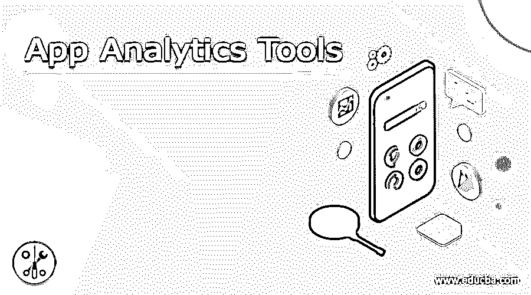

# 应用分析工具

> 原文：<https://www.educba.com/app-analytics-tools/>

## 应用分析工具简介

应用分析是团队测试和分析数据并了解用户如何参与其应用的过程。应用分析有助于了解用户对应用的兴趣，以及系统的表现如何。缺少哪些功能？简而言之，它给出了应用程序的整体性能。为了进行这种分析，团队使用工具。应用程序分析工具分析应用程序的性能，并帮助您更好地了解使用和应用程序之间的交互，以及如何优化应用程序以达到目标。

### 十大应用分析工具

在这里，我们讨论 10 大应用分析工具:

<small>网页开发、编程语言、软件测试&其他</small>

1.  **Localytics:** Localytics 是最好的 app 分析工具。这是一个基于云的分析工具，面向来自媒体、旅游、商业、零售和生活方式的每一位客户。其保留功能可生成一份分析报告，查明业务问题的原因，如低转换率、流失、客户保留率下降。它还提供定制的通知和建议以及个性化的消息传递功能。Localytics 理解并停止。客户流失、应用卸载，以及使用预测分析鼓励对话。Localytics 参与各种移动应用渠道，包括应用和网络推送、应用内消息带应用收件箱。
2.  Google Analytics: 另一个最好的应用程序分析工具是 Google Analytics，它可以跟踪和报告应用程序的流量。它跟踪用户的各种活动，如会话持续时间、跳出率、每次会话的页数等。它与谷歌广告整合在一起。它使用漏斗可视化等技术来识别表现不佳的页面，用户来自哪里，他们的地理位置，他们停留了多长时间。谷歌分析还提供高级功能，如客户访客细分。
3.  **苹果分析:**另一个 app 分析工具是苹果分析。它跟踪用户参与度、应用商店印象，并提供用户细分工具。它让我们深入了解哪些应用程序或应用程序订阅是受欢迎的。基于这些数据和分析，可以对应用程序进行更改，以吸引新用户和现有用户。它允许用户测量你的应用程序在应用程序商店的浏览百分比。跟踪各种活动，如安装数量、使用应用程序的用户数量、会话和活动设备。
4.  **Firebase:** Firebase 由 Google 开发，用于创建移动和网络应用。它与谷歌广告和 AdMob 等其他谷歌产品集成在一起。从分析，信息，数据库和崩溃报告分析可以在一个中心位置完成。它允许用户用他们的脸书、谷歌 Twitter 或 GitHub 账户登录应用程序。它跟踪入职流程的每个步骤，以改善体验。Firebase 使用远程配置向每个定义的受众显示特定的内容。
5.  Mixpanel: Mixpanel 是最流行的应用分析工具之一。它是无代码的，这意味着跟踪应用程序分析不需要任何编码知识。它有两个版本，免费版和付费版。它的免费版本提供有限的访问权限，付费版本提供各种设施。基于这些数据点，组织可以选择它的计划。它有助于组织检查各种范围的数据点，并了解用户在多个渠道上的整体表现。
6.  **Buildfire:** Buildfire 用于开发以及分析 app。它提供了 build fire recon 功能，可为用户提供强大的应用分析。Buildfire 跟踪各种活动，如有多少用户注册，插件的使用，安装数量，跳出率等。Buildfire 根据活动创建了一个用户群。基于用户标签，它还限制了应用程序的内容。它允许用户将他们的数据与其他数据整合，如谷歌分析，Mixpanel，振幅等。它还在用户活动的每一步提供有针对性的推送通知。
7.  AppsFlyer: AppsFlyer 是一款基于 SaaS 的应用分析工具，支持各种操作系统，如 Windows、iPhone 和 Android。AppsFlyer 提供了多种功能，包括保留报告、群组分析、安装测量、丰富的应用内事件、iOS 捆绑应用测量、电视应用广告归因、基于人的归因深度链接、智能横幅、绩效指标。
8.  另一个最好的应用分析工具是 Smartlook。它提供录音来验证用户。它允许用户整合 iOS 和 slack 等各种平台上的数据。提供可定制的仪表板，以便轻松跟踪和分析数据。
9.  **AppDynamics:** 另一个 app 分析工具是 AppDynamics。它是一个基于应用程序性能管理的工具，用于管理云计算环境中以及数据中心内部的应用程序的性能和可用性。它允许用户执行云迁移、跟踪活动、审计、DevOps 采用等。AppDynamics 还会通知应用程序的可用性及其工作范围。智能软件和工具与 AppDynamics 一起提供，以改进工具的工作。
10.  App Annie: App Annie 是另一个最佳应用分析工具，它允许用户跟踪他们的竞争对手，并确定最佳应用及其活动。它管理、丰富和识别您自己的广告和货币化数据中隐藏的绩效机会。

### 推荐文章

这是一份应用分析工具指南。在这里，我们还将讨论应用分析工具的定义和前 10 名，并给出解释。您也可以看看以下文章，了解更多信息–

1.  [手机应用分析工具](https://www.educba.com/mobile-app-analytics-tools/)
2.  [预测分析工具](https://www.educba.com/predictive-analytics-tools/)
3.  [云迁移工具](https://www.educba.com/cloud-migration-tools/)
4.  [Azure API App](https://www.educba.com/azure-api-app/)

