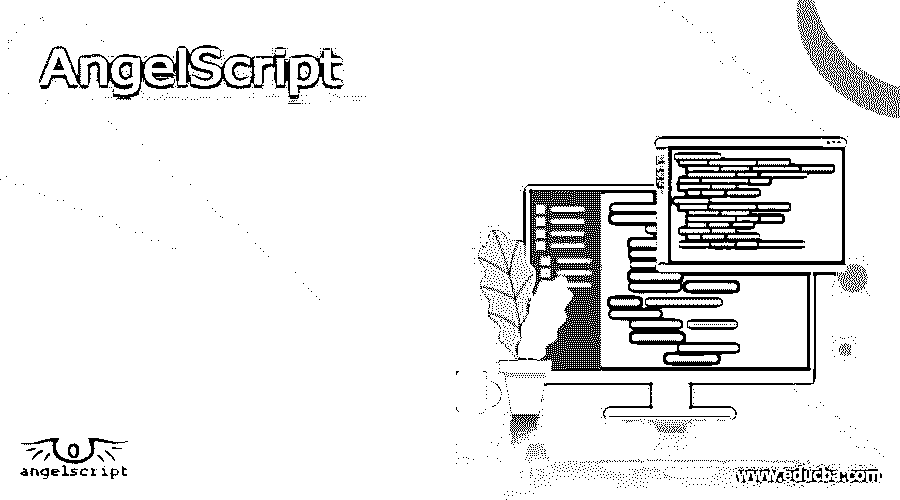

# AngelScript

> 原文：<https://www.educba.com/angelscript/>

## AngelScript 简介

AngelScript 定义为面向游戏的 angel-code 脚本语言，由 Andreas Jonsson 作为跨平台脚本库开发；它通过在计算机内部创建和运行虚拟机来工作，其中的脚本是使用 c/c++语法编写的，这允许我们编写脚本，一个可以在任何计算机平台上工作的计算机程序，它具有静态类型，对象句柄，面向对象，单继承，多继承和接口等特性，还允许操作符注册和重载，其中的虚拟机负责内存管理和指针等细节，它是免费使用的。

### 我们为什么需要 AngelScript？

AngelScript 是必要的，因为它像 c/c++一样是一种强大的面向对象的脚本语言。它拥有极其灵活的跨平台脚本库；因此，所编写的脚本或计算机程序可以在任何平台上工作，并且脚本库被设计成改进脚本的功能；通过使用它，用户可以在外部脚本的帮助下扩展功能。

<small>网页开发、编程语言、软件测试&其他</small>

它还有一个特性，我们可以在 angel-script 环境中调用 c 和 c++函数；正因为如此，使用它对开发人员很有帮助，angel-script 类的语法紧跟 c++类的语法。因此，这对于使用 c++的开发人员来说是必要的，他们必须使用 angel-script，这样他们就可以轻松地工作。

天使脚本可用于机器人学，即机器人的行为规则遵循天使脚本。此外，它对于视频游戏开发也很有用，可以延长游戏的寿命。因此，通过使用 angle-script，启动项目，这样会运行得更快。通过使用外部脚本，我们可以改进应用程序的功能。

### AngelScript 是如何工作的？

Angelscript 的工作如下，因为它有一个嵌入式脚本库，angel-script 允许脚本与它们一起工作。

1.  首先，我们需要 angel-script 的应用程序，然后必须注册接口，以便脚本可以与应用程序交互；该接口还包含函数、变量和类。
2.  其次，我们必须设置消息回调以接收关于错误的信息，以人类可读的形式接收错误，因为如果注册没有正确完成，那么注意消息将作为关于不正确注册或脚本有错误的回调消息而无法编译。如果我们需要验证返回代码，没有必要花费太多精力去了解它，因为回调消息可以以人类可读的形式给出信息，以便我们可以纠正它。这两步是关于发动机配置的。
3.  引擎配置之后，下一步是编译应该执行的脚本。此外，需要编写一个函数来调用注册的打印函数，并将该函数的输出存储在文件中。
4.  在这一步中，已经编写了用于加载脚本文件和编译它的代码，有一个 CSriptbuilder 定义它，它帮助加载文件，它将执行一些必要的过程，并且它将告诉引擎构建一个脚本模块，还需要构造 builder 代码进行处理。如果代码在此之后失败，那么它将没有内存来分配模块。如果文件名已经被删除或者给出了错误的名称，或者写了一些不必要的代码，那么构建器就不能加载该文件。
5.  最后一步是确定要调用的已定义函数，并以代码格式设置执行上下文。如果找不到该函数，那么需要编写一个打印函数来显示函数预期的消息。
6.  然后必须创建上下文，准备上下文，然后执行上下文；如果执行没有按预期进行，就需要编写一个异常代码来处理异常。

### AngelScript 的示例

下面是一个非常简单的示例，它将简要概述 Handle:

`class Stu
{
void StName()
{
system.out.println("List of student");
}
}
void CallHandle(Stu@ s)
{
s.StName();
}
void Main()
{
Stu st;
st.StuName();
Stu@ s= null;
s.StuName();
s.Stu();
@s = Stu();
s.StuName();
Stu@ s1 = null;
if (s1 == null)
{
}
if(s1!=null)
{
}
if(s1 is null)
{
}
if(s1 !is null)
{
}
s1=null;
@s1=null
}`

在上面的例子中，我们解释了句柄的概念，这是 angel-script 而不是 c/c++中的新概念；在这个例子中，我们获取一个类并创建一个方法来调用句柄，然后，在调用学生姓名的函数的 main 方法中，获取一个空引用，并在处理时创建两个空引用来处理异常。这是手柄的概述。

### 优势

AngelScript 的优势在于它的特性，

*   它具有类似 c/c++的静态类型的特性，使用与我们在 c/c++中使用的相同的静态类型来使类型动态化，并且我们只需要在 angel-script 中注册额外的类型。
*   它有一个提供指针的对象句柄特性，但是指针在脚本中是不安全的；因此它使用对象句柄而不是指针；脚本中的对象句柄控制对象的生存期。
*   它支持游戏中的逻辑，增加了游戏的寿命。

### 不足之处

下面列出了一些缺点；

*   Angelscript 支持主要平台上的本机调用约定，但也有一些平台只支持通用调用约定；泛型调用是纯 C++的，在任何地方都适用。
*   angel-script 中使用的 CScriptString 无法在本机模式下返回对象值，这是不兼容的。
*   可能存在内存泄漏问题。

### 结论

在本文中，我们得出的结论是，它是一种脚本语言，拥有与 c/c++代码准确通信的应用程序信息；它有一个内置的库，因此在我们的项目中制作脚本语言很容易；在本文中，我们看到了用多种语言开发程序的一些原因。

### 推荐文章

这是 AngelScript 的指南。这里我们也讨论一下入门，为什么需要 angelscript？有优点也有缺点。您也可以看看以下文章，了解更多信息–

1.  [二叉树 JavaScript](https://www.educba.com/binary-tree-javascript/)
2.  [打字稿巴别塔](https://www.educba.com/typescript-babel/)
3.  [类型脚本默认参数](https://www.educba.com/typescript-default-parameter/)
4.  [JavaScript 计算器](https://www.educba.com/javascript-calculator/)

