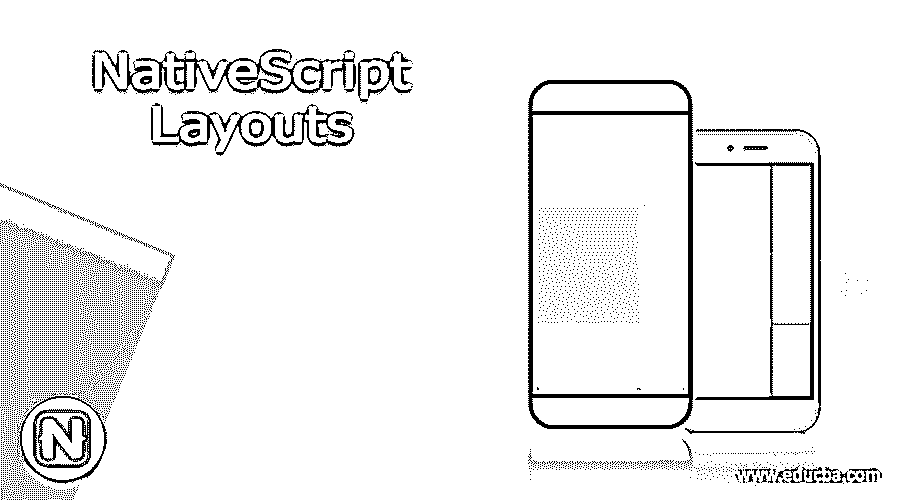
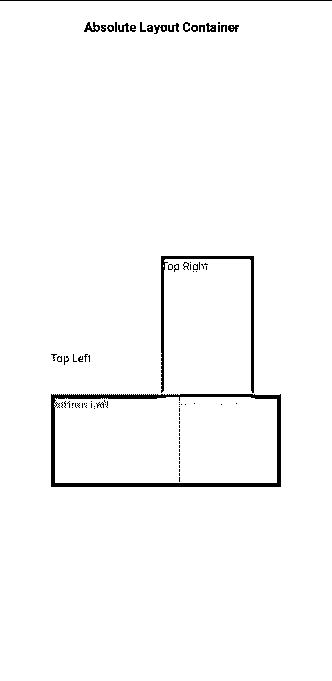
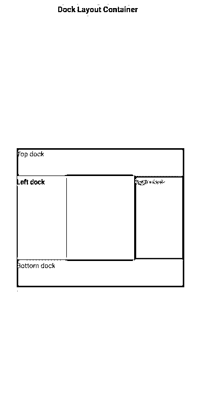
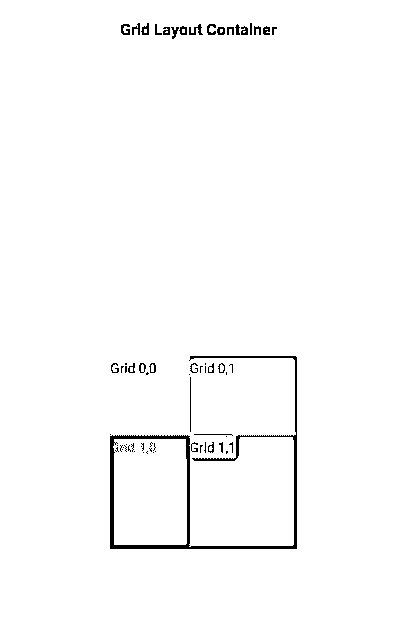
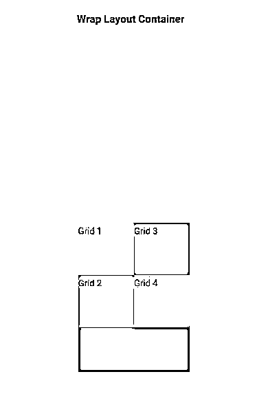
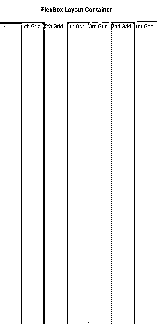

# 原生脚本布局

> 原文：<https://www.educba.com/nativescript-layouts/>

## NativeScript 布局简介

NativeScript 布局是一个布局系统，提供屏幕上视图的大小和位置。它测量并定位网页上的布局容器及其子视图。NativeScript 布局容器是 HTML 标签

的一种，但不止于此。布局定义了本机 UI 元素在屏幕上的呈现方式。一般来说，HTML变得迟缓，尽管移动效率很高，弱设备可能会面临组成移动应用的嵌套的复杂结构的问题。在 NativeScript 布局中，我们有一些预定义的布局，用户可以从中选择，将在本主题的进一步讨论中深入了解。在这里，我们将看到 NativeScript 布局如何用于一个好的 UI，以及它的布局容器是什么。

这些布局容器充当父组件，并且可以有一个或多个子组件。子组件可以基于父容器提供的技术进行排列。

<small>网页开发、编程语言、软件测试&其他</small>

### 前 6 名原生脚本布局及示例

下面是 6 个 NativeScript 布局容器，

*   绝对布局，
*   码头布局，
*   网格布局，
*   堆栈布局，
*   换行布局，
*   FlexBox 布局

我们将看到每个布局容器，每个容器的语法，以及它是如何工作的。

#### 1.绝对布局容器

它是 NativeScript 中最简单的布局容器之一。它允许用户通过其坐标来设置视图，并且绝对布局不对子节点施加任何约束，并且将他们的子节点放置在以左上角为原点的二维坐标系统中。基于不同的屏幕尺寸，布局的响应可能会很麻烦。

它使用子节点的 4 个属性进行定位，

*   **left:** 它是从原点向 x 方向侧面移动的子对象的位置。
*   **top:** 它是从原点沿 y 方向向下移动的子节点的位置。
*   **宽度和高度:**是孩子的宽度和高度。

**语法(绝对布局):**

`<AbsoluteLayout>
……..
</AbsoluteLayout>`

##### 示例#1:绝对布局容器示例

`<Page loaded="pageLoaded" >
<ActionBar>
<Label text="Absolute Layout Container"></Label>
</ActionBar>
<AbsoluteLayout width="250" height="250">
<Label left="0" top="100" width="150" height="150" text="Top Left" backgroundColor="yellow"></Label>
<Label left="120" top="0" width="100" height="150" text="Top Right" backgroundColor="gray"></Label>
<Label left="0" top="150" width="150" height="150" text="Bottom Left" backgroundColor="green"></Label>
<Label left="140" top="150" width="150" height="150" text="Bottom Right" backgroundColor="red"></Label>
</AbsoluteLayout>
</Page>`

**输出:**

这里，我们显示的是 NativeScript 的绝对布局容器。宽度和高度定义为 250。顶部指的是 y 方向上的位置，而左侧指的是 x 方向上的位置。

#### 2.码头布局容器

如果用户希望将布局固定到屏幕的任何部分，即允许子容器停靠在父容器内，那么它就是一个有用的容器。集装箱的每一侧都可以停靠。它使用子对象的 dock 属性进行停靠；bottom **:** 它将子组件停靠在屏幕的底部。

*   **top:** 它将子组件停靠在屏幕的顶角。
*   **left:** 它将子组件停靠在屏幕的左上角。
*   **right:** 它将子组件停靠在屏幕的右上角。

**语法(停靠布局):**

`<DockLayout>
……
</DockLayout>`

##### 示例 2:码头布局容器示例

`<Page loaded="pageLoaded" >
<ActionBar>
<Label text="Dock Layout Container"></Label>
</ActionBar>
<DockLayout width="300" height="250" backgroundColor="yellow" stretchLastChild="false">
<Label text="Top dock" dock="top" height="50" backgroundColor="gray"></Label>
<Label text="Bottom dock" dock="bottom" height="50" backgroundColor="gray"></Label>
<Label text="Left dock" dock="left" width="90" backgroundColor="orange"></Label>
<Label text="Right dock" dock="right" width="90" backgroundColor="red">
</Label>
</DockLayout>
</Page>`

**输出:**

根据布局，我们可以很容易地说，这个布局停靠在左侧、顶部、底部和右侧。这里黄色是整个布局的背景。

#### 3.网格布局容器

它是一个复杂的组件，允许以包含行和列的表格格式将复杂的视图排列在彼此之上。

这里要注意的特性是:

*   **行列:**是行列号
*   **rowSpan 和 colSpan:** 是子组件在布局中跨越的行或列的总数。

**语法(网格布局):**

`<GridLayout>
……
</GridLayout>`

##### 示例 3:网格布局容器示例

`<Page loaded="pageLoaded" >
<ActionBar>
<Label text="Grid Layout Container"></Label>
</ActionBar>
<GridLayout columns="70, auto, *" rows="70, auto, *" width="165" height="170" backgroundColor="gray">
<Label text="Grid 0,0" row="0" col="0" backgroundColor="yellow"></Label>
<Label text="Grid 0,1" row="0" col="1" colSpan="2" backgroundColor="orange"></Label>
<Label text="Grid 1,0" row="1" col="0" rowSpan="2" backgroundColor="red"></Label>
<Label text="Grid 1,1" row="1" col="1" backgroundColor="yellow"></Label>
</GridLayout>
</Page>`

**输出:**

所以这里的网格布局一直在显示，它是以行和列的形式显示的。

#### 4.堆栈布局容器

它将根据方向设置，以水平或垂直的一维方式组织其子元素。

**语法:(堆栈布局)**

`<StackLayout>
…..
</StackLayout>`

##### 示例 4:堆栈布局容器示例

`<Page loaded="pageLoaded" >
<ActionBar>
<Label text="Stack Layout Container"></Label>
</ActionBar>
<StackLayout orientation="horizontal" width="300" height="100"
backgroundColor="gray">
<Label text="Grid 1" width="60" height="50" backgroundColor="yellow">
</Label>
<Label text="Grid 2" width="60" height="50" backgroundColor="red">
</Label>
<Label text="Grid 3" width="60" height="50" backgroundColor="yellow">
</Label>
<Label text="Grid 4" width="60" height="50" backgroundColor="red">
</Label>
<Label text="Grid 5" width="60" height="50" backgroundColor="yellow">
</Label>
</StackLayout>
</Page>`

**输出:**

这里，我们以水平方式显示了堆叠布局。

#### 5.包装布局容器

它用于根据屏幕大小将内容换行到新的行和列。

**语法:(换行布局)**

`<WrapLayout>
…..
</WrapLayout>`

##### 示例 5:包装布局容器示例

`<Page loaded="pageLoaded" >
<ActionBar>
<Label text="Wrap Layout Container"></Label>
</ActionBar>
<WrapLayout orientation="vertical" width="150" height="200"
backgroundColor="gray">
<Label text="Grid 1" width="75" height="70" backgroundColor="yellow">
</Label>
<Label text="Grid 2" width="75" height="70" backgroundColor="orange">
</Label>
<Label text="Grid 3" width="75" height="70" backgroundColor="orange">
</Label>
<Label text="Grid 4" width="75" height="70" backgroundColor="yellow">
</Label>
</WrapLayout>
</Page>`

**输出:**

这里，我们以垂直方式展示了一个包装的布局。

#### 6.FlexBox 布局容器

它是一个高级布局容器，提供了一个将简单布局渲染为复杂布局的选项。它基于 CSS FlexBox。

它有很多特性，

*   **flexDirection:** 是子组件排列的方向。flexDirection 的可能值为
*   **行和列:**子元素在一行中并排排列，在一列中一个在另一个下面。
*   行反转和列反转:子元素在一行中并排排列，在一列中一个在另一个下面，方向相反。
*   **flexWrap:** 表示子元素是在单行或单列中呈现，还是流动到多行，由 flexDirection 设置换行。
*   **wrap:** 如果在 flexDirection 上没有可用的空间，它将对子元素进行换行。
*   **缠绕-反转:**与缠绕类似，但方向相反。
*   **justifyContent:** 表示子元素如何基于彼此和整体结构进行排列。
*   **flex-end:** 将子元素打包到行尾。
*   **space-between:** 通过在行中均匀分布来打包子元素
*   **space-around:** 它类似于 space-between，但是将子组件均匀地排列在它们周围。

**语法:**

`<FlexboxLayout>
…..
</FlexboxLayout>`

##### 示例 6: Flex Box 布局容器示例

`<Page loaded="pageLoaded" >
<ActionBar>
<Label text="FlexBox Layout Container"></Label>
</ActionBar>
<FlexboxLayout flexDirection="row-reverse">
<Label text="1st Grid Item" backgroundColor="yellow"></Label>
<Label text="2nd Grid Item" backgroundColor="gray"></Label>
<Label text="3rd Grid Item" backgroundColor="orange"></Label>
<Label text="4th Grid Item" backgroundColor="gray"></Label>
<Label text="5th Grid Item" backgroundColor="pink"></Label>
<Label text="6th Grid Item" backgroundColor="gray"></Label>
<Label text="7th Grid Item" backgroundColor="red"></Label>
</FlexboxLayout>
</Page>`

**输出:**

这里，我们实现了 FlexBox 布局，flexDirection 是相反的。我们还有 flexWrap 和 justifyContent。

### 结论

至此，我们将结束我们的主题“NativeScript Layouts”。我们已经了解了什么是 NativeScript 布局以及这些布局中包含的所有类型。我们已经实现了大约 6 种类型的 NativeScript 布局，每种布局都有一个示例，让您更好地理解这个概念。

### 推荐文章

这是一个本地脚本布局指南。在这里，我们还讨论了定义和 6 个 NativeScript 布局，以及不同的示例和它们的代码实现。您也可以看看以下文章，了解更多信息–

1.  [二叉树 JavaScript](https://www.educba.com/binary-tree-javascript/)
2.  [JavaScript 计算器](https://www.educba.com/javascript-calculator/)
3.  [JavaScript 下划线](https://www.educba.com/javascript-underscore/)
4.  [Lua vs JavaScript](https://www.educba.com/lua-vs-javascript/)

