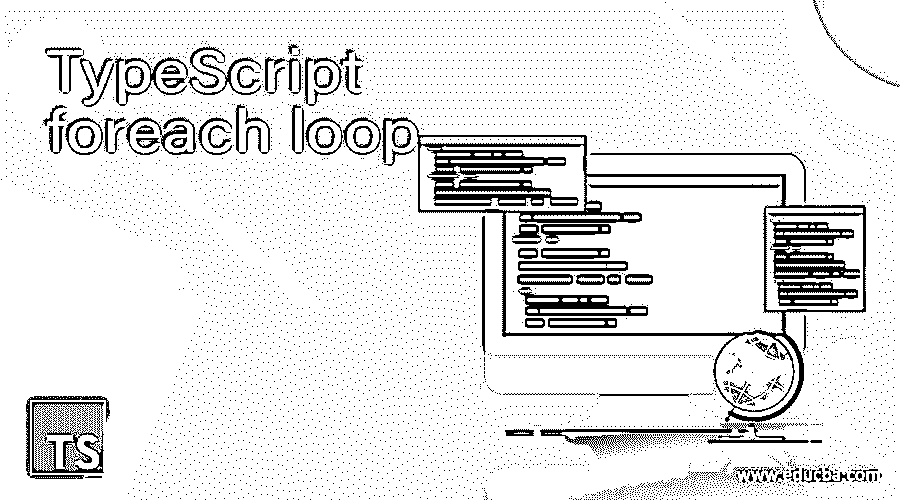
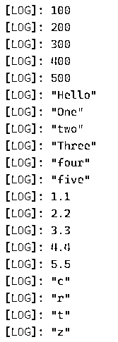
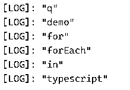
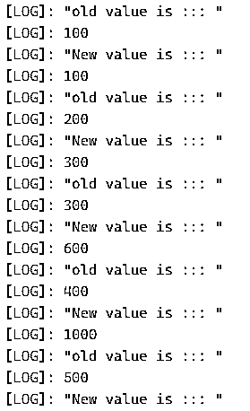
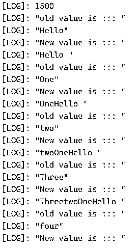
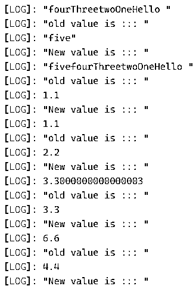
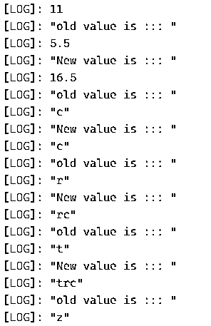
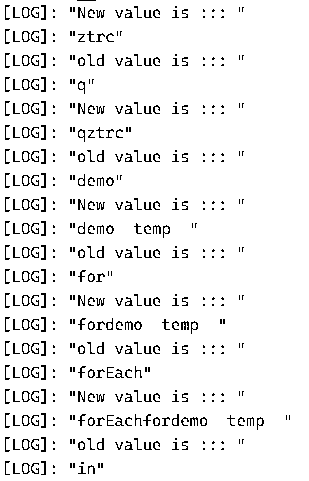
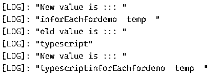

# TypeScript foreach 循环

> 原文：<https://www.educba.com/typescript-foreach-loop/>

## TypeScript foreach 循环简介

TypeScript 中的 foreach 循环用于处理数组元素。通过使用 foreach 循环，我们可以显示数组元素，对它们执行任何操作，操纵每个元素，等等。foreach 循环可以应用于数组、列表、集合和映射。简而言之，foreach 循环用于像任何其他编程语言一样迭代数组元素。在下一节中，我们将详细了解如何使用 foreach 循环以及它是如何工作的。

**语法**

<small>网页开发、编程语言、软件测试&其他</small>

正如我们已经讨论过的，foreach 循环用于迭代元素。我们可以在 TypeScript 中的数组、列表、集合或映射上调用它。让我们来看看它的输入参数，具体是什么，见下文；

`your_array.forEach(callback[, thisObject]);`

在上面几行语法中，你可以看到，我们在数组上调用这个函数，在这之后，我们可以有回调函数，它将保存来自数组的值。让我们来看一个练习语法，以便更好地理解语法，见下文；

**举例:**

`arr.forEach(function (arr1val) {
// perform logic here by the use of value of array
});`

在上面几行代码中，我们在数组上调用这个函数；在下一节中，我们将更详细地讨论它的用法。

### 流程图

我们在 TypeScript 中为 forEach 循环创建了一个流程图，这将使它更好地理解它。首先，如果元素存在，它将询问数组；它将调用回调函数并逐个返回每个元素。之后，我们可以使用这个值对元素执行任何功能。如果数组的大小不大于 1，那么它将简单地返回数组。将不会执行这些操作。

下面是 foreach 循环的流程图(请参见；

*   数组或任何迭代对象:在第一个条件中，我们被允许使用任何迭代对象如数组、列表、集合映射等来调用这个函数。在 typescript 中。
*   foreach():之后，我们可以从 typescript 库中调用 foreach()方法来显示元素。
*   回调函数:这里，我们有一个回调函数，负责从数组中给我们一个接一个的数组元素。该函数将迭代，直到到达数组中的最后一个元素。
*   返回值:在 typescript 中调用 foreach()方法内部的回调函数后。这将是数组中的值。通过使用这个值，我们可以对它们执行任何操作。但是有时要小心对数组中相同元素的修改；它可能会像任何其他编程语言一样抛出一些异常。
*   如果迭代对象的大小不超过“0”，那么它将简单地从函数返回，而不调用任何回调函数。因此数组的大小应该大于“0”才能看到 typescript 中 foreach 的功能。

### foreach 循环在 TypeScript 中是如何工作的？

截至目前，我们知道 foreach 循环用于迭代数组元素；在此之后，我们可以对元素执行任何操作并显示元素。这个函数接受一个回调函数，我们可以在任何迭代对象上调用这个函数，比如数组、列表、集合、映射等等。在这一节中，我们将通过它的方法签名和一个示例来详细了解它的工作原理，下面将详细介绍它的内部工作原理；

**方法签名:**

**1)your _ array . foreach(callback[，thisObject]):** 正如你在这个签名中看到的，它在这里接受一个参数。我们可以在任何迭代对象上调用它。

**2)返回类型:**将数组元素对象作为输出返回，可以是任何东西。

让我们看一个例子来理解它的工作细节，见下文；

`let demoarray = [20, 30, 40, 50];
demoarray.forEach(function (myvalue) {
console.log(myvalue);
});`

在上面的代码行中，我们通过给数组赋值来创建一个名为“demoarray”的数组。之后，我们在 TypeScript 中调用 foreach 函数来显示这些值。此外，我们可以对数组元素执行任何操作。但是举例来说，我们现在在控制台上显示数组的值。我们正在使用一个名为“function”的回调函数；在这里，这个回调函数从数组中一个接一个地返回值给我们。

### TypeScript foreach 循环的示例

下面举几个例子

#### 示例#1

在本例中，我们试图通过在 typescript 中使用 forEach 循环来迭代不同类型的数组元素，并在控制台日志中显示它们。

**代码:**

`let demoarray1 = [100, 200, 300, 400, 500];
let demoarray2 = ["Hello", "One", "two", "Three", "four", "five"];
let demoarray3 = [1.1, 2.2, 3.3, 4.4, 5.5];
let demoarray4 = ['c', 'r', 't', 'z', 'q'];
let demoarray5 = ["demo", "for", "forEach", "in", "typescript"];
demoarray1.forEach(function (myvalue) {
console.log(myvalue);
});
demoarray2.forEach(function (myvalue) {
console.log(myvalue);
});
demoarray3.forEach(function (myvalue) {
console.log(myvalue);
});
demoarray4.forEach(function (myvalue) {
console.log(myvalue);
});
demoarray5.forEach(function (myvalue) {
console.log(myvalue);
});`

**输出:**

#### 实施例 2

在本例中，我们通过使用 foreach 循环对数组元素进行迭代来对它们执行一些操作。

**代码:**

`let demoarray1 = [100, 200, 300, 400, 500];
let demoarray2 = ["Hello", "One", "two", "Three", "four", "five"];
let demoarray3 = [1.1, 2.2, 3.3, 4.4, 5.5];
let demoarray4 = ['c', 'r', 't', 'z', 'q'];
let demoarray5 = ["demo", "for", "forEach", "in", "typescript"];
let temp1 = 0;
let temp2 = " ";
let temp3 = 0.0;
let temp4 = '';
let temp5 = "  temp  " ;
demoarray1.forEach(function (myvalue) {
temp1 = myvalue + temp1;
console.log("old value is ::: ")
console.log(myvalue);
console.log("New value is ::: ")
console.log(temp1);
});
demoarray2.forEach(function (myvalue) {
temp2 = myvalue + temp2;
console.log("old value is ::: ")
console.log(myvalue);
console.log("New value is ::: ")
console.log(temp2);
});
demoarray3.forEach(function (myvalue) {
temp3 = myvalue + temp3;
console.log("old value is ::: ")
console.log(myvalue);
console.log("New value is ::: ")
console.log(temp3);
});
demoarray4.forEach(function (myvalue) {
temp4 = myvalue + temp4;
console.log("old value is ::: ")
console.log(myvalue);
console.log("New value is ::: ")
console.log(temp4);
});
demoarray5.forEach(function (myvalue) {
temp5 = myvalue + temp5;
console.log("old value is ::: ")
console.log(myvalue);
console.log("New value is ::: ")
console.log(temp5);
});`

**输出:**

### 结论

在这种情况下，我们可以通过在 TypeScript 中使用 foreach 循环来迭代数组元素。这非常重要，因为我们总是需要一些东西来逐个显示数组元素并执行操作。这与另一种编程语言的工作方式相同。但是 t 更简单，更优化，可读性更强，更容易被开发者接受。

### 推荐文章

这是 TypeScript foreach 循环的指南。这里我们讨论 foreach 循环如何在 TypeScript 中工作，以及示例和输出。您也可以看看以下文章，了解更多信息–

1.  [打字稿数组](https://www.educba.com/typescript-array/)
2.  [如何安装 Typescript](https://www.educba.com/install-typescript/)
3.  [打字稿操作符](https://www.educba.com/typescript-operators/)
4.  [打印面试问题](https://www.educba.com/typescript-interview-questions/)

