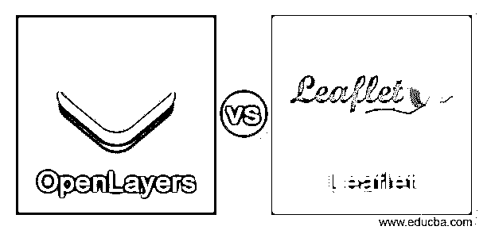
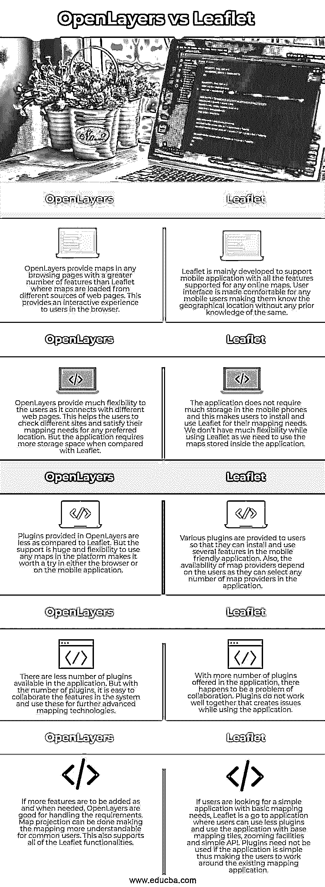

# OpenLayers vs 传单

> 原文：<https://www.educba.com/openlayers-vs-leaflet/>

## **OpenLayers 与传单**的区别

一个 JavaScript 库被称为 OpenLayers，它通过免费提供的 API 应用程序帮助在任何 web 浏览器中将地图数据显示为 slippy 地图。API 增加了多个地理应用程序，帮助用户构建类似 Google maps 的应用程序。传单也是一个 JavaScript 库，有助于创建地图应用程序，是免费提供的。开发者可以在浏览器中创建平铺地图，而不需要创建地图的地点的任何地理信息。可以创建交互式图层，以便用户可以利用应用程序中的弹出窗口和标记。

### OpenLayers 与传单之间的直接比较(信息图)

以下是 OpenLayers 与传单之间的 5 大区别:

<small>网页开发、编程语言、软件测试&其他</small>

### OpenLayers 与传单的主要区别

以下是 OpenLayers 与传单的主要区别:

*   OpenLayers 和 Leaflet 都提供了一些共同的功能，如切片图层、矢量图层和应用程序的移动支持。OpenLayers 中的平铺层可以根据用户的要求从任何网页中提取信息。此外，如果需要，也可以使用未倾斜的层。也可以根据需要使用地理空间地图服务。传单提供了缩放选项，以便用户在滚动地图时可以在平铺的图层中找到准确的位置。我们可以在手机上安装这两个应用程序，但传单更轻便。OpenLayers 正在构建轻量级和移动友好的组件，以便用户可以使用它们。
*   社区对这两个应用程序的支持是巨大的，因为它们是开源的，所以代码保存在 git 存储库中，开发人员可以在那里对代码进行更改，并使用它们来进一步开发功能。OpenLayers 可以被认为是一个成熟的应用程序，具有较少的依赖性，因为它可以在需要时作为 GPS 系统单独工作。这种独立性不能从传单中期待，因为插件不支持彼此，并将在一天中的任何时间产生依赖性。
*   如果我们想要更多的自定义映射支持，就需要更多的 JavaScript 代码来帮助管理具有任何功能需求的应用程序。因此，在应用程序中使用低级 API。这个 API 有助于控制应用程序，因为它不需要手动操作。同时，在传单中使用了高级 API，使得用户可以为同样的内容编写更少的代码。如果我们不使用插件，我们应该写更多的脚本，或者可以用插件来管理，应用程序将变得复杂。
*   这两个应用程序的功能是相同的，但是它们是以不同的方式实现的。如果用户需要一个应用程序来查找位置，传单是最好的。如果他需要更多的相关信息，他可以安装插件，并在同一个应用程序中使用它们来实现任意数量的功能。但如果用户需要从头开始构建一些东西，并需要在整个生命周期中使用它，OpenLayers 是最好的，因为用户可以在需要时定制应用程序并编写代码。传单是简单应用的选择，OpenLayers 是复杂应用的选择。
*   我们可以在使用 OpenLayers 的同时连接外部服务器，并从中获取信息，或者从服务器导入 excel 表格并在应用程序中使用。我们也可以在传单中导入 excel 表格，但在使用该应用程序时不容易与服务器连接。我们应该安装同样的插件。

何时使用活页和 OpenLayers 总是取决于用户。如果使用简单，就像在手机上安装和使用它，传单是最好的，但如果用户需要一个更复杂的应用程序，如果他们可以接受更多的脚本，OpenLayers 是最好的选择。

### OpenLayers 与传单对比表

OpenLayers 与传单之间的比较如下:

| **OpenLayers** | **传单** |
| OpenLayers 为任何浏览页面中的地图提供了比传单更多的功能，传单中的地图是从网页的不同来源加载的。这在浏览器中为用户提供了交互式体验。 | 传单主要是为了支持移动应用程序而开发的，具有任何在线地图支持的所有功能。用户界面对于任何移动用户来说都是舒适的，使他们知道地理位置，而不需要事先知道地理位置。 |
| OpenLayers provides much flexibility to the users as it connects with different web pages. This helps the users to check different sites and satisfy their mapping needs for any preferred location. But the application requires more storage space when compared with Leaflet. | 该应用程序不需要太多的移动电话存储，这使得用户安装和使用传单，为他们的地图需求。我们在使用传单时没有太多的灵活性，因为我们需要使用应用程序中存储的地图。 |
| 与传单相比，OpenLayers 中提供的插件较少。但是支持是巨大的，在平台中使用任何地图的灵活性使得它值得在浏览器或移动应用程序中尝试。 | 向用户提供了各种插件，以便他们可以安装和使用移动友好应用程序中的几个功能。此外，地图提供商的可用性取决于用户，因为他们可以在应用程序中选择任意数量的地图提供商。 |
| 应用程序中可用的插件越来越少。但是随着插件数量的增加，很容易将系统中的功能进行协作，并将其用于更高级的地图绘制技术。 | 随着应用程序中提供的插件越来越多，就出现了协作的问题。插件不能很好地协同工作，这在使用应用程序时会产生问题。 |
| 如果需要添加更多功能，OpenLayers 很适合处理这些需求。可以进行地图投影，使普通用户更容易理解地图。这也支持所有传单功能。 | 如果用户正在寻找一个简单的应用程序与基本的地图需求，传单是一个去的应用程序，用户可以使用更少的插件，并使用应用程序与基础地图瓷砖，缩放设施和简单的 API。如果应用程序很简单，就不需要使用插件，这样用户就可以围绕现有的地图应用程序工作。 |

### 推荐文章

这是 OpenLayers vs 的指南传单。在这里，我们还讨论了 OpenLayers 与传单的关键区别，并提供了信息图表和比较表。您也可以看看以下文章，了解更多信息–

1.  [Linux Mint vs Ubuntu](https://www.educba.com/linux-mint-vs-ubuntu/)
2.  [JIRA vs Bugzilla](https://www.educba.com/jira-vs-bugzilla/)
3.  [Ubuntu vs Fedora](https://www.educba.com/ubuntu-vs-fedora/)
4.  [CentOS vs Fedora](https://www.educba.com/centos-vs-fedora/)

