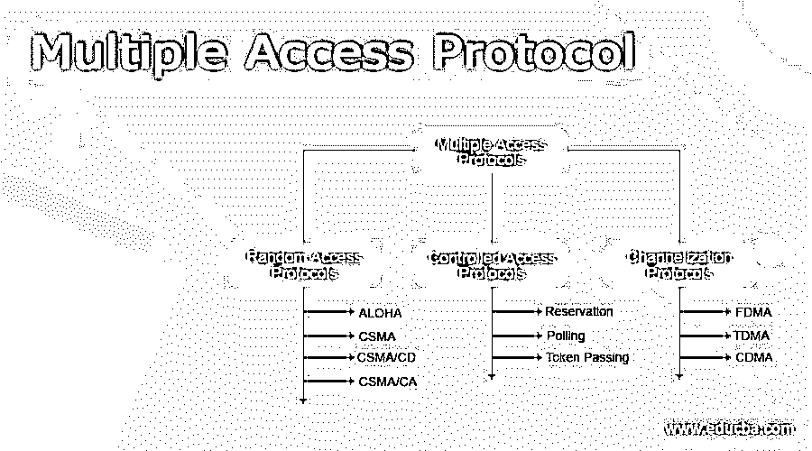

# 多址协议

> 原文：<https://www.educba.com/multiple-access-protocol/>

## 多址协议介绍

如果发送方和接收方之间没有专用链路来在两个设备之间进行通信或传输数据，则多路访问协议对于限制冲突和避免信道间串扰至关重要。

### 什么是多路访问协议？

当发送方和接收方具有专用链路来传输数据分组时，数据链路控制足以处理信道。假设两个设备之间没有可靠的通信或数据传输路径。在这种情况下，许多站同时接入信道并通过它广播数据。这可能会导致冲突和串扰。

<small>网页开发、编程语言、软件测试&其他</small>

例如，在一次新闻发布会上，记者在组织者讲话结束时向他提问，然后众多记者同时提出疑问和问题。所以为了避免混乱，主办方要规范当时的观众。

### 多址控制

*   FDMA(频分多址)—带宽被分成相等的频段，允许每个站拥有自己的 bar。引入了消除串扰和噪声保护频带，以确保两个频带不会重叠。
*   在时分多址(TDMA)中，带宽在站之间共享。时间被分成时隙，并且站被分配在这些时隙期间传输数据。
*   然而，存在同步开销，因为每个站必须知道它的时隙。向每个空间添加同步位解决了这个问题。TDMA 的另一个问题是传播延迟，使用保护带可以克服这个问题。
*   码分多址(CDMA)–所有传输同时在一个信道上进行。没有带宽或时间划分这种东西。
*   如果一个房间里的几个人同时说话，如果只是两个人说同一种语言，也可以想象无缺陷的数据接收。同样，来自许多站点的数据可以同时以不同的编码语言传送。

### 多接入协议类别

以下是不同类别的多路访问协议:

#### 1.随机接入协议

该协议确保所有站都具有同等的优势，这意味着没有一个站比另一个站具有更高的优先级。根据介质的状态，任何站点都可以传输数据(空闲或繁忙)。它有两个特点:

*   数据传输没有固定的时间。
*   站点传送数据没有固定的顺序。

随机接入协议进一步分为以下几类:

a. ALOHA: 该协议是为无线局域网创建的，但也可用于共享介质。多个电台可能同时广播数据，导致冲突和数据混乱。

*   **纯 Aloha:** 当一个站传输数据时，等待响应。如果确认没有在给定时间内到达，站在重新发送数据之前等待一个随机时间(Tb)。因为不同的车站停留的时间长短不一，所以发生另一次事故的可能性就降低了。
*   **时隙 Aloha:** 和纯 Aloha 一样，只是我们把时间分成了时隙，数据只能在每个地方的开始发送。如果一个站点用完了时间，它必须等待下一个可用的时隙。它降低了碰撞的几率。

**b. CSMA:** 载波侦听多路访问–通过要求站点在传输数据前侦听介质(空闲或繁忙)来减少冲突。如果信道空闲，它传输数据；它会等待磁道变为非活动状态。然而，由于传播延迟，在 CSMA 仍有发生碰撞的可能性。例如，站 A 将在发送数据之前首先检测媒体。然后，如果发现信道空闲，它将开始传输数据。然而，假设 b 站希望发送数据并检测到介质。在这种情况下，它也会发现自己处于空闲状态，并在从站 A 传输第一位数据(由于传播延迟而延迟)时发送数据。因此，来自站 A 和 B 的数据会发生冲突。

c. CSMA/CD: 载波侦听多路访问与冲突检测。如果检测到冲突，站点可以停止数据传输。有关更多信息，请参见 CSMA/光盘效率。

**d. CSMA/CA:** 发送方接收确认信号，作为冲突检测过程的一部分。如果只有一个信号(它自己的)，则数据被成功传送，但是如果有两个信号(它自己的和与它碰撞的那个)，则发生了碰撞。碰撞必须显著影响接收到的信号，才能区分这两种情况。然而，在有线网络中，情况并非如此。因此，CSMA/CA 被采用。

CSMA/CA 协议通过以下方式避免冲突:

*   **帧间间隔:**站点在发送数据之前等待介质空闲(以最小化由于传播延迟而导致的冲突)，但会保持很长时间，称为帧间间隔或 IFS。之后，它检查介质是否仍然空闲。电台的优先级决定了国际单项体育联合会的规模。
*   **竞争窗口:**被分成时隙的时间被称为竞争窗口。当发送器准备好传输数据时，它选择一个随机数量的时隙作为等待时间，每当介质没有空闲时，等待时间加倍。如果介质变得繁忙，该过程不会完全重新开始；相反，当信道再次空闲时，定时器重新启动。
*   **确认:**如果超时前未收到反馈，发送方将重新传输数据。

#### 2.访问控制

该站发送数据，并且所有其他站都已批准该数据。有关更多信息，请参见受控访问协议。

#### 3.渠化

链路的现有带宽在频率、时间和编码上被许多站共享，以允许它们同时接入信道。

### 多址协议 CSMA 接入

*   **1-持久:**节点检测信道，空闲则发送数据；它不断检查介质是否空闲，一旦磁道空闲，就无条件地(以一种概率)传输。
*   **非持久:**节点检测信道，空闲则发送数据；否则，它会在一段随机时间后(不是连续地)检查介质，如果发现介质空闲，则进行传输。
*   **P-persistent:** 节点检测媒体，空闲时以 P 概率传递数据。如果信息没有被发送((1-p)概率)，它等待一段时间，然后重新检查媒体；如果它仍然空闲，它以 p 概率发送。重复此过程，直到帧发送完毕。Wifi 和分组无线技术都使用它。
*   **O-persistent:** 节点优势提前确定，传输按此顺序发生。如果信道空闲，节点等待轮到它发送数据。

### 结论

*   多址协议处理发送方和接收方之间的多个信道。
*   该协议操作两个设备之间的多个信道，并处理用于通信的网络。

### 推荐文章

这是多址协议指南。这里我们讨论了多址接入协议及其分类，CSMA 接入，并给出了详细的解释。您也可以浏览我们推荐的其他文章，了解更多信息——

1.  [物联网通信协议](https://www.educba.com/iot-communication-protocol/)
2.  [SMTP 协议](https://www.educba.com/smtp-protocol/)
3.  [什么是网络协议](https://www.educba.com/what-is-networking-protocols/)
4.  [用户数据包协议](https://www.educba.com/user-datagram-protocol/)

