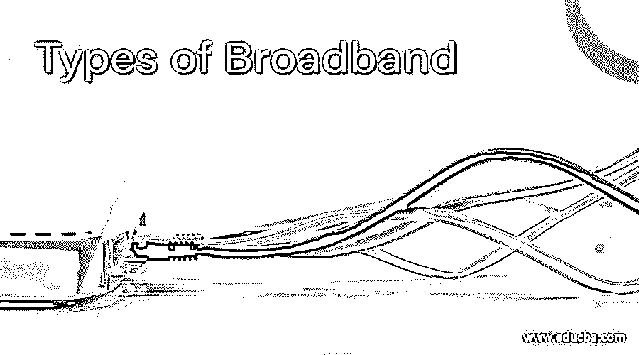

# 宽带类型

> 原文：<https://www.educba.com/types-of-broadband/>

## 宽带类型介绍

宽带是所有在手机上使用互联网以及在家中使用 Wi-Fi 服务的人的通用术语。这是一个家喻户晓的术语，我们大多数人都知道宽带的描述及其工作方式。宽带服务覆盖很宽的带宽，并且在其频谱内有几个信号要跟踪和传输。我们可以说，宽带是提供传输数据的高速互联网接入的服务。宽带设备中使用软件来访问互联网。它是一种单通道技术，有不同类型的宽带。让我们看看宽带的类型。

### 宽带类型

宽带是根据通信网络中使用的高速传输技术进行分类的。

<small>网页开发、编程语言、软件测试&其他</small>

#### 1.数字用户线路

数字数据通过 DSL 中的普通电话线传输。这种传输技术使用电线传输数据，比传统方法更快。传输速度为每秒 100 kbps 到 Mbps。这取决于电话公司离你的公司或家有多远，无论你在哪里使用这项服务。它们向企业提供两种类型的服务:高速率和超高速率数字用户线路。DSL 传输可以分为两种类型。

*   **非对称数字用户线**

需要大量数据但不发送大量数据的个人更喜欢这种连接。住宅用户是 ADSL 的中坚力量。与上游数据相比，在下游提供了更快的数据，因此这对于住宅用户来说是一个优势。此外，这里提供的语音呼叫服务不会中断同一线路上的其他服务，如传统电话服务或正常的电话呼叫。这是用于互联网接入的常见服务。

*   **对称数字用户线**

企业大多更喜欢这种服务，因为上游和下游的数据提供速度相同。它与 ASDL 相反，因为在这里，下载速度和上传速度是一样的。这项服务还没有实现标准化，因此它只适用于一家供应商。

#### 2.有线通

通过电视机向用户提供娱乐的同轴电缆用于在电缆调制解调器中提供宽带。传输速度为 1.5 Mbps 及以上。此调制解调器中有两个连接，一个连接到设备，另一个连接到墙上的电缆插座。这项服务不需要 ISP，因为打开设备就可以使用宽带连接。此外，即使使用宽带服务，它也提供电视连接。速度与 DSL 不相上下，电缆网络在传输速度中发挥了作用。

#### 3.纤维

电信号被转换成光，这种光有助于通过玻璃纤维传输数据。这些纤维的直径与人类头发的直径相当。数据传输比 DSL 和电缆调制解调器快。这种光纤还可以提供语音和视频点播服务。速度取决于配置和使用的带宽。电信为语音、视频和互联网服务提供光纤技术。

#### 4.无线的

无线电链路用于连接用户设备和服务提供商的连接，它可以是固定的，也可以是移动的。无线连接需要天线，它用在 DSL 和电缆使用成本较高的地方。使用更长距离的定向设备，并且在固定设备的发射器和接收器之间需要视线。许可和未许可的频谱用于提供服务。WLAN 被用于提供这种宽带服务，并且通常在机构或企业内的最后一英里到达是在 WLAN 的帮助下提供的。在未经许可的设备的帮助下提供公共互联网接入。

#### 5.卫星设备

这主要用于在其他通信方式难以实现的偏远地区提供服务。由于卫星设备提供语音和视频服务，它们也可以用于提供宽带连接。在这里，由于速度的其他因素，一个主要的问题是气候。轨道的视线也是一个值得关注的问题。因此，与 DSL 和电缆相比，速度较慢。上传和下载速度不同，其中下载速度 500 kbps，上传速度 80 kbps 左右。但与拨号上网相比，它们的速度更快。

#### 6.电力线宽带

中低压配电提供宽带连接，速度类似于 DSL 和电缆调制解调器。不需要单独的电源连接，因为宽带服务可以从现有的电连接中获得。这是一项新技术，只在极少数地方使用。由于电力线无处不在，使用宽带连接很容易，因为它不需要单独的设施。

### 宽带的优势

*   在比较宽带和拨号连接时，速度总是需要考虑的因素。宽带速度更快，带宽更宽。只有使用宽带，才能进行在线游戏和下载电影。
*   电话连接不受影响，即使在使用宽带接入时也能正常工作。通过同一个网络传输，效果很好。
*   不需要拨号号码，只要需要，服务总是可用的。
*   随着技术的变化，宽带改变了互联网连接的面貌，现在互联网的所有服务都是现成的。
*   无限制访问是另一个优点，连接永远不会中断。价格不是根据持续时间而是根据速度和使用的数据量来计算的。

### 结论

影响宽带类型选择的几个因素。这取决于价格、我们居住地区的可用性以及与宽带类型相结合的服务。它们可以是电话或任何其他形式的娱乐。由于宽带比传统的拨号连接更快，许多人更喜欢使用宽带。

### 推荐文章

这是一个宽带类型的指南。在这里，我们讨论不同类型的宽带以及宽带的优势。您也可以看看以下文章，了解更多信息–

1.  [路由器类型](https://www.educba.com/types-of-routers/)
2.  [计算机网络的类型](https://www.educba.com/types-of-computer-network/)
3.  [光盘类型](https://www.educba.com/types-of-compact-disc/)
4.  [什么是 LTE 网络？](https://www.educba.com/what-is-lte-network/)

