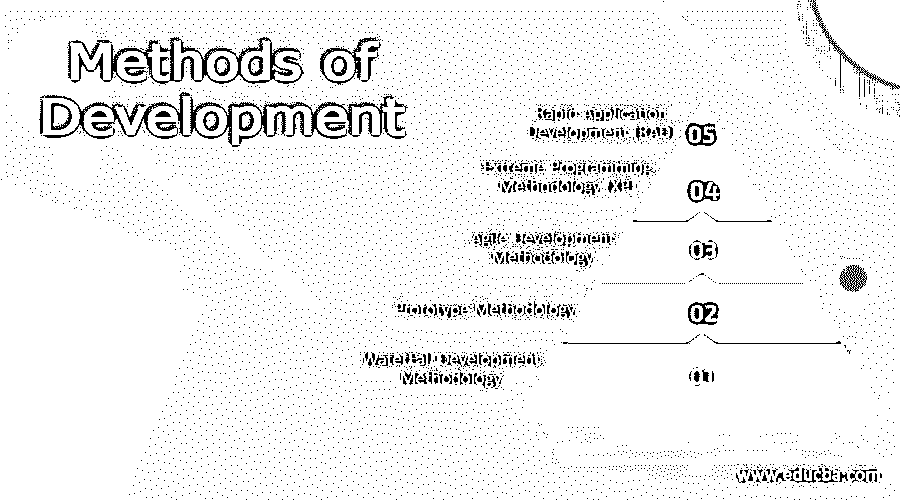

# 开发方法

> 原文：<https://www.educba.com/methods-of-development/>

## 开发方法介绍

软件开发是 IT 组织及其员工的生计。有许多方法可以用来开发软件；其中一些包括瀑布、敏捷、极限编程、原型方法、快速应用开发模型等。选择哪种开发方法取决于许多因素，如软件的复杂性、客户的参与程度、批准用于开发的资金、团队技能和经验，以及最终所开发软件的应用程序。但是要做出选择，我们必须了解可用的开发方法。这篇文章将会看到一些组织间著名的趋势分析方法以及它们的优缺点。

### 5 种开发方法

以下是不同的开发方法:

<small>网页开发、编程语言、软件测试&其他</small>

#### 1.瀑布开发方法

瀑布模型是 IT 组织中非常流行的术语。这被认为是遗留的或者传统的开发方式，但是一些开发过程考虑使用瀑布来开发他们的需求。瀑布方法遵循一个线性的开发序列，让用户明白上一级完成后下一级是逐步实现的。这种方法得出的结论是，回过头来处理任何类型的变化都是不可能的。它创建于 1970 年，由于其计划驱动的方法，在几十年中一直很突出。发展的流程是严格的，发展的顺序如下。

*   获取软件目的或需求及其范围
*   一旦理解了范围和需求，然后分析它
*   准备尽可能好的设计来实现需求
*   实施设计
*   严格测试实现
*   部署和维护实施

下面让我们列出这种方法的一些优点和缺点。

**优点:**

*   这种方法很容易理解，因为它是线性的和连续的
*   由于模型是刚性的，所以处理起来更简单
*   这种方法便于测试和分析。

**缺点:**

*   这种方法只适用于精确的需要
*   瀑布法很难实施维护项目。

#### 2.原型方法论

这种方法鼓励只为需求开发一个抽样模型，并且它的结果被验证为功能本质。然后决定是否继续进行最终的可信解决方案。正如该方法所暗示的，该方法实际上倾向于解决瀑布方法开发过程中出现的不同问题。在这种开发方法中，由于需要做出决策，客户会持续参与。让我们看看这种模式的一些优点。

**优点:**

*   这种开发方法可能会降低软件的固有风险。
*   由于客户自始至终都参与其中，因此可以更好地识别审查和风险。
*   这种方法给出了软件功能过程的清晰概念。
*   这种方法也将有助于更好地收集项目的需求。

**缺点:**

*   客户过多地参与开发会使项目滞后
*   这个项目有可能增加成本

#### 3.敏捷开发方法

瀑布模型有一些主要的限制，其中一个就是高度的灵活性。以适应瀑布中的任何变化，这通常是困难或不可能的。为了克服这些限制以及其他模型的一些限制，敏捷开发了出来。有了敏捷，我们可以很容易地适应任何变化，而且，我们可以坚持更快的软件生产的需求。

敏捷将允许客户在软件开发的整个阶段进行协作，并且由于开发过程是基于迭代的，它很容易对变化做出响应。敏捷方法较少关注文档，更多关注工作软件，并且准备的文档足够简洁和详细。让我们来看看敏捷优势的一些优点和缺点:

**优点:**

*   与其他模型相比，敏捷可以轻松地处理基于 sprint 的迭代的复杂需求，并且非常有效地处理可变性。
*   敏捷允许与客户直接沟通，因此可以审查实现，并且可以捕获变更。
*   使用基于敏捷的方法，查找和解决缺陷相对容易。

**缺点:**

*   对文档的压力相对较小，对工作软件的压力较大。
*   如果冲刺的结果不明确，就有可能被推迟或偏离轨道。

#### 4.极限编程方法(XP)

极限编程将专注于使用最佳实践来生产更高质量的软件。类似于基于敏捷的方法，XP 允许在更短的冲刺中发布。

一般来说，XP 方法包含很少的价值，而不是严格的步骤。这些简单性定义了开发人员需要什么，而不是更多，沟通定义了团队必须足够协作并鼓励客户参与；持续的反馈，这是改进缺点所必需的；最后，尊重。下面让我们来看看 XP 模型的一些优点和缺点。

**优点:**

*   XP 方法支持更高的透明度和可追溯性有助于降低成本，因为它更侧重于开发。
*   在很大程度上允许客户参与
*   允许开发合理的计划并遵循预定的计划

**缺点:**

*   这种有效性包括频繁的会面
*   此外，这项工作极大地依赖于参与人员的素质，因此对开发人员的技能要求很高。

#### 5.快速应用开发(RAD)

这是开发软件的一种更快的方法，因此取代了基于瀑布的方法。它适用于基于敏捷的软件开发，专注于快速原型或快速迭代发布。因此，RAD 更倾向于要开发的软件的应用，而不是严格的计划和需求记录，这是基于瀑布的方法的主要部分。

RAD 中的阶段就像最终确定项目需求和最终确定设计，开始构建原型直到最终产品准备好，一旦产品准备好收集用户或客户反馈并应用他们的建议，测试任何缺陷，部署。下面让我们来看看 RAD 方法的一些优点和缺点。

**优点:**

*   该流程的开发是基于原型的，因此相当容易。
*   这种方法允许客户或用户提供快速反馈，并根据建议；这些改变很容易实现。

**缺点:**

*   需要团队中熟练的专业人员来开发
*   难以应用于小型预算项目。

### 结论-开发方法

因此，我们可以用不同的方法来开发软件，在上面的文章中我们已经看到了一些流行的方法。大多数组织正朝着基于敏捷的方法和其他形式的开发相结合的方向发展。这并不意味着瀑布无关紧要。瀑布方法给出了更好的文档，因此很少有组织在他们的软件开发中使用瀑布方法。

### 推荐文章

这是开发方法的指南。在这里，我们讨论组织中流行的著名方法及其优缺点。您也可以看看以下文章，了解更多信息–

1.  [软件开发模型](https://www.educba.com/software-development-models/)
2.  [业务发展战略](https://www.educba.com/business-development-strategies/)
3.  [手机应用开发工具](https://www.educba.com/mobile-app-development-tools/)
4.  [什么是敏捷开发？](https://www.educba.com/what-is-agile-development/)

