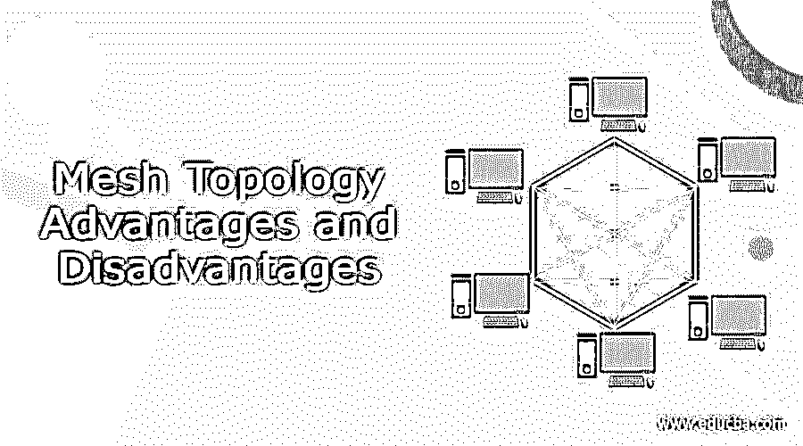
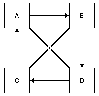

# 网状拓扑的优点和缺点

> 原文：<https://www.educba.com/mesh-topology-advantages-and-disadvantages/>

## 定义网状拓扑的优点和缺点

在网络世界中，我们有许多不同种类的网络策略，网状拓扑就是其中之一。在拓扑结构中，我们有一个不同的系统可用，并且每个系统都相互连接，简而言之，我们可以说系统相互连接形成了一个网络。这种类型的拓扑通常用于无线网络设计。此外，我们将网状拓扑基本上分为两种形式，即部分连接的网状拓扑和完全连接的网状拓扑，为了让初学者更加清楚，我们将在文章的下一部分详细讨论这两种形式。

任何拓扑类型都有不同的优点和缺点，对于网状拓扑来说，它们在数量上是相同的。简而言之，在网状拓扑中，我们将基础架构节点(即交换机、网桥和另一个基础架构设备)相互连接，并用于在服务器和客户端之间相互传输数据，因此网状拓扑是自配置的，并保证很少节点会偶然出现故障。在本教程的下一部分，我们将看到网状拓扑的内部工作原理，并附上流程图，以及优缺点。

<small>网页开发、编程语言、软件测试&其他</small>

### 网状拓扑内部如何工作？

到目前为止，我们已经了解了什么是网状拓扑以及它们的行为方式，在本节中，我们将详细了解网状拓扑的内部工作原理和基本结构，以便更好地理解，下面让我们开始了解；

正如您在上面的图表中所看到的，我们只有几个相互连接并形成分布式系统的可用系统。在网状拓扑中，每个独立的系统或节点都相互连接。这种网状拓扑基本上用于以低效的方式向客户端传输数据。此外，它也是我们拥有的众多其他网络拓扑形式之一，每种形式都有自己的优缺点。网状拓扑使用下面提到的两种技术之一将消息传送到下面提到的另一个系统；

a)路由技术

b)浮动技术

1)我们有四种不同的系统，分别命名为 A、B、C、d

2)从上图中我们可以看出，每一个都是相互独立连接的。

3)首先 A 连接到 b。

3)第二个 B 连接到 c。

3)第三个 C 连接到 d。

3)第四个 A 连接到 D，依此类推。

这就是网状拓扑的内部结构，用于在网络类型中传输数据。

### 不同类型的网状拓扑？

我们已经讨论了网状拓扑如何工作，现在我们将讨论下面提到的不同类型的可用网状拓扑；

1)部分连接的网状拓扑:在这种类型的网状拓扑中，所发生的是网状网络内的至少两个系统彼此连接，并且它们用于避免来自网络类型的冗余，还减少了维护系统的代码和开销。如果网状拓扑中的一个系统出现故障，也不会影响另一个网络的性能，因此成本低廉。但是系统的其余部分将正常工作，并在它们之间共享数据。

2)全连接网状拓扑:这是我们拥有的基本网状拓扑形式，其中网络内的所有系统将相互连接，以共享往来数据，但这需要大量开销，并且也很昂贵，因为我们必须保持与网络内每个系统的连接。我们可以使用下面的公式来计算在网络内部形成这种拓扑所需的连接数，见下文；

**例如:**

n(n-1)/2

如您所见，我们正在使用我们拥有的多个系统来计算连接数，我们只是将它们除以 2。尝试计算您的网络所需的连接。

### 网状拓扑的优点和缺点

现在在对网状拓扑有了基本的了解之后，现在我们将很容易地确定使用网状拓扑为我们的网络来回传输数据的优点和缺点。让我们仔细看看其中的几个细节见下文；

**优点:**

1)网状拓扑可以轻松管理大量流量。因为我们有很多设备可以同时传输数据。
2)如果一个系统或设备出现故障，不会影响其他设备，所有其他设备都可以顺利转移。
3)如果将来我们想要增加设备数量，或者我们想要扩展我们的网络，那么添加新系统或设备不会影响现有网状拓扑系统的任何工作。

**缺点:**

1)构建网状拓扑来传输数据非常耗时，因为我们需要考虑所有系统或设备，并且还要进行监控

2)在网状拓扑结构中，维护也是非常费时和费时的，因为每个系统都是相互连接的，也需要大量的维护。

3)实现这种结构的成本非常高，与其他网络拓扑相比非常高。这也是网状拓扑的缺点之一，在使用它进行数据传输之前，我们需要重新考虑。

4)每个节点也相互连接，这可能导致连接的冗余，也增加了该连接的不必要的情况，并且还需要额外的努力来监控这种情况。

### 结论

我们已经看到了网状拓扑的缺点和优点，但在此之前，我们必须对这种网络拓扑有一个正确的详细了解，以便找出其优点和缺点。正如我们已经详细讨论过的那样，它们易于使用，易于理解，但是可能需要开发人员进行大量的维护，而且成本也很高。

### 推荐文章

这是一个关于网状拓扑优缺点的指南。这里我们讨论定义，网状拓扑内部如何工作？不同类型的网状拓扑？分别是。您也可以看看以下文章，了解更多信息–

1.  [总线网络拓扑](https://www.educba.com/bus-network-topology/)
2.  [菊花链拓扑](https://www.educba.com/daisy-chain-topology/)
3.  [以太网拓扑](https://www.educba.com/ethernet-topology/)
4.  [扎里斯基拓扑](https://www.educba.com/zariski-topology/)

