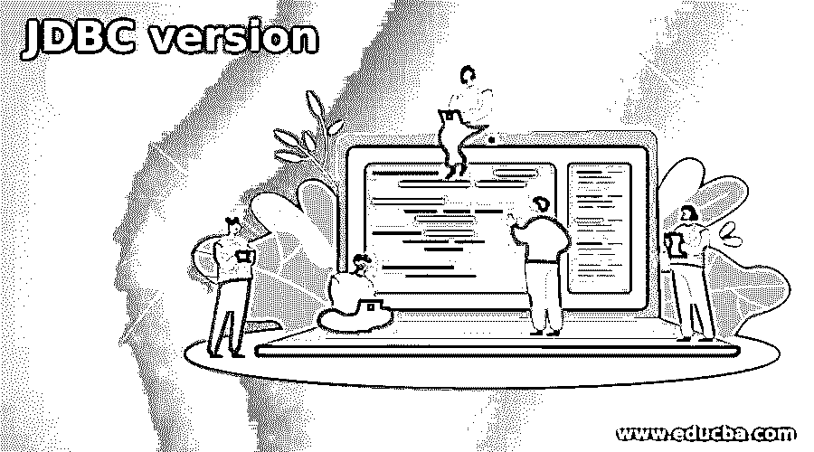
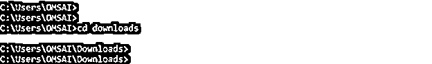
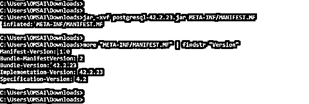

# JDBC 版本

> 原文：<https://www.educba.com/jdbc-version/>

## JDBC 版简介

JDBC 版本是 JDBC 发布的软件，有多个 JDBC 版本可在 JDK 实现。JDBC 目前的稳定版本是 4.3，发布于 2017 年 9 月 21 日 st ，4.3 是一个稳定版本，意味着我们可以使用这个版本实现 API 软件。第一个版本发布于 1997 年，它的版本名称是 JDBC 1.2，这是 JDBC 的第一个稳定版本。在发布版本 1.2 之后，许多稳定的版本在 JDK 实现中发布，JDBC 4.0 和更高版本支持 java SE 环境。

### JDBC 的版本

*   基本上，JDBC 是 java 之类的编程语言的 API(应用编程接口)。它将被定义为从客户端访问数据库服务器。
*   JDBC 只不过是 java 应用程序中使用的数据访问技术。它也是 Java 平台标准版的一部分。
*   这用于从数据库中查询数据，也用于更新数据库中的数据。它用于关系数据库，如 MySQL、Oracle、PostgreSQL 等。
*   JDBC 允许从同一个应用程序以及现有的应用程序实现。
*   基本上，API 提供了加载正确的 java 包的机制，该包已在 JDBC 的潜水员管理器中注册。
*   在连接工厂中使用 JDBC 驱动程序管理器来创建 JDBC 的连接。JDBC 的完整形式是 java 数据库连接。
*   基本上，JDBC 连接将支持创建和执行我们在 java 中使用的语句方法。
*   JDBC 将支持下面的 java 语句如下。

1.  声明
2.  准备报表
3.  可调用语句

*   statement 方法是使用 statement 类定义的，每次执行时都会将语句发送到数据库服务器。
*   使用 PreparedStatement 将缓存该语句，而不是使用 JDBC 连接中的 PreparedStatement 将该语句预编译到数据库中。
*   callable 语句用于从数据库服务器执行存储过程。
*   下面是可用的版本如下。

**JDBC 版—**

<small>网页开发、编程语言、软件测试&其他</small>

*   JDBC 1.2
*   JDBC 2.1
*   JDBC 3.0
*   JDBC 4.0
*   JDBC 4.1
*   JDBC 4.2
*   JDBC 4.3

**JDBC 1.2—**

*   该版本发布于 1997 年，在 JDK 版本 1.1 中实现。
*   这个版本将支持 SQL 查询执行。

**JDBC 2.1—**

*   该版本于 1999 年发布，在 JDK 版本 1.2 中实现。
*   这个版本将支持 SQL 查询执行和字符集。

**JDBC 3.0—**

*   该版本发布于 2000 年，在 JDK 版本 1.4 中实现。
*   这个版本将支持 SQL 查询执行和 SQL 驱动程序。

**JDBC 4.0—**

*   这个版本发布于 2006 年，在 JDK 版本中实现为 Java SE 6。
*   4.0 版本的主要特点是它会自动加载 java.sql 的驱动程序
*   它将支持数据类型为行。
*   它将支持国家字符集的转换。
*   JDBC 版本 4.0 支持 XML 和 SQL/XML。

**JDBC 4.1—**

*   该版本于 2011 年发布，在 JDK 版本中实现为 Java SE 7。
*   4.1 版本的主要特点是它将增加对 try with resource 语句的支持。
*   它具有时间戳的增强日期类型值。
*   此外，这个版本将支持 java 对象到 JDBC 类型的额外映射。
*   与之前的 4.0 版本相比，此版本将包含 API 的变化。

**JDBC 4.2—**

*   该版本于 2014 年发布，在 JDK 版本中实现为 Java SE 8。
*   4.2 版本的主要特点是它将支持 ref cursor。
*   与之前的版本名称 4.1 相比，它包含了额外的 java.sql 接口。
*   与以前的版本相比，它包含了额外的 SQL 类型接口。
*   与之前的版本名称 4.1 和 4.0 相比，它包含了额外的 JDBC 类型枚举。

**JDBC 4.3—**

*   该版本于 2017 年发布，在 JDK 版本中实现为 Java SE 9。
*   这是 2017 年 9 月发布的当前稳定版本。
*   这个版本将增加对分片的支持。
*   与以前的版本相比，它将增加对连接生成器接口的额外支持。
*   此外，这个版本将包含分片键的接口。
*   这个版本将包含分片密钥生成器的接口。
*   基本上，JDBC 4.3 版本在 JDK 版本中实现为 Java SE 9。但是 JDBC 4.3 的特定数据库驱动程序不可用。
*   JDBC 版本 4.3 是向后兼容的，我们在使用 java SE 9 或更高版本以及 JDBC 3.0、JDBC 4.0、4.1 和 JDBC 4.2 驱动程序时没有遇到任何问题。
*   我们可以使用以下步骤来检查版本。

**检查 windows 版本的步骤**

*   通过在搜索栏中搜索 cmd 打开命令提示符窗口。
*   打开 cmd 提示符后，转到我们的 JDBC jar 文件所在的文件夹。

**代码:**

`> cd downloads`

运行以下命令检查版本。

*   为了检查版本，我们首先需要将所有数据转换成 META-INF/MANIFEST。MF 文件。
*   创建文件后，我们必须使用 findstr 命令检查版本。

**代码:**

`> jar -xvf postgresql-42.2.23.jar META-INF/MANIFEST.MF
> more "META-INF/MANIFEST.MF" | findstr "Version"`

*   在上面的例子中，我们可以看到它将显示来自 MANIFEST 的几乎五个版本。MF 文件。
*   第一行显示清单的版本为 1.0。
*   第二行显示了包清单的版本。在上面的例子中，我们可以看到包清单的版本是 2。
*   第三行显示 PostgreSQL JDBC 驱动程序的捆绑版本，它将显示 PostgreSQL JDBC 驱动程序版本为 42.2.23。
*   第四行显示 PostgreSQL JDBC 驱动程序的实现版本，它将显示 PostgreSQL JDBC 实现驱动程序版本为 42.2.23。
*   最后一行将显示 JDBC 的实际版本，即 4.2。

### 结论

有多种类型的版本可用于将 JAVA API 连接到数据库服务器。有七种类型的 JDBC 版本可供选择，即 JDBC 1.2、JDBC 2.1、JDBC 3.0、JDBC 4.0、JDBC 4.1、JDBC 4.2 和 JDBC 4.3。JDBC 的最新稳定版本是 JDBC 4.3。

### 推荐文章

这是一本 JDBC 版的指南。在这里，我们讨论多种类型的 JDBC 版本，用于将 JAVA API 连接到数据库服务器。您也可以看看以下文章，了解更多信息–

1.  [卡夫卡版](https://www.educba.com/kafka-version/)
2.  [CodeIgniter 版本](https://www.educba.com/codeigniter-version/)
3.  [DirectX 版本](https://www.educba.com/directx-versions/)
4.  [Adobe Flash 版本](https://www.educba.com/adobe-flash-versions/)

