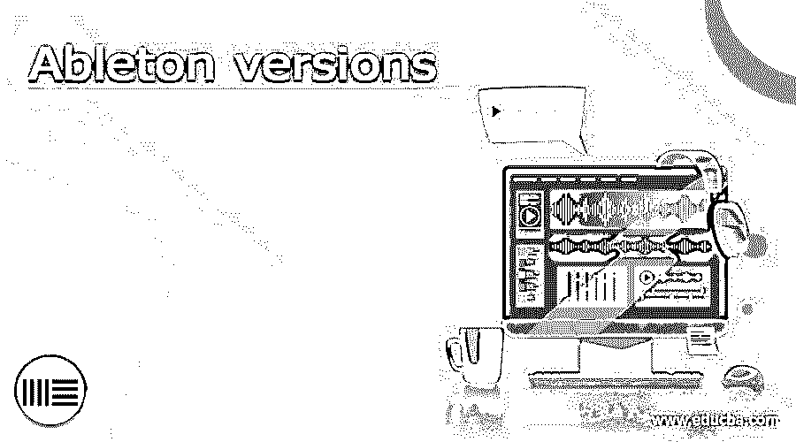

# Ableton 版本

> 原文：<https://www.educba.com/ableton-versions/>

## Ableton 版本介绍

Ableton 版本可以理解为该软件的独立套件，根据用户的要求具有不同的功能。就 Ableton 而言，我们有三个主要版本，这些版本可以命名为 Intro、Standard 和 Suite。这三者都有自己的特性来处理用户的几个需求。Ableton 在有限的时间内提供免费试用，所以你可以检查所有三个版本，以便对它们有一个很好的了解，但如果我告诉你，然后介绍版本有音频编辑以及操作的基本功能，标准版本可以理解它的完整版本，有所有必要的功能，套件版本有一些先进的功能。

让我一个一个地告诉你所有三个版本的重要方面和事实，这样你可以对它们都有所了解，并可以根据你的需要使用它们中的任何一个。

<small>网页开发、编程语言、软件测试&其他</small>

### 阿尔伯特的内向性格

这是这个软件的非常基础的版本，如果你是初学者，想开始学习这个软件，那么你可以使用这个软件的介绍版本。虽然它是这个软件的一个非常基础的版本，但是它有许多特性，所以让我们一个接一个地看看这些特性。

*   **价格:**如果你想拥有 Ableton 软件的介绍版，那么你必须支付 99 美元的订阅费，这是该软件最便宜的版本，插件数量有限。
*   **音频和 MIDI 轨道**:它有 16 个音频轨道和 MIDI 功能，这意味着您只能录制 16 个轨道。它也有高品质的鼓以及乐器样品，使它几乎可以接近非常用户。
*   当你开始使用这个版本的 Ableton 时，你会发现里面有 16 个场景特征。
*   **发送和返回音轨:**在这个版本的工作中，你会发现 2 个发送和返回的数字。
*   **声音:**这个版本提供了 1500 多种声音特性。
*   音频效果:我告诉过你这是一个非常基础的版本，但是你会发现这个版本有 21 种音频效果。
*   MIDI 效果:和音频效果功能一样，我们在这个软件中也有 MIDI 效果功能，它的数量是 11，这意味着你将有 11 种 MIDI 效果。
*   **兼容:**您可以轻松地将此版本用作辅助 DAW，这意味着我们可以使用此版本制作样品图案，并将它们导出到我们的辅助 DAW 中。

因此，如果您正在寻找一个价格合理的应用程序来学习数字音频工作站的基础知识，那么这个版本适合您。

### Ableton 的标准版本

这个可以考虑中等价位版本的 Ableton。所以让我们也讨论一下它的要点。

*   价格:如果你想拥有 Ableton 软件的标准版本，那么你必须支付 499 美元的订阅费，你可以将其视为中等价格版本，这意味着它比 Intro 版本贵得多。
*   **音频和 MIDI 曲目:**正如我们所知，我们在 Intro 版本中有 16 首曲目，但在这个版本中没有曲目限制，这意味着您可以录制、混合以及控制完整的歌曲。
*   **场景:**与音频和 MIDI 音轨一样，它也有无限的场景功能。我们也有更多的插件选项，我们可以在这个软件中安装不同用途的外部插件数量。
*   **发送和返回曲目:**在使用这个版本的过程中，你会发现 12 个发送和返回曲目的编号。您还可以访问一些预加载的样本，这些样本可能包括电子节拍，传统乐器和更多的实验声音。
*   **声音:**这个版本提供了 1800+的声音特性。
*   **音效:**与 Intro 版本相比，该版本有多个音效，共有 36 个音效。
*   MIDI 效果:与音频效果功能相同，我们在这个软件中也有 MIDI 效果功能，它的数量是 13，这意味着你将有 13 种 MIDI 效果。
*   **兼容:**您可以轻松地将此版本用作主 DAW，它是家庭录音室制作人员的首选，可以获得高质量的声音和样本以及现场循环表演。

因此，这个版本的 Ableton 为每个人都提供了一些东西，它还为音乐的高级制作提供了更多的功能，如提取音频到 MIDI 和音频切片到鼓架。

### Ableton 的套装版本

这是另一个版本的 Ableton 的昂贵版本，所以让我们也来讨论一下。

*   价格:如果你想拥有 Ableton 软件的套装版本，那么你必须支付 799 美元的订阅费，这个版本的软件包中有许多插件、声音和许多其他高级功能。
*   **音频和 MIDI 音轨:**与该软件的标准版本相同，它也有无限的音频和 MIDI 音轨。它也有众多的合成器插件，你可以调整以及调整，找到正确的声音按照你的要求。
*   与音频和 MIDI 音轨一样，它也有无限的场景功能。
*   **发送和返回轨道:**它也有发送和返回轨道，与该软件的标准版本 12 相同。
*   声音:这个版本为我们提供了 5000 多种声音功能。
*   **音效:**这个版本有 59 个音效。
*   MIDI 效果:和音频效果功能一样，我们在这个软件中也有 MIDI 效果功能，它的数量是 15，这意味着你将有 15 种 MIDI 效果。
*   **兼容:**您可以轻松地将此版本用于工作室和 liver 性能目的。

### 结论–Ableton 版本

我想现在你已经了解了 Ableton 的版本，也了解了每个版本的不同特性。阅读完这篇文章后，你可以很容易地选择任何一个版本，开始使用 Ableton 进行音频编辑和操作工作。

### 推荐文章

这是一个 Ableton 版本的指南。在这里，我们讨论了 Ableton 的版本，您也可以了解每个版本的不同功能。您也可以看看以下文章，了解更多信息–

1.  [Joomla 版本](https://www.educba.com/joomla-version/)
2.  [CodeIgniter 版本](https://www.educba.com/codeigniter-version/)
3.  [DirectX 版本](https://www.educba.com/directx-versions/)
4.  [cPanel 版本](https://www.educba.com/cpanel-version/)

