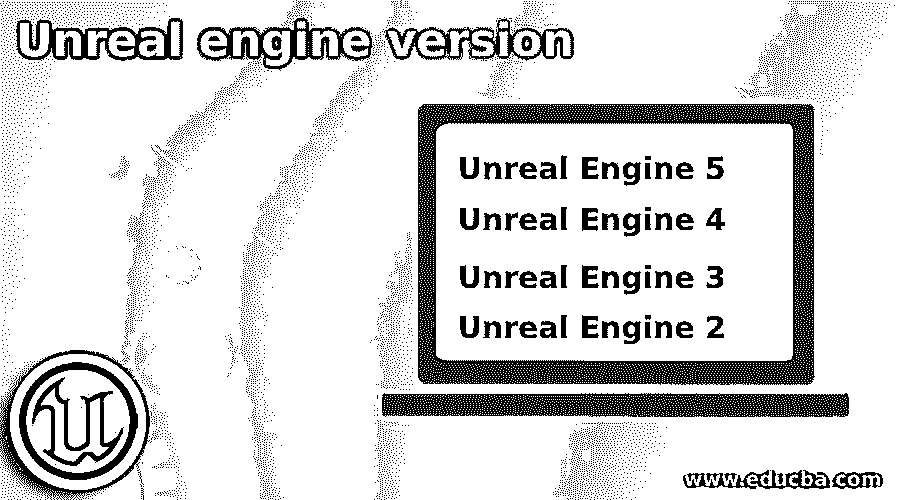

# 虚幻引擎版本

> 原文：<https://www.educba.com/unreal-engine-version/>

## 虚幻引擎版本介绍

虚幻引擎版本可以被称为不同形式的软件，其开发者不时地推出这些软件以克服先前版本的缺点，并向它们添加新的和高级的功能。例如，在第一代虚幻引擎中，它完全依赖于软件渲染，这意味着所有的图形计算都由系统的 CPU 处理，但后来，它使用了附加显卡的功能。与此相同，他们在该软件的不同版本中包含了几个功能。所以今天我们将讨论虚幻引擎的所有版本，从最新版本到旧版本。

### 虚幻引擎的版本

该软件有五个版本，根据时间的要求，它越来越与工作区兼容，虚幻 5 是它的最新版本，所以让我们从该软件的虚幻 5 版本开始。

<small>网页开发、编程语言、软件测试&其他</small>

#### 1.虚幻引擎 5

*   它于 2020 年 5 月 13 日发布，支持所有现有系统，包括下一代游戏机，如 PlayStation 5 和 Xbox 系列 X/S。
*   预计将于 2022 年初全面推出，其所有的先进和令人兴奋的功能使游戏的开发比以前更顺利。
*   非常有趣的功能是 Nanite，它是一个引擎，允许将非常详细的摄影源材料导入到游戏中，并为其观众提供非常有吸引力的外观。
*   Nanite 可以导入任何对象以及包括 ZBrush 和 CAD 模型的环境的任何其他预先存在的 3D 表示。不仅如此，它还可以处理与导入对象相关的细节层次，并使该对象适合目标平台，并绘制距离。

现在让我们转到虚幻引擎 5 的前一个版本，在这个版本之前，我们有虚幻引擎 4，它也有一些独特的功能，所以让我们看看它。

#### 2.虚幻引擎 4

*   Epic Games 的副总裁在 2005 年 8 月发布了虚幻引擎 4，它的主要功能之一是使用体素圆锥跟踪的实时全局照明，消除了预先计算的照明。这个特性提供了游戏开发的下一个层次，并为开发者提供了更多的控制。
*   2014 年 3 月 19 日，它推出了新的许可模式供公众使用，每月支付 19 美元的订阅费就可以使用，但后来在 2015 年 3 月，它发布了订阅更新，对所有用户免费。
*   它还拥有一个 Blueprints 可视化脚本系统，允许游戏开发者快速开发游戏逻辑而无需使用代码，并在设计师、技术艺术家和程序员之间实现良好的管理。
*   它支持许多平台，如微软 Windows，Mac OS，Linux，iOS，Android，HTML，任天堂 Switch，PlayStation，Xbox 等等。

在虚幻引擎 4 之前，虚幻引擎 3 是虚幻引擎的一个版本，所以让我告诉你这个版本的主要方面。

#### 3.虚幻引擎 3

*   它于 2004 年 7 月发布，以第一代为基础，但具有许多高级功能，如程序员可以看到的基本架构决策，这与面向对象的设计有关，基于数据的脚本方法，以及许多其他使游戏开发比以前版本更容易的功能。
*   它支持伽马校正，这是一个高动态范围渲染器。第一批使用虚幻引擎 3 发布的游戏是 Xbox 360 的战争机器和 Windows 的 Roboblitz 这些是在 2006 年 11 月 7 日发布的。
*   最初，它只受到微软 Windows、Xbox 360 和 PlayStation 平台的支持，但后来在 2010 年，iOS 和 Android 也加入了它。Infinity Blade 是第一个 iOS 游戏，而 Dungeon Defenders 是第一个 Android 游戏。

接下来是虚幻引擎版本系列中的虚幻引擎 2，根据它的开发时间，它也有一些好的特性。所以让我们来看看它们。

#### 4.虚幻引擎 2

*   1998 年 10 月，它的开发者正在研究下一代引擎，后来它被发布了。第一款多人射击游戏《美国陆军》是美国陆军基于这款引擎发布的。不久，虚幻在 Xbox 上发布了虚幻冠军，这是第一个利用微软 Xbox live 的游戏之一。
*   虽然它是基于前身，但它有显著的高级渲染功能，以及一个改进的工具集，可以快速获得任何结果。
*   它有能力以比虚幻更细致的方式运行 100 倍的关卡。该引擎包括各种功能，如粒子系统、电影编辑工具、3D Studio Max 和 Maya 使用的导出插件以及 PlayStation 2 中首次展示的骨骼动画系统。

接下来是这个引擎的第一个版本，叫做第一代。所以让我们也来看看它的细节。

**第一代**

*   它是由 Epic Games 的创始人蒂姆·斯维尼开发的，并于 1998 年开始编写这个引擎，用于制作游戏，包括图形、工具和网络功能。
*   最初，渲染完全依赖于软件渲染，这意味着由系统本身的 CPU 处理图形的计算，但后来，它利用附加显卡的功能来实现这一目的。
*   它还有一些其他的功能，如碰撞检测、有限形式的纹理过滤和彩色照明等等。

这是虚幻引擎的五个版本，各有特色。

### 结论

在本文中，我已经向您提供了关于不同版本的虚幻引擎的所有可能信息，现在您已经很好地了解了它是如何开发的，它的开发人员为每个版本添加了不同的更新，以使它们与当时的要求兼容。所以现在你可以用虚幻的版本来控制它。

### 推荐文章

这是一个虚幻引擎版本的指南。这里我们讨论虚幻引擎的所有版本，从最新版本到旧版本。您也可以看看以下文章，了解更多信息–

1.  [虚幻引擎 vs CryEngine](https://www.educba.com/unreal-engine-vs-cryengine/)
2.  [虚幻引擎 vs Unity](https://www.educba.com/unreal-engine-vs-unity/)
3.  [粉笔 vs GIMP](https://www.educba.com/krita-vs-gimp/)
4.  [SCTP vs TCP](https://www.educba.com/sctp-vs-tcp/)

