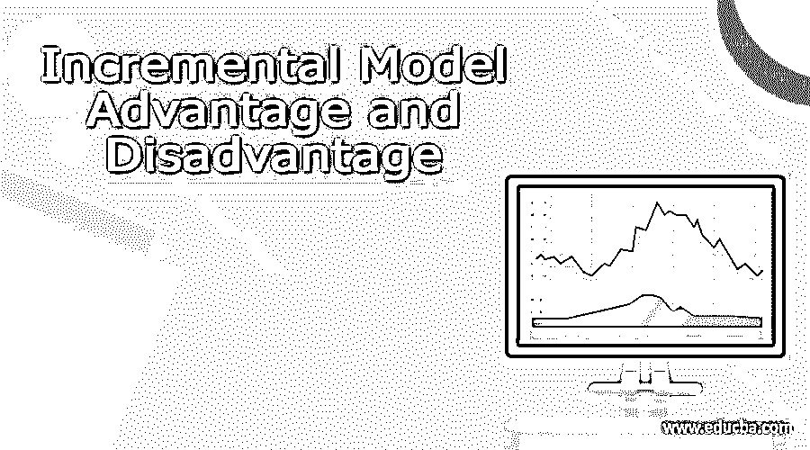

# 增量模式的优势和劣势

> 原文：<https://www.educba.com/incremental-model-advantage-and-disadvantage/>

## 增量模式的优势和劣势

增量模型是软件开发周期中的一个过程，我们将需求分成多个模块。这个模块经历了模型的各个阶段，直到开发模型的目的和完成为止。

这是一个非常重要的模型，我们将需求分成多个构建，每个构建都有自己的生命周期。所有必需的开发阶段都是在所有模块上完成的，这样模块就有了它的任务，并且运行良好。需求、设计、实现和测试阶段由所有模块完成，并且每个模块版本都在前一个版本的基础上增加了新的功能。

<small>网页开发、编程语言、软件测试&其他</small>

这基本上表明增量工作已经完成，软件的开发变得更加顺畅和轻松。它也可以被称为产品的逐步开发。这种增量模型广泛用于各种数据行业，是数据开发活动的最佳实践之一。

在本文中，我们将尝试分析增量模型的优点和缺点。让我们试着更详细地了解一个增量模型。

### 模型优势和劣势

由于这种模式是一种逐步的基于模块的开发模式，这种模式也有一定的优点和缺点，我们可以看到招致。让我们检查一下相同的一些优点和缺点。

#### 优势

1.模块的分布使得 SDLC 更容易。
2。这种模式具有成本效益。
3。根据技能组合合理利用资源。
4。平滑良好的学习图。
5。相对来说导致更快的产品交付。
6。风险很容易管理。
7。可以放不同的发布模式。
8。自始至终实现、分析和检查功能。
9。接触新技术。
10。以前的模型架构可以进一步重用并节省时间。
11。错误很容易被发现。
12。更容易调试。
13。功能性释放
14。更好地支持整个 SDLC。
15。每个模块的功能和集成技术的公平的想法。
16。版本修改很容易。
17。核心功能的开发可以根据客户和产品的使用来实现。

#### 不足之处

1.需要对模型进行很好的规划。
2。应该适当地计划模块破损。
3。在使用模块之前，需要了解整个系统。
4。总成本有时很高。
5。不同的模块可能需要不同的接口，有时可能是新的设置。
6。在任何跨模块依赖的情况下，流水线操作或释放有时会被延迟。
7。端到端的设计图对开发人员来说应该非常清楚。
8。模块需要做的前期定义。

有不同类型的增量模型，其中包括

*   **分期交割:**

一次只能完成项目的一部分。这涉及到团队对单个模块的承诺，该模块可以在成功发布后推出。当需要交叉演示批准时，需要这种模型，因为可以对产品进行分阶段监控。

*   **并行开发:**

这种模型涉及到可以同时处理多个模块并实现功能的方法。这种模式速度更快，并且完全依赖于产品拥有的劳动力。该模型可以实现计划交货。分而治之的机制可以做到这一点。使用这种开发模式可以实现增量资源部署。

### 什么时候使用这种模式？

当企业有以下需求时，可以使用此模型:

1.该产品的领域是新的。
2。团队和技术是新的。
3。一步一步的记录和演示是必要的。
4。需求被区分优先级。
5。基本功能需要快速交付。
6。如果产品需要提前上市。
7。一些模块的详细信息已经收集，或者可能会随着时间的推移而出现。
8。正确理解端到端系统。
9。商业已经度过了低风险阶段。
10。不会发生模块重叠。
11。如果对模型进行任何增强，则更容易管理风险和停机时间。
12。红外线清晰，没有障碍物。
13。批准不需要花费时间和更长的时间。

### 结论

从上面的文章中，我们看到了增量模型。从本文中，我们试图了解这种模型的优缺点以及在 SDLC 中使用了什么。各种优势表明了为什么这种模式被广泛接受。

我们还看到了增量模型的优势及其在各种编程目的中的使用。

### 推荐文章

这是增量模型优缺点的指南。这里我们讨论增量模型的优点和缺点。您也可以看看以下文章，了解更多信息–

1.  [费尔康模型](https://www.educba.com/phalcon-model/)
2.  [软件开发模型](https://www.educba.com/software-development-models/)
3.  [敏捷流程模型](https://www.educba.com/agile-process-model/)
4.  [增量模式](https://www.educba.com/incremental-model/)

