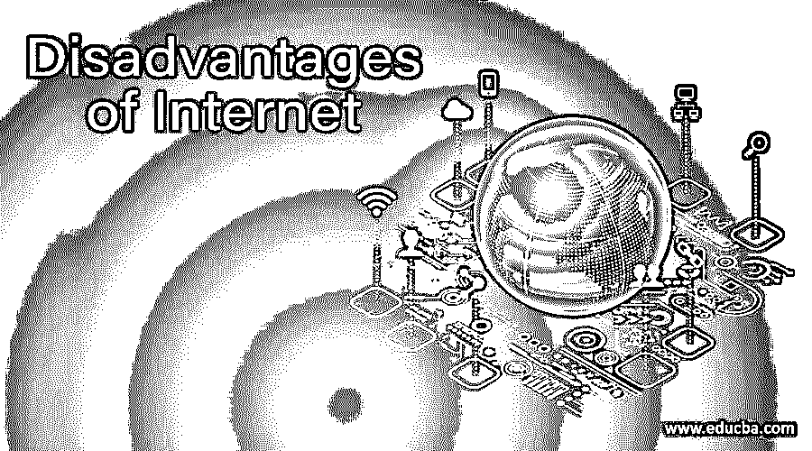

# 互联网的缺点

> 原文：<https://www.educba.com/disadvantages-of-internet/>

## 介绍互联网的缺点

互联网的缺点是，它为许多非法活动提供了一个完美的滋生地，将错误的信息与错误的人联系在一起，容易连接反社会分子以策划阴谋，允许青少年访问禁止的内容，否则在现实世界中不可能，让人们沉迷于游戏/其他不重要的活动，使他们粘在座位上，使他们效率低下，妨碍白领工人的注意力/集中力，并通过搜索引擎轻松地向他们提供信息来扼杀人们的记忆力。

互联网的邪恶直接或间接影响商业运作，由于信息资产被黑客攻击而给组织造成损失，发展针对现有机构的仇恨团体，使人们懒惰和缺乏创新，并允许假新闻和谣言自由传播，破坏了许多人的安宁和平静。

<small>网页开发、编程语言、软件测试&其他</small>

让我们详细分析一下互联网是如何影响我们的。

### 互联网的缺点

虽然互联网是人类最伟大的发明，带来了许多好处，并已深入渗透到政府、商业、教育、电子商务、银行、太空研究、娱乐和新闻媒体，但它也带来了自己的邪恶，并开始影响每个人。以下是互联网如何影响不同领域的案例。

#### 1.在线教育

*   它在教师和学生之间以及学生之间没有或很少提供面对面的互动。它只提供独白的空间，不提供对话。
*   教师不能像个人教室那样对教授给学生的课程产生影响。
*   学生不会像在物理课堂上那样，在观察同学的表现时受到同伴的压力。
*   学生需要付出比物理课更多的努力来掌握一门学科。
*   对一个学生来说，与同学和老师发展关系需要更多的努力。
*   学生需要很强的自我激励能力来参加课程并保持对课程的兴趣。
*   网络学位的价值和认可程度低于物理课程。

#### 2.网上银行

*   欺诈者随时都有可能侵入银行账户，窃取钱财。
*   账户持有人被垃圾邮件欺骗，并被要求分享账户信息，包括密码。
*   不熟悉互联网操作的人需要向代理人寻求银行交易的帮助，并向代理人泄露机密信息。
*   少数银行的网上银行的一些操作有点复杂，在没有明确演示或帮助热线的情况下，用户必须努力完成交易。
*   由于与生俱来的恐惧，人们对涉及巨额金额的网上交易持怀疑态度。
*   由于用户的错误操作或连接问题，完成交易不会正确地通知给账户持有人，增加了用户的焦虑。

#### 3.商业

*   由于完全数字化，该组织的机密数据有被黑客窃取的风险。
*   业务在 IT 上运行，运营可能会受到破坏系统的歹徒的阻碍，给组织造成巨大损失。
*   组织在网络罪犯手中面临着风险，这些罪犯使用恶意软件渗透到系统中，窃取数据并勒索钱财。
*   由于上班时间大量使用互联网进行个人工作和娱乐，白领员工的生产力将会下降。
*   随着手机上互联网的可用性，甚至蓝领员工的生产时间也失去了。
*   互联网为内部员工窃取数据提供了便利
*   黑客使用网络钓鱼攻击，即看起来与带有恶意链接的官方邮件完全相似的伪造邮件，点击该链接将在系统中植入病毒并危及公司的数据

#### 4.社会化媒体

互联网为普通人提供了一个平台，让他们可以与朋友、亲戚和志趣相投的人单独或集体分享个人内容。许多社交媒体应用程序，如 WhatsApp、脸书、Twitter、Myspace、Instagram、linked in 等。，应运而生。人们开始使用这些应用程序聊天、分享，并永远保持在线联系。

最初，一切都很好；人们发现与他人保持联系既方便又容易，他们也享受着新技术的好处。在没有意识到社交媒体的邪恶一面的情况下，企业和其他商业部门已经开始挖掘新媒体的潜力及其影响力，并开始将其用于商业交易和为其产品做广告。但是坏事接踵而至，邪恶已经开始露出它们丑陋的嘴脸，详情如下

*   照片和其他个人物品落入了闹事者的手中。他们非法复制这些内容，并将其用于错误的目的，并给原始所有者带来声誉。
*   有时，内容被利用现代高科技工具操纵，犯罪分子威胁原始所有者，勒索他们，并勒索金钱。
*   内容被违法者盗版并用于他们的个人利益。侵犯版权的事件在社交媒体上比比皆是。
*   一些歹徒向个人、团体、组织、机构、宗教团体传播仇恨信息，以扰乱情绪，造成损害，羞辱个人或组织的形象和品牌，造成痛苦并满足其虐待狂的快感。
*   社交媒体不是经过审查的媒体，像脸书和 Twitter 这样的应用程序所有者无法对媒体上发布的不良内容进行监控，也无法对其进行监管。
*   在这种媒体中，人物暗杀、喷涌仇恨反应、死亡威胁和咆哮是常见的。
*   这个媒体鼓励并提供了一个平台，让人们在没有任何礼仪，尊重和尊重他人的情况下发布他们的膝跳反应，并使消息的原始所有者失眠。

#### 5.个人的

*   人们沉迷于游戏、YouTube、WhatsApp 等互联网，花费太多时间牺牲对工作的专注。
*   持续接触手机和电脑屏幕会导致眼睛疲劳和身体疼痛。
*   物理的、社会的互动是互联网的敌人，人们被手机和笔记本电脑束缚住了，这导致了人们的抑郁。
*   正如计算器扼杀了人们的算术技能一样，互联网缩短了思维过程，因为人们倾向于在有疑问时参考搜索引擎，而不是绞尽脑汁从记忆中获得答案。
*   互联网使人们变得懒惰，减少身体活动，导致健康问题。

### 结论

虽然互联网有一些缺点，如本文所列，但它的优点大于缺点，今天没有它人们就无法生活。互联网渗透到我们的个人生活、商业运作和许多机构的运作中。我们需要改变我们在互联网世界中的工作方式，并制定更多的治理和法规来生活和享受互联网的好处。

### 推荐文章

这是一本关于互联网弊端的指南。在这里，我们讨论列出的几个缺点，它们的优点大于缺点，今天人们不能没有它们。您也可以看看以下文章，了解更多信息–

1.  [互联网的使用](https://www.educba.com/uses-of-internet/)
2.  [什么是互联网应用](https://www.educba.com/what-is-internet-application/)
3.  [网络营销工具](https://www.educba.com/internet-marketing-tool/)
4.  [基于互联网的商业理念](https://www.educba.com/internet-based-business-ideas/)

