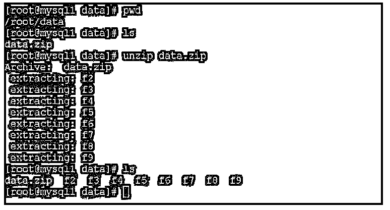
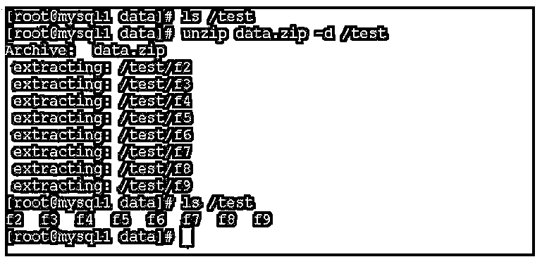

# CentOS 解压缩

> 原文：<https://www.educba.com/centos-unzip/>

## CentOS unzip 简介

以下文章提供了 CentOS unzip 的概要。在 Linux 环境中，我们支持多用户登录。因此，它将生成大量的日志信息、应用程序信息、作业级别信息等。在这里，我们可以认为信息只不过是一个日志。很难共享或管理一个非常小的文件，所以我们把它压缩成 zip 格式。将多个文件移动或传输到单个文件(即 zip 格式)将非常容易。但是当 zip 文件发送到目的地时，我们需要提取它。在这里，解压缩概念进入了画面。解压缩只是一个提取 zip 文件内容的过程。根据要求，我们需要选择压缩技术。

**CentOS unzip 的语法:**

<small>网页开发、编程语言、软件测试&其他</small>

*   **unzip:**unzip 是可以用作解压缩过程命令的关键字。这将有助于在 CentOS 环境中提取 zip 文件。我们可以在语法或命令中使用 unzip 关键字。它将接受选项、文件名等参数。unzip 命令将有助于解压缩 zip 文件。
*   **选项:**我们可以提供不同的标志作为与 unzip 命令兼容的选项。
*   **文件名:**我们需要提供 zip 文件名来解压命令。

### CentOS unzip 如何工作？

在 CentOS 环境中，不存在 unzip 命令或实用程序。因此，我们需要在工作环境中安装解压缩包。我们可以使用 rpm 或 yum 实用程序来安装它。当解压缩文件时，它将解压缩 zip 文件中所有可用的数据。

以下是与“unzip”命令兼容的选项列表。

*   **–Z:**如果我们在 unzip 命令中使用“-Z”选项，那么 unzip 命令中的其余选项将作为 zipinfo(1L)选项。了解更多信息。对于这些选项的描述，我们需要查看正确的手册页。
*   **–A:**对于 DLL 的编程接口(称为 API)，我们对 OS/2，Unix DLL 使用-A 选项。它将打印 API 的扩展帮助。
*   **–c:**我们可以使用“-c”选项将文件提取到标准输出或屏幕(“CRT”)。我们也可以说“-c”选项类似于-p 选项。但是在这里，除了从 unzip 命令中提取的每个文件的名称都被打印出来。“-c”选项没有在 unzip 用法中列出。
*   **–f:**“-f”选项将用于刷新现有文件，即它将只提取那些已经存在于磁盘上的文件。它将比磁盘副本更新。默认情况下，解压缩查询将在覆盖之前运行，但是如果我们使用-o 选项，它可能会禁止查询。注意，在许多操作系统中，如果我们需要正确使用-f 和-u 选项，必须正确设置时区(TZ)环境变量。为了正常工作(在 UNIX 下，该变量通常是自动设置的)。原因是 DOS 格式的文件时间和 Unix 格式的文件时间不同。DOS 格式文件将始终使用本地时间，UNIX 或 Linux 操作系统将始终使用 GMT/UTC 格式。
*   **–l:**如果我们使用“-l”选项，那么它将以短格式打印信息。它将列出存档文件。它将打印不同的选项，如修改日期、指定文件的时间、名称、未压缩文件的大小等。它还将打印其中指定的文件总数。在 OS2_EAS 中，在这个下面，如果解压是编译好的。l 选项也将根据大小打印列表列。此外，我们还可以看到 zip 文件注释和单个文件注释。
*   **–p:**借助“-p”选项，我们可以借助管道实用程序(即 stdout)提取文件。这里什么都没有，但是文件数据被发送到 stdout。因此，文件总是以二进制格式提取。由于相似，它们被存储，即没有转换。
*   **–t:**此选项将有助于测试存档文件。如果我们使用此选项，它将提取内存中提供的每个输入文件，然后比较循环冗余校验，即 CRC。它也将增强校验和。
*   **–T:**在大多数情况下，它会在存档文件上设置时间戳。它也将对应于 zip。go 选项，只是它可以用于通配符 zip 文件。这个选项比普通选项快得多。
*   **–u:**这将有助于更新现有文件。如果需要，它还会创建新的。根据“-f”选项，“-u”选项也将执行与-f 选项相同的功能。它将提取磁盘上比相同文件更新的文件。此外，它将提取磁盘上不存在的文件。我们需要正确设置时区。

### CentOS 解压缩示例。

以下是 CentOS unzip 的示例:

#### 示例#1

CentOS unzip:解压缩文件。

在 CentOS 环境中，我们能够解压缩文件。

**代码:**

`unzip data.zip`

**说明:**

*   按照上面的命令，我们正在解压“data.zip”文件。

**输出:**

#### 实施例 2

CentOS unzip:将文件解压缩到特定目录。

使用 unzip 命令，我们能够将文件解压缩到特定的目录路径中。

**代码:**

`unzip data.zip -d /test`

**说明:**

*   按照上面的命令，我们将文件解压到特定的位置，即/test 目录。

**输出:**

### 结论

我们已经看到了“CentOS unzip”的完整概念，以及带有不同输出的正确示例、解释和命令。默认情况下，解压缩包在最小 CentOS 安装中不可用。因此，我们需要手动安装。根据要求，我们可以使用 unzip 命令的不同选项。

### 推荐文章

这是一个 CentOS 解压指南。这里我们讨论一下简介，CentOS unzip 是如何工作的？以及更好理解的例子。您也可以看看以下文章，了解更多信息–

1.  [CentOS 命令](https://www.educba.com/centos-commands/)
2.  [什么是 CentOS？](https://www.educba.com/what-is-centos/)
3.  [如何安装 CentOS？](https://www.educba.com/install-centos/)
4.  [CentOS 添加 sudo 用户](https://www.educba.com/centos-add-sudo-user/)。

