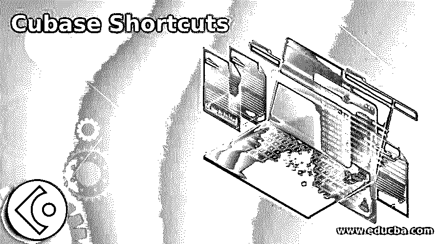

# 立方快捷方式

> 原文：<https://www.educba.com/cubase-shortcuts/>

## Cubase 快捷方式介绍

Cubase 快捷键可以理解为帮助我们快速访问任何工具或选项命令的键盘组合键。当我们使用该软件的快捷方式时，它加快了我们的工作效率，我们有快捷方式命令用于工具面板的工具，用于音频编辑的参数设置，用于和弦设置，用于设备的不同面板的部分，一些基本的快捷方式命令也在这里，如撤消，重做，剪切，复制等等。

在这里，我们将看到所有重要的命令，涵盖几乎所有的基本以及先进的快捷方式命令，以便您将有更多的工作技术在这个软件的命令。在这里，我们将在不同部分看到该软件的快捷方式，如工具面板、音频设置、自动化等工具的快捷方式。

<small>网页开发、编程语言、软件测试&其他</small>

### Cubase 工具面板的工具快捷方式

下面给出了 cubase 工具面板的工具快捷方式:

*   **鼓槌工具(0):** 要激活鼓槌工具，我们应该按下键盘的零数字键。
*   **选择工具(1):** 通过按下键盘的 1 个数字键，我们可以激活选择工具。
*   **范围工具(2):** 要快速访问范围工具，您必须按下键盘的 2 个数字键。
*   **分割工具(3):** 按键盘的 3 个数字键进行分割。
*   **涂胶工具(4):** 按键盘的 4 个数字键可以进入涂胶工具。
*   **橡皮擦工具(5):** 按键盘的 5 个数字键作为橡皮擦工具的快捷键。
*   **缩放工具(6):** 键盘的 6 个数字键可以作为缩放工具的快捷键。
*   **静音工具(7):** 通过按键盘的 7 个数字键，我们可以激活静音工具。
*   **绘图工具(8):** 绘图工具的快捷键是键盘的 8 个数字键。
*   **播放工具(9):** 键盘的 9 个数字键可以作为播放工具的快捷命令。
*   **上一个刀具/下一个刀具(10):** 键盘的 10 个数字键可以作为上一个刀具或下一个刀具选择的快捷命令。

### 音频设置的快捷键

以下是音频设置的快捷键:

*   **调节范围(A)的淡入度:**要调节所选范围的淡入度，我们可以按键盘上的一个键。
*   **Crossfade/Fade (X):** 按下键盘的 X 键，我们可以进行 Crossfade 编辑提议。
*   **直接脱机处理(F7):** 在脱机模式下，按键盘的 F7 功能键直接处理您的编辑。

### 自动化快捷键

下面给出了自动化的快捷键:

*   **打开/关闭所有轨道的阅读自动化(Alt + R):** 按下键盘的 Alt + R 键，您可以打开或关闭所有轨道，以实现阅读自动化。
*   **打开/关闭所有曲目的自动书写功能(Alt + W):** 按下键盘的 Alt + W 键，您可以打开或关闭所有曲目，以实现自动书写功能。
*   **自动化面板(F6):** 按键盘的 F6 功能键，启用不同用途的自动化面板。

### 和弦的快捷键

以下是和弦的快捷键:

*   **和弦垫(Ctrl + C):** 键盘的 Ctrl + C 组合键可以作为和弦垫的快捷键。

### 设备的快捷键

以下是设备的快捷键:

*   **MixConsole 下区(Alt + F3):** 对于 MixConsole 下区，我们可以按键盘的 Alt + F3 功能键。
*   **混音器(F3):** 按下键盘的 F3 功能键，我们可以激活混音器设备。
*   **虚拟键盘(Alt +K):** 要拥有虚拟键盘，我们可以按下键盘的 Alt +K 键。
*   **VST 连接(F4):** 我们可以按键盘的 F4 功能键激活 VST 连接设备。
*   **VST 仪器(F11):** 与 VST 连接相同，我们为 VST 仪器提供快捷命令，即键盘的 F11 功能键。
*   **VST 演奏(F12):** 键盘的 F12 功能键将激活 VST 演奏装置。

### 用于剪切、复制、粘贴、撤消和重做的快捷键

下面给出了剪切、复制、粘贴、撤消和重做的快捷键:

*   **剪切(Ctrl + X):** 通过按下键盘的 Ctrl + X 键，我们可以剪切我们选择的元素，用于音频编辑过程。
*   **复制(Ctrl + C):** 与剪切命令相同，我们可以通过按下键盘的 Ctrl + C 键来复制我们想要的元素。
*   **剪切(Ctrl + V):** 要粘贴任何复制或剪切的元素，我们可以按键盘的 Ctrl + V 键。

### 编辑命令的快捷键

下面给出了编辑命令的快捷键:

*   **激活或取消激活聚焦对象(Alt + A):** 要激活或取消激活编辑过程中的聚焦对象，我们可以按下键盘上的 Alt + A 键，这意味着当我们第一次按下这些键时，它将激活该命令，当我们再次按下这些键时，它将取消激活该命令。
*   **自动滚动开/关(F):** 按下键盘的 F 键，将启用或禁用该软件的自动滚动功能。
*   **删除(Delete):** 如果你想删除你选中的元素，你只需按键盘上的 Delete 键。
*   **复制(Ctrl + D):** 如果您想在编辑过程中复制您想要的元素，那么您只需选择该元素并按下键盘的 Ctrl + D 键。
*   **扩大/缩小(Alt + E):** 要扩大或缩小层长，可以按键盘的 Alt + E 键。
*   **插入静音(Ctrl + Shift + E):** 按下键盘的 Ctrl + Shift + E 键，会在你选择的区域插入静音。
*   **反转(Alt + F):** 按下键盘的 Alt + F 键，执行反转命令。
*   **光标左侧选择(E):** 按键盘的 E 键，在光标左侧进行选择。
*   **将选择边写入光标(D):** 在光标右侧按键盘 D 键进行选择。
*   **静音(M):** 使用键盘时，按下键盘的 M 键，使音频静音。
*   **使对象静音/取消静音(Alt + M):** 与静音相同，我们有使对象静音或取消静音的命令，您可以通过按键盘的 Alt + M 键来完成。

### 结论 Cubase 快捷方式

这些是工具的一些重要快捷键，也是这个软件的命令，你可以在这个软件的任何项目中使用它们。这些快捷方式将帮助你提高工作技能，也为你提供高效的工作能力。

### 推荐文章

这是一个立方快捷方式的指南。这里我们讨论 cubase 工具面板的工具快捷键，音频设置快捷键，设备和编辑命令。您也可以看看以下文章，了解更多信息–

1.  [谷歌文档快捷方式](https://www.educba.com/google-docs-shortcuts/)
2.  [微软 Word 快捷键](https://www.educba.com/microsoft-word-shortcut-keys/)
3.  [谷歌幻灯片快捷方式](https://www.educba.com/google-slides-shortcuts/)
4.  [写字板快捷键](https://www.educba.com/wordpad-shortcut-keys/)

