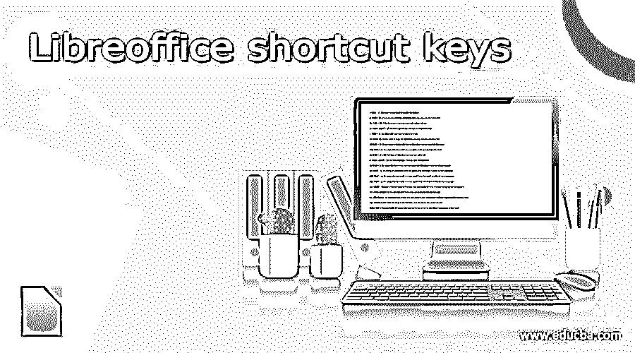

# Libreoffice 快捷键

> 原文：<https://www.educba.com/libreoffice-shortcut-keys/>

## 图书馆快捷键简介

LibreOffice 中有许多快捷键很容易掌握。以下是如何利用这种媒体的完整指南。请继续阅读，了解最重要的快捷方式。OpenOffice 的继任者 LibreOffice 已经成为创建办公数据、保存记录、创建内容等的重要工具。通过将 LibreOffice 用作桌面应用程序，用户可以利用 LibreOffice 生成优秀的数据和办公基础，如图表、演示文稿等。当涉及到创建可以打印或保存为数字文件的信息时，它是一个游戏规则改变者。然而，Libre Office 是微软 Office 的免费替代品。

### 图书馆快捷键

让我们来看看 Libre Office 快捷键

<small>网页开发、编程语言、软件测试&其他</small>

**一、Ctrl + J** :这个关键字用来给事物正名

**二。如果你想加双下划线，你可以使用这个关键字。**

**三世。Ctrl + H:** 这个关键字用来查找和替换东西

**四。Ctrl + Shift + P:** 对于上标，可以使用这个关键字。

**v. Ctrl + L:** 对于左对齐，可以使用这个关键字。

六。如果你想靠右对齐，你可以使用这个快捷键。

**七。Ctrl + Y:** 如果你想重新载入最后一个动作那么你可以使用这个关键字，

**viii。Ctrl + 0:** 通过使用这个关键字你可以应用正文段落文本样式。

**九。Ctrl + A:** 借助这个关键字你可以全选

**x. Ctrl + Shift + B:** 对于下标，可以使用这个关键字。

**xi。Ctrl + 1:** 通过使用这个关键字，可以在段落中应用标题 1 样式。

**十二。Ctrl + 2:** 通过使用这个关键字，可以将它应用到段落中的 head 2 样式。

**十三。Ctrl + 3:** 通过使用这个关键字，可以将它应用到段落中的 head 3 样式。

**十四。Shift + Enter:** 在这个键的帮助下，可以在不改变段落的情况下断行。

**十五。Ctrl+Enter:** 如果使用这个关键字，可以手动分页

**xx。Alt+Enter:** 通过使用这个关键字，您可以在不应用数字样式的情况下插入一个新段落

**二十一。向左箭头:**在左键的帮助下，可以将光标向左移动。

Xxii。Ctrl +向左箭头:通过使用这个关键字，你可以直接跳到单词的开头

**二十三。向右箭头:**在右键的帮助下，你可以向右移动光标。

**二十四。shift+向下箭头:**使用该关键字，可以选择向下的行。

**二十五。Shift+Home:** 通过使用这个快捷键，你可以开始行

**二十六。End:** 当您按下 End 关键字时，您将直接转到该行的末尾。

**二十七。Ctrl+Home:** 有了这个关键字的帮助，就可以开始文档了

**xxviix。向上箭头:**在向上键的帮助下，你可以将光标向上移动

**xxx。向下箭头:**在向下键的帮助下，你可以将光标向下移动

让我们来看看 LibreOffice 的功能键

**1。F2:** 该关键字用于编辑栏

**2。F3:** 在这个关键字的帮助下你可以完成自动正文

**3。F4:** 借助这个关键字你可以查看开放的数据源

**4。F5:** 如果您按下 F5 键，您可以打开和关闭导航器

**5。F7:** 按这个快捷键可以检查拼写

**6。F8:** 按这个快捷键你可以添加扩展模式

**7。Shift + f8:** 借助这个关键字你可以打开或关闭你的场底纹

**8。Ctrl + F9:** 在这个的帮助下，我们可以看到字段

**9。Shift + F11:** 通过使用这个关键字你可以创建风格

10。F12: 你可以在编号上用这个关键字

这里有更多的钥匙，如

**1。Ctrl + Home:** 假设当前单元格不为空，这个函数返回到表格的开头继续。除非另有说明，否则按任意键将转到活动单元格的开头，按任意键将打开当前表格，再次按任意键将打开文档。

**2。Ctrl + tab:** 如果当前单元格为空，则转到表格的末尾。相反:第一次按结束当前表格，第二次按移动到活动单元格的末尾，第三次按完全结束文档。

**3。Ctrl+Shift+F10:** 要快速停靠或取消停靠导航器、样式和格式窗口或其他窗口，请使用此组合。

**4。Shift+Ctrl+Del:** 如果没有选择完整的单元格，则从光标到当前句子结尾的文本被删除。要擦除后续单元格的内容，请将光标移动到当前单元格的末尾，并选择无完整单元格。

要删除下面的语句并将其内容移到最后一个表格单元格中，请不要在表格中选择单元格，并将光标放在它们的末尾。如果表格后面有一个空行，空行将被删除。

### 结论

在本文中，我们看到了 LibreOffice 快捷键。通过使用这些快捷方式，你可以节省你的时间，这将减轻工作。我希望你喜欢这篇文章。

### 推荐文章

这是一个图书馆快捷键指南。在这里，我们讨论图书馆办公室快捷键，通过使用这些快捷键，你可以节省你的时间。您也可以看看以下文章，了解更多信息–

1.  [Illustrator 快捷键](https://www.educba.com/illustrator-shortcut-keys/)
2.  [谷歌文档快捷方式](https://www.educba.com/google-docs-shortcuts/)
3.  [ArchiCAD 快捷键](https://www.educba.com/archicad-shortcuts/)
4.  [OneNote 快捷方式](https://www.educba.com/onenote-shortcuts/)

