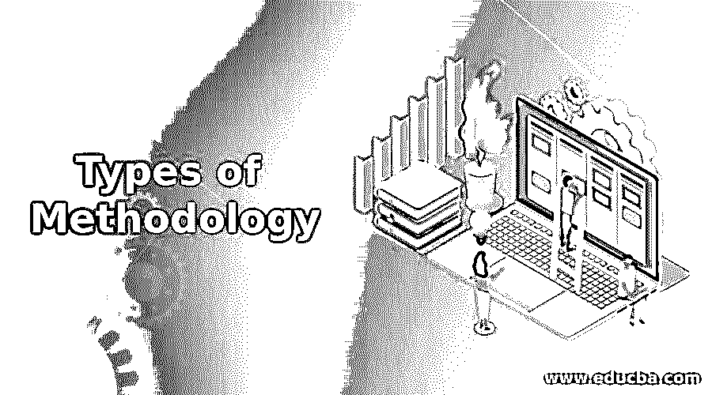

# 方法论的类型

> 原文：<https://www.educba.com/types-of-methodology/>

## 方法论类型介绍

这种方法是在研究领域中系统地、理论地进行的整体分析。它包含与该知识分支相关的方法的原则和目标。它包含了关于不同阶段、范例、定量模型、理论研究和定性方法的想法。[方法的概念](https://www.educba.com/what-is-methodology/)不是给你的问题一个解决方案，而是支持被认为是解决方案的步骤被标记和处理以计算正确的结果。因此，本文将简要介绍为解决方案分析而实施的不同方法。

### 带解释的方法类型

用于运用任何概念的原则的分析和原则应该是清楚的，并且要注意。方法的系统思想应该在概念的学科中实现，并解释方法论的描述。在开始任何项目之前，这个人应该对他的方法有足够的了解，这个方法将会在他的项目中实施。人们使用的主要方法是混合的、定量的、定性的方法。在这些大类下，很少提交调查、自我报告、研究分析和其他专业报告的案例。术语“方法”代表了获取知识所必须采取的步骤。它定义了数据收集的方法和数据组织的方式，并给出了要计算的精确结果。它并不代表为实现目标而在适当程序中遵循的任何方法和对过程的种类和性质的关注。当有一个适当的结构来研究有关的方法时，它包括提供一个建设性的和通用的框架。它可以被分解成块、子过程、组合以及它们序列的变化。

<small>网页开发、编程语言、软件测试&其他</small>

建设性的框架是由范式代表的，范式的持续发展缓和了任何特定的方法论。该算法也类似于具有连续框架的范例，其中构造基于逻辑数据，而不是物理和连接组件的序列。任何对结果计算的描述都等同于方法论，具有重要的认识论意义，并限制程序的过程。这也限制了它在组织方法中使用的一套工具和手段方面的功能。简单来说，就是在项目研究中做出的设计，制定项目的程序，通过使用或不使用工具或仪器来达到预期的结果。

在方法论的过程中，方法是不能互换的。但是在过去的几年里，这种方法和它的步骤导致了混乱和误解，这种混乱和误解经历了在构建研究中隐含的适当分析。

#### 1.定性研究

定性研究的方法旨在探索具体的过程，而不是为了证明任何预测。它主要是在社会科学、教育、访谈、观察和其他焦点团体中收集信息。它提供没有任何上下文信息的原始数据，上下文信息在文化上是同义词，表示个人信息。国际著名的家庭健康组织出版的指南详细解释了定性研究方法。因此，在人们选择任何方法之前，最好参考一下。这本书有助于在项目分析的许多可用方法中选择收集数据的正确方法。

#### 2.定量方法

这种方法比其他定性方法更有意义。在这里，分析师构建假设，而不是描述或探索现象。它处理统计数据和事实。在医学和科学领域进行定量研究。

#### 3.混合方法

这种方法包括定量和定性研究。它使用不同的测量方法，既包括观察和采访等上下文解释，也包括统计事实。在混合方法的帮助下，分析师可以在多个阶段对主题进行更深入的调查。这种深入的分析有助于分析师获得对共同主题的不同观点。混合方法论融合了更多的哲学概念，使不同的理论和思想完美融合。

#### 4.设计框架

在每种方法中，不同的设计为研究提供了一种哲学或框架。它比正常的方法更不同。例如，如果设计集中于描述或探索一个特定的案例，一个团体，或一个人，用户需要各种各样的观察，自我报告和访谈。它包括各种主题，以形成一幅完整的画面。这张图片或特定的情况给出了一个简单的例子的情况下，可以归类到一个类似的人口。

提交任何项目的重点不仅仅是简单描述应用的方法，而是证明你是如何实施和展示研究的。研究应以研究问题和研究目标为基础。它应该解释目标，读者应该选择一个合适的方法来解决所有出现的问题陈述以及研究问题。但是对整个部分的解释不应该偏离项目的中心目的。但是在定性研究中，分析依赖于图像、观察和语言，包括主题分析、内容分析和话语分析。

对单词及其同义词、句子和短语的讨论和分类被称为内容分析。对信息进行编码和仔细检查以发现广泛的模式和主题被称为主题分析。交流的方式和它们在社会环境中的意义被称为话语分析。在研究中实施之前，用于排序、测量、分类和寻找序列以使其一般化的一些定量技术。定量方法的最好例子是进行调查。定性技术适用于解释、说明、语境化和收集特定概念的见解。定性技术的完美例子是进行访谈。数字测量和深度探测的结合使混合技术成为可能。

### 结论

市场研究是确保初创企业达到高标准的一个重要方面。目标营销也提供了一个健康的竞争，通过实施这些方法来获得高额利润。

### 推荐文章

这是一个方法论类型的指南。在这里，我们还讨论了方法的介绍和类型，以及详细的解释。您也可以看看以下文章，了解更多信息–

1.  [迭代方法](https://www.educba.com/iterative-methodology/)
2.  [金博尔方法学](https://www.educba.com/kimball-methodology/)
3.  [看板方法](https://www.educba.com/kanban-methodology/)
4.  [项目管理方法](https://www.educba.com/project-management-methodology/)

