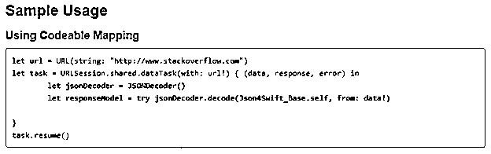
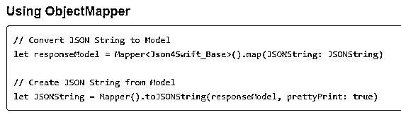
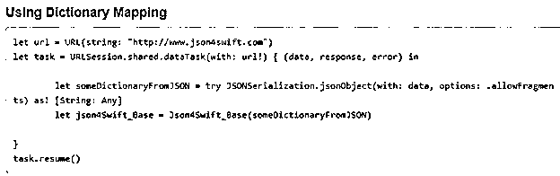
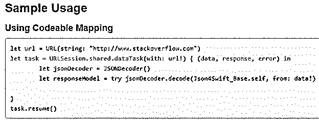
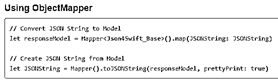
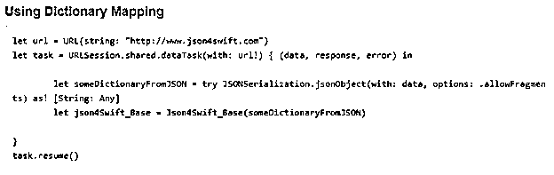

# Swift JSON

> 原文：<https://www.educba.com/swift-json/>

## Swift JSON 简介

Swift JSON 通过返回一系列格式化数据或信息，用于 IOS web 应用程序与服务器的通信。这种以适当的层次方式组织的格式化数据被称为 Swift JSON。Foundation framework 包含一个名为 JSONSerialization 的类，专门用于将 web 应用程序中涉及的任何 JSON 转换为 Swift 数据类型，如数组、数字、布尔值、字符串和字典。很难预测基于 JSON 的 web 应用程序的值将作为返回数据的一部分接收的实际结构或顺序。

**语法:**

<small>网页开发、编程语言、软件测试&其他</small>

任何 Swift JSON 都没有合适的语法，它可以是包含有序数据的任何资源文件，如下所示，但在验证任何 JSON 数据时，缩进确实很重要，因为不正确的 JSON 输入可能会有所不同，并且在解析和遍历时会有不同的行为。

`{
"title": "some_data",
"url": "any_url_can_be_included",
"category": "Category_for_swift_language",
"views": 25648
}`

### JSON 在 Swift 中是如何工作的？

*   当任何 web 应用程序试图与其他服务器通信时，任何编程语言中的 JSON 解析或操作都是一种常见的功能。
*   任何处理 JSON 数据的 web 应用程序都试图以有序的方式解码 JSON 数据。快速的 JSON 解析对于任何 IOS 开发者来说都是非常重要的，因为他们通常会熟悉这些类型的数据。
*   swift 中的解码模块非常灵活，非常容易理解，不需要任何外部 API 的支持。
*   有时，包含 JSONSerialization 类方法的 swift JSON 会返回任何类型的值，并在数据无法轻松解析的情况下抛出错误，然后会向用户提供带有错误提示的正确验证，以识别实际的异常。
*   尽管 JSON 数据将得到验证，但有时 JSON 可能包含单个值，web 应用程序的响应可以将对象或数组编码为任何顶级对象进行操作。
*   与 swift 相关的所有数据类型都根据需要使用，并且可以考虑任何可选值。
*   非常需要从模型-视图-控制器设计模式中创建模型对象，这种模式通常用于将 json 数据转换为特定于模型视图中应用程序领域的对象。
*   如果应用程序与一个或多个 web 服务相关，并且没有为模型对象的表示返回单个或一致的模型，则考虑实现几个初始化器来处理所有可能的表示。
*   JSON 初始化器在提取和获取有错误和异常的详细实现时帮助很大。使用错误协议进行错误处理有助于使用失败协议进行反序列化。
*   很多时候，应用程序会为任何资源返回多个端点，这些资源按照任何特定的协议返回单个 JSON 响应。
*   搜索端点可以返回零个或多个端点，在这种情况下，所请求的查询在呈现给端点时可以包含更多或其他元数据。
*   JSON 解析器在解析中起着关键作用，因为它有助于使整个 JSON 数据以适当的可视化格式组织起来，这给人一种数据可以以适当的方式组织起来的印象。
*   Swift 是一种编程语言，通过给出操作和操纵的适当理想化和组织的概念，允许程序员以非常简单和有效的方式使用和制作有序和可视化的数据。

### Swift JSON 示例

以下是下面提到的例子。

#### 示例#1

这个程序演示了 JSON 数据，其中输入提要表示如下，执行 JSON 解析后的输出提要显示为输出。但是它提供了带有可编码映射的示例使用提要。

**代码:**

`{
"title": "Usage of the optional Swift language.",
"version": "4.0",
"category": "Swift_version",
"views": 25642
}`

**输出:**

#### 实施例 2

这个程序演示了 JSON 数据，其中输入提要用与示例 1 相同的输入来表示，只是 JSON 解码器将利用对象映射器将 JSON 字符串转换为模型。这显示在如下所示的输出中:

**代码:**

`{
"title": "Usage of the optional Swift language.",
"version": "4.0",
"category": "Swift_version",
"views": 25642
}`

**输出:**

#### 实施例 3

这个程序演示了 JSON 数据，其中输入提要用与示例 1 相同的输入来表示，但是不同之处在于，JSON 解码器将利用字典映射器将 JSON 字符串转换为模型。这显示在如下所示的输出中:

**代码:**

`{
"title": "Usage of the optional Swift language.",
"version": "4.0",
"category": "Swift_version",
"views": 25642
}`

**输出:**

#### 实施例 4

这个程序演示了每个定义的键的自定义映射，以及 blog 和键/值对与 JSON 的映射，并将键编码作为 JSON 到 blog 的主要转换。

**代码:**

`{
"title": "Sat_Sun_Week:end_Comboff",
"version": "swift_version_4.0",
"visitors_way": 258965,
"posts_for_members": 62542
}`

**输出:**

#### 实施例 5

这个程序演示了每个定义的键的自定义映射，用 JSON 映射一个 blog 和键/值对，并使用对象映射器进行表示，如输出所示。

**代码:**

`{
"title": "Sat_Sun_Week:end_Comboff",
"version": "swift_version_4.0",
"visitors_way": 258965,
"posts_for_members": 62542
}`

**输出:**

#### 实施例 6

这个程序演示了每个定义的键的自定义映射，以及 blog、键和值对与 JSON 的映射，并使用字典映射器进行表示，如输出所示。

**代码:**

`{
"title": "Sat_Sun_Week:end_Comboff",
"version": "swift_version_4.0",
"visitors_way": 258965,
"posts_for_members": 62542
}`

**输出:**

### 结论

Swift JSON 是验证并使整个数据集和信息以可视化的方式组织起来供程序员使用的恰当方式。任何 web 应用程序和服务器之间的成功通信都非常有助于分析整个应用程序，以便有效地在所有应用程序之间统一进行产品分析和信息划分。

### 推荐文章

这是 Swift JSON 的指南。在这里，我们讨论 JSON 如何在 Swift 和示例中工作，以及代码和输出。您也可以看看以下文章，了解更多信息–

1.  [Swift 版本](https://www.educba.com/swift-version/)
2.  [JSON 解析器](https://www.educba.com/json-parser/)
3.  [反应原生迅捷](https://www.educba.com/react-native-swift/)
4.  [Swift For Loop](https://www.educba.com/swift-for-loop/)

