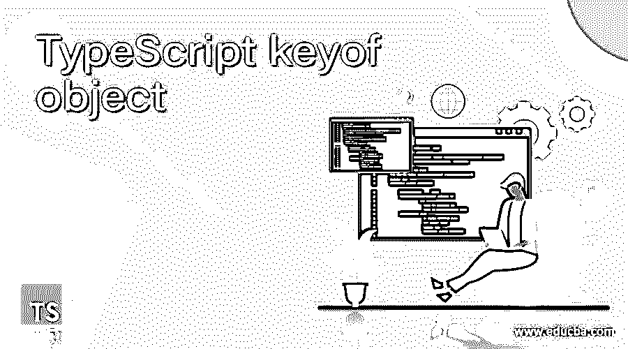
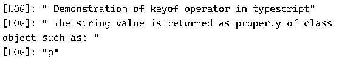
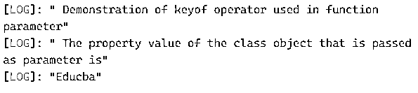

# 对象的 TypeScript 键

> 原文：<https://www.educba.com/typescript-keyof-object/>




## 对象的 TypeScript 键介绍

在 typescript 中，keyof 被定义为用于任何对象类型的索引类型查询运算符。该对象类型的 key 将是对象名称的属性的并集，这也适用于用户属性的对象类型，它产生其键的类型文字并集，此处的类型可以是字符串或数字文字。一般来说，我们可以在 typescript 程序中声明的类型之前使用关键字“keyof”来定义它，这类似于 javascript 中的 object.keys，其中在 typescript 中，它将是对象的类型，而不是采用该运算符返回的所有对象属性的联合类型的文字值，为此使用了管道运算符(|)。

**语法:**

<small>网页开发、编程语言、软件测试&其他</small>

在 typescript 中，可以使用以下语法声明 keyof 运算符:

```
Keyof A
A = Type
```

或者

```
type A = var_name
type B = keyof A
```

当我们使用 keyof 运算符来组合类型的索引类型查询的类型属性时，会使用以上两种语法。在上面的语法中，它生成类型 A 的索引类型查询，或者简单地说，它将生成类型 B 的属性名称的并集，因此无论何时查询任何类型，它都会生成对象类型的属性的并集。

### keyof 对象运算符在 typescript 中是如何工作的？

在 typescript 中，keyof 运算符的工作方式类似于 javascript 中的 object.keys 方法，它返回对象可枚举属性的数组，这些属性大多是字符串格式，因此它可能只接受可能在运行时引发错误的键参数，因此这就是 keyof 运算符的用武之地，它将接受类型而不是该运算符作为对象名称属性的并集返回的文字值，因此它被称为索引类型查询运算符，因为它返回文字类型而不是用户定义的类型。因此，只要需要减少任何有助于其他类型定义的重复类型定义，就使用 keyof 的确切工作方式，例如当使用 keyof 创建和声明一个类对象时，以便该运算符转换类型而不是文字值。在早期版本的 typescript 中，仅支持字符串命名的属性，但在较新版本中，它支持数字和符号。

### 对象的 TypeScript keyof 示例

以下是下面提到的例子。

#### 示例#1

**代码:**

```
console.log(" Demonstration of keyof operator in typescript")
class A
{
p: number = 9;
}
let q: keyof A;
q = "p";
console.log(" The string value is returned as property of class object such as: ")
console.log(q)
```

**输出:**




在上面的程序中，我们声明了一个名为“A”的类， 我们有一个数字类型的“p ”,我们赋了一个值“9 ”,然后我们声明了另一个变量“q ”,我们使用关键字“keyof”生成保存类类型的“q ”,然后我们将“p”作为字符串值赋给“q ”,因此当我们打印“q”的值时，它将字符串值打印为“p ”,而不是“9 ”,我们可以看到 keyof 运算符是如何用于打印 对象的属性，带有它的类型值而不是文字值，如果我们想打印这个值，那么我们需要使用 getclass_nameprop()方法，该方法使用“this”操作符来引用这个值。 上面代码的输出如截图所示。我们应该注意，我们不能在代码中使用除了“p”之外的任何其他属性名，否则它将抛出一个错误，指出其他属性名将不能赋给类型“p”。

#### 实施例 2

现在让我们考虑另一个例子，我们可以在函数参数中使用 keyof 运算符:

**代码:**

```
console.log(" Demonstration of keyof operator used in function parameter")
class function_keyof{
p: string = "Educba";
}
function getProp(r: keyof function_keyof, res: function_keyof): any{
return res[r];
}
let n: function_keyof = new function_keyof();
let obj_prop1 = getProp("p",n);
console.log(" The property value of the class object that is passed as parameter is")
console.log(obj_prop1);
```

**输出:**




在上面的程序中，我们声明了一个名为“function_keyof”的类，其中“p”是一个类型为 string 的类对象，我们也可以在较新版本的 typescript 中使用 type number，而“p”被赋值为“Educba”。然后，我们使用 getprop()函数，在该函数中，我们使用 keyof 操作符传递参数，并返回属性值的数组。在上面的代码中，我们调用函数 getprop()，在这里我们传递“p”和类的对象，它将只显示类对象“p”的值，如果我们按预期传递除“p”之外的任何值，它将抛出一个错误..

### 运营商的规章制度

*   它可以有一个用 keyof 运算符声明的某种类型的子类型，子类型可以是 string | number | symbol。
*   对于任何对象类型都是字符串，则字符串、数字和文字类型的联合可以作为联合属性存在，该属性在该对象类型的 keyof 中也可以具有符号属性。类似地，如果对象类型是数字，那么 union 将只有数字和文字类型，它们可以表示字符串和类似符号的属性。
*   我们还应该注意，对于给定类的对象类型的类似字符串的属性，必须使用标识符或字符串文字来声明，类似地，对于类似数字的属性，我们使用数字文字或属性名称来声明该数字文字类型，而对于类似符号的属性，我们仅使用该符号类型的属性名称来声明该类对象类型。

### 结论

在本文中，我们得出结论，javascript 中的 as object.keys 和 typescript 中的 keyof 操作符的行为略有不同，我们还可以说，在与条件类型或映射类型结合的复杂类型中，更建议使用 keyof 操作符。在本文中，我们可以看到一些使用 keyof 运算符的示例演示。

### 推荐文章

这是一个对象的键入指南。在这里，我们讨论 keyof 对象操作符如何在 typescript 和示例中工作，以及代码和输出。您也可以看看以下文章，了解更多信息–

1.  [打字词典](https://www.educba.com/typescript-dictionary/)
2.  [打字稿通用](https://www.educba.com/typescript-generic/)
3.  [什么是 TypeScript？](https://www.educba.com/what-is-typescript/)
4.  [打字稿字母](https://www.educba.com/typescript-let/)


