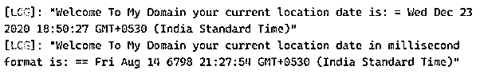
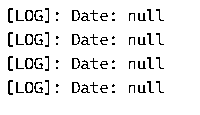
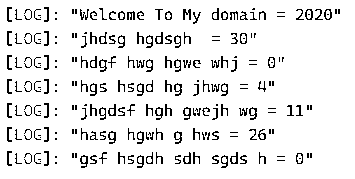

# 打字日期

> 原文：<https://www.educba.com/typescript-date/>

## 打字稿日期简介

Typescript date 是其中一个类，它用于在 date 对象的帮助下在应用程序中提供准确的日期。我们可以根据用户的位置访问日期，它还处理一些用户定义的和自定义的功能需求，如协调世界时(UTC)、格林威治标准时间(GMT)等。这些类型的区域时间是使用日期对象计算的，并且并行计算世界时间标准，它取决于 UTC 时间格式。这些日期和时间格式是跨全球区域计算的，全球日期和时间会有所不同。

**语法:**

<small>网页开发、编程语言、软件测试&其他</small>

Typescript date 对象主要表示应用程序的日期和时间功能。对于任何地区，它都有使用日期和时间的默认方法。因此，typescript date 对象使用任何国家和位置的日期和时间间隔。

`var or let variable name: Date= new Date(yyyy, mmmm, dddd, other parameters….);
----other typescript coding logics depends upon the user requirements---`

在上面的代码中，我们使用了 Date()类，我们可以为指定的类创建对象，并调用一些默认方法来处理应用程序的日期和时间功能。我们可以使用其他参数，也有 DDDD，MMMM，YYYY，就像我们可以使用不同格式的日期，此外，我们还在类型脚本中调用时间。

### 日期函数在 TypeScript 中是如何工作的？

Typescript 编程语言有许多库和框架，用于用创建应用程序的默认方法来声明文件和类。通过使用 Date()类，我们可以传递不同的时间参数，如毫秒、纳秒等。我们也可以使用库、框架来声明文件，也可以避免脚本中的编译时错误。有时我们用日期、年、月、小时、分钟、秒、分钟秒和纳秒。如果我们使用 Date()方法，它将返回日期和时间；如果我们使用 getDate()，它将返回用户在输入中提到的指定日期中的某一天，并根据本地时间和区域获取值。当我们使用 getFullYear()时，它用于根据用户所在地区的当地时间返回指定日期的年份。日期可以是任何格式，如 dd、yy、mm 或 dd/mm/yy 等。getHours()方法用于根据本地时间返回指定日期中的时间间隔，如 Hours()，getMilliseconds()是可以根据本地时间用户及其用法在指定日期中使用的方法之一。就像我们使用了一些其他的方法，叫做 getMinutes()，getTime()，等等，这些方法被使用并且功能化了应用程序的行为。

**例#1**

**代码:**

`let vars: Date = new Date();
console.log("Welcome To My Domain your current location date is: = " + vars);
let vars1: Date = new Date(152376479874398);
console.log("Welcome To My Domain your current location date in millisecond format is: == " + vars1);
let vars2: Date = new Date("21-12-2020");
console.log("Date = " + date);
let vars3: Date = new Date(2020, 2545, 2356, 7256, 756, 623, 7387);
console.log("fdhwgh hwgedfghgw heehhegw hwg hwg hwg jhweg hjweg hwg hwgevnb gwjhghj gweh gweh eh ghwe weh eh weh wgh gh weg wgh wgg gh gg gg g2ghwjq g jg33 jj jwge jw jwgj wg jjgw= " + vars3);`

**输出:**

上面的示例显示了基本的日期和时间操作，可以创建这些操作来访问当前位置的应用程序。从用户的角度来看，它可能因日期和时间而异。在这里，我们可以在新的 date()方法的帮助下，通过使用日期字符串、日期参数、时间戳和无参数来创建日期，这些日期类型可用于更安全地创建和利用应用程序。

**例 2**

**代码:**

`let vars = '2020-12-22 235 63e5 63 376 376 834 834 386 386 386 8346 3864 83476 93 36 38'
let vars1= '10-05-1989 jdhg jdhg hjdh kjhkjcje khd jkdb'
let vars2= 'fsdgc hdvs vhdsgc bhsdv653 hgdsc736 635cdsdh 3y2t vdhg y3te hdgf 2367 dgy36 dcv7 hwegd 3yt'
var vars6 = "dhsghdw dg gdjs hgd gsd gcs jh dgf jhgdh hed hd j jdghc jdhg jdg jdgh jdgh dij hidu jd ihdj"
let vars3 = new Date(vars);
let  vars4 = new Date(vars1);
let  vars5 = new Date(vars2);
let vars7 = new Date(vars6);
console.log(vars3)
console.log(vars4)
console.log(vars5)
console.log(vars7)`

**输出:**

在第二个例子中，我们使用的 date 类对象将以不同的方式被更多地用于访问基于 web 的应用程序，这取决于用户的区域需求。日期也将被存储，并作为基于 0 的索引开始，然后继续，直到用户输入值结束。在这里，我们可以使用包含数字和非数字字符的日期，因此它会在用户屏幕上输出 null。

**例 3**

**代码:**

`let vars: Date = new Date(2020, 10, 32, 625, 763, 1652, 7126);
vars.setDate(30);
vars.setMonth(12);
vars.setFullYear(2020);
vars.setHours(11);
vars.setMinutes(25);
vars.setSeconds(60);
console.log("Welcome To My domain = " + vars.getFullYear());
console.log("jhdsg hgdsgh  = " + vars.getDate());
console.log("hdgf hwg hgwe whj = " + vars.getMonth());
console.log("hgs hsgd hg jhwg = " + vars.getDay());
console.log("jhgdsf hgh gwejh wg = " + vars.getHours());
console.log("hasg hgwh g hws = " + vars.getMinutes());
console.log("gsf hsgdh sdh sgds h = " + vars.getSeconds());`

**输出:**

在最后一个示例中，我们使用了带有一组默认参数的 Date()方法，每个变量引用都将被一些默认方法调用，如 setDate()、setMonth()…每个方法都将传递基于其属性的值。

### 日期的规则和规定

1.  typescript 中的 date 类将只使用数值类型的值，此外，它还会在应用程序中添加时间。
2.  Date 对象接受默认格式，如 UTC、GMT、EST 和 HKT 等。对于每个地区，日期和时间将根据用户的位置而变化。

### 结论

在结论部分，日期和时间是基于 web 的应用程序的默认特性之一。因为用户将访问世界上不同地区的应用程序。以便日期功能将计算执行具有正确前景的用户输入的日期和时间。

### 推荐文章

这是打字日期指南。这里我们讨论日期函数如何在 TypeScript 和示例中工作，以及代码和输出。您也可以看看以下文章，了解更多信息–

1.  [打字词典](https://www.educba.com/typescript-dictionary/)
2.  [什么是 TypeScript？](https://www.educba.com/what-is-typescript/)
3.  [打印面试问题](https://www.educba.com/typescript-interview-questions/)
4.  [什么是 TypeScript？](https://www.educba.com/what-is-typescript/)

