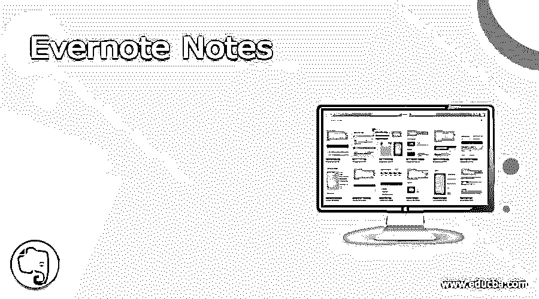

# Evernote 笔记

> 原文：<https://www.educba.com/evernote-notes/>

## Evernote 笔记简介

近年来，Evernote 已经成为设计用于存档、记笔记、任务管理和组织的最佳应用程序之一。总部位于加州雷德伍德城的 Evernote 公司开发了 Evernote 应用程序。使用这个应用程序，用户可以创建不同形式的笔记，如文本、音频、照片、图画或 web 内容。evernote 中存储的笔记也可以被标记、编辑、搜索、注释、导出，或者被附加上附件。Evernote 可在包括 iOS、Windows、Android、macOS 在内的不同平台上使用。在一定的限制下，它对用户是免费的，但也可以购买付费计划来取消限制或扩展其功能。在本文中，我们将介绍 Evernote 的不同用途。

### Evernote 使用

我们都有自己不同产品的保修卡和用户手册，我们甚至不能翻阅它们，甚至几年来一次也不打开它们。现在，我们可以下载他们的 pdf 版本，保存到 Evernote。在 Evernote 中保存它们之后，现在我们可以在保修卡和用户手册中搜索任何单词，并且可以在几秒钟内找到这个单词。

<small>网页开发、编程语言、软件测试&其他</small>

让 Evernote 成为你的纪念品。我们可以使用 Evernote 的相机来保存我们的记忆，无论是票根、情书、戏剧节目、旅游手册，这个列表永远不会结束。在 Evernote 中保存这些记忆后，我们可以随时重新观看这些记忆，并可以窥视过去。这会让你的 evernote 变成一个数字剪贴簿。

养宠物的趋势越来越明显，但是我们没有保管好与宠物相关的文件，这使得我们在宠物需要照顾的时候很困难。现在，使用 Evernote，我们可以保存所有的宠物信息。我们可以在 Evernote 中保存宠物的收养文件、宠物保姆的联系方式、许可证、兽医护理信息、疫苗接种记录数据，这将有助于我们将与我们毛茸茸的朋友相关的所有文件保存在一个地方。

保存您孩子的艺术作品。我们可以创建一个虚拟冰箱门，与我们的朋友和家人共享。我们可以浏览我们孩子的艺术作品，并为我们的生活保存它们，此外，它还使我们从所有的混乱中解脱出来。使用 Evernote，我们可以为孩子的艺术制作一个剪贴簿，并在他们毕业那天送给他们。

使用 Evernote 作为你的支出跟踪器。我们可以在 Evernote 上跟踪我们的日常开支，这最终将有助于制定个人财务预算。我们可以使用 Evernote 的邮件转发或相机功能将我们的收据发送到 Evernote 的笔记本上。如果我们从一个卖家那里购买大量的商品，那么我们也可以为这个卖家做一个标签。现在到了年底，我们可以在自己喜欢的商店里查看自己的花费。

给自己列一份每周家务清单。我们可以创建一个我们需要做的任务列表，并可以添加每个任务的复选框，以便我们可以检查每个已经完成的任务。我们还可以为家人和朋友制作这份清单，并与他们分享这份清单，并添加提醒，这样他们就可以负责任地完成任务。

我们都有电商平台不同店铺的打折券。现在，Evernote 有不同的优惠券使用方式。我们可以使用 web clipper 来拍摄优惠券的照片，我们也可以拍摄优惠券的截图，或者可以使用电子邮件转发。现在，我们可以为 Evernote 上存储的优惠券保留一个标签，并为这些优惠券的到期日期设置一个提醒。

离线写亲爱的日记的日子已经一去不复返了。现在人们发现在网上写日记更有帮助，Evernote 就是这样一个可以帮助我们的应用。让 Evernote 成为你可以随时随地访问的日志。

让 Evernote 成为你的日程表或日历。现在，如果我们需要在日期方面跟踪某事，我们可以通过 Evernote 来完成。此外，Evernote 有一些很棒的模板，让我们可以随时查看我们的年、月、周或日。这将有助于我们跟踪各种事情，即使我们不在家或不在工作场所。

如今，每个人都有忙碌的生活方式，这使得我们很难跟踪自己的健康状况。人们寻找能帮助他们保持健康的方法。Evernote 可以给我们所有人很大的帮助。通过 Evernote，我们可以保留我们的健康和锻炼记录。我们可以监控我们的进展，以保持我们在健身或减肥过程中的动力。我们可以使用 Evernote 维护卡路里计数、锻炼程序和饮食计划。

保留你的秘方收藏。扫描并保存你家的旧食谱，从网上提取好的食谱，或者从书中抓拍你最喜欢的食谱的照片。我们还可以在准备菜肴时添加我们的帮助注释。如果需要，我们也可以把这些食谱分享给我们的家人和朋友。

让 Evernote 成为你的创意盒子。通过 web clipper 抓取文章、社交媒体帖子或图片，保存那些激发你灵感的东西。随时随地使用保存的文章和图片寻找灵感或想法。我们可以在手机上使用网络剪刀，让用户可以在任何地方方便地剪切任何东西。

我们可以让 Evernote 成为我们的简讯目的地。我们可以使用 Evernote 的电子邮件地址直接接收 Evernote 中的所有时事通讯，而不是杂乱无章地向我们的邮箱发送垃圾邮件。

### 结论

在上述文章的基础上，我们了解了 Evernote。我们浏览了 Evernote 的不同用法，这将帮助我们以最有效的方式使用 Evernote。这篇文章将帮助任何正在寻找一个在线平台的人，他们可以在这个平台上存储他们的重要文档，设置提醒，监控他们的饮食和卡路里，以及做许多其他任务。

### 推荐文章

这是 Evernote 笔记指南。这里我们讨论一下 Evernote 笔记的简介、不同用途。您也可以看看以下文章，了解更多信息–

1.  [Simplenote vs Evernote](https://www.educba.com/simplenote-vs-evernote/)
2.  [观念选择](https://www.educba.com/notion-alternatives/)
3.  [米拉诺特备选方案](https://www.educba.com/milanote-alternative/)
4.  [OneNote 备选方案](https://www.educba.com/onenote-alternative/)

