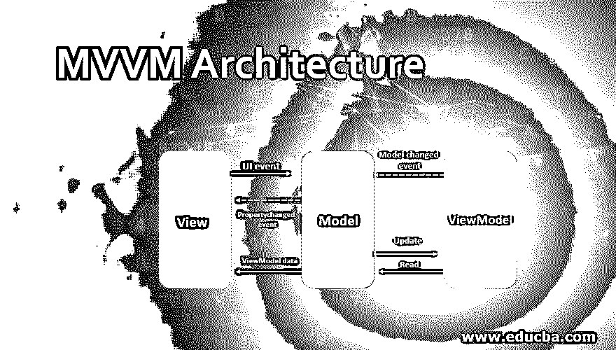

# MVVM 建筑

> 原文：<https://www.educba.com/mvvm-architecture/>

## MVVM 建筑介绍

MVMM 过程使用循环技术来组织新构建的代码。MVMM 的体系结构由模型、视图和视图模型组成。它用于安排代码，以便在所有可扩展的应用程序中实现紧凑的、可维护的和可测试的代码。MVMM 体系结构中的块模型用于保存包含业务策略和逻辑的信息。格式化数据由视图保存。以便它可以很容易地应用到模型中。视图模型表征了模型和视图之间已建立的联系，使代码更加增强和紧凑。在这个话题中，我们将学习 MVVM 建筑。

### MVVM 建筑解读

MVMM 是软件应用程序和设备的架构模式。MVMM 的功能是分离用于实现图形用户界面的代码。它是由标记语言或 GUI 代码制成的。代码被输入到后端逻辑和业务规则的框架中。MVMM 的 ViewModel 用于转换值，通过轻松控制和呈现输入对象，这些值对于从模型中探索数据对象具有重要意义。ViewModel 是比 view 更高级的选项，它管理视图显示中的大部分逻辑。ViewModel 用于部署中介模式，安排对后端逻辑的大量访问，后端逻辑用于配置由 view 管理的用例。MVVM 是对马丁展示模式的一种改变，具有独特的模式。MVVM 被用作视图抽象，并在同一技术中对其进行表征。但是在这里，表示模型用于查看特定用户平台上不相关的应用程序。

<small>网页开发、编程语言、软件测试&其他</small>

### MVVM 建筑的组成部分

MVVM 架构的重要组成部分包括模型、视图和视图模型，这将在下一节中详细介绍。

#### 1.模型

它被称为领域或面向对象的技术，用于表示实时内容或数据访问层。以内容为中心的技术出现在数据访问层。

#### 2.视角

模型视图呈现者和模型视图控制器的模式显示在视图的布局和结构中，这是最终用户在他的屏幕上看到的内容。它扩展了接收用户交互的模型表示，并通过数据绑定属性(如事件回调)将视图管理中的点击、键盘、手势转发给模型。视图模型和视图提供了链接。

#### 3.视图模型

ViewModel 探索视图的抽象，以禁止公共命令和属性。在 MVVM 中，MVC 模式的控制器选项和 MVP 模式的演示者选项被替换为绑定器选项，该选项促进了 MVVM 和视图中视图模型的有界属性之间的交互。ViewModel 用于定义模型中提供的数据的状态。

ViewModel 和 MVP 中的 Presenter 选项的主要区别是存在对视图的引用。但是 ViewModel 不像 MVP 中的 presenter 那样包含任何引用。代替视图，straight 绑定到 ViewModel 上的属性来交换更新的信息。有效函数需要合并有界技术来生成合并函数的样板代码。

Binder 是一个重要的功能，用于减轻开发人员的工作压力，以开发样板文件的逻辑来同步视图和视图模型。因此，联编程序提供声明性数据，命令的合并隐含在 MVVM 模式中。当在 Microsoft stack 外部执行时，来自绑定技术的声明数据用于创建一个可能的模式。在 MVP 和 MVC 中，如果没有绑定器的用户，样板文件的代码是无法编译的，所以他们更喜欢使用其他工具来生成代码。

MVVM 的建筑模式允许快速反应变得更适应过程中发生的波动。MVVM 模式中的重要角色是读取，读取模型和数据模型。读取的选项用于激活关于用户动作和状态的视图模型。阅读模型用于展示与选项视图相关联的知识流。执行数据模型来抽象数据源。部署与 ViewModel 结合的数据模型的操作来保存数据。

在某些情况下，MVVM 类似于演示者模式和模型视图。这是因为视图和模型在抽象视图的状态和属性方面表现出色。重要的用户界面面板用于抽象呈现中的浏览数据。部署 MVVM 模式来调制用户界面的事件确定程序。

### 优势

MVVM 建筑的重要好处是视图和模型之间的分离，这超出了实际效果。它是灵活的，不需要视图就能适应变化。MVVM 中的所有组件都以独立的方式运行。

MVVM 的可持续性有助于保持敏捷，并随着新的实例的快速发布而继续前进。可变代码的分离使得更加关注变化的部分变得更加简单。

每段粒度代码的可测试性都部署在内部和外部空间，对核心逻辑的工作是有效的。因此，单元测试是可能的，并且有助于 MVVM 架构获得更多的关注。它能够定期监视输入过程中隐含的代码的工作和操作。

MVVM 的可扩展性用于在粒度代码单元的边界之间提供纯粹的隔离。因此，可重用选项变得更具支持性，并且可以替换新的代码块，以便在基础设施的适当位置执行类似的对象。

MVVM 在所需实例中的应用有助于用户在软件应用中构建一个有效的设计模式模型。

### 推荐文章

这是一本 MVVM 建筑指南。这里是 MVVM 建筑的重要组成部分，以及建筑的优点和解释。您也可以看看以下文章，了解更多信息–

1.  [Servlet 架构](https://www.educba.com/servlet-architecture/)
2.  [Nodejs 体系结构](https://www.educba.com/nodejs-architecture/)
3.  [Magento 建筑](https://www.educba.com/magento-architecture/)
4.  [网络服务的架构](https://www.educba.com/architecture-of-web-services/)

