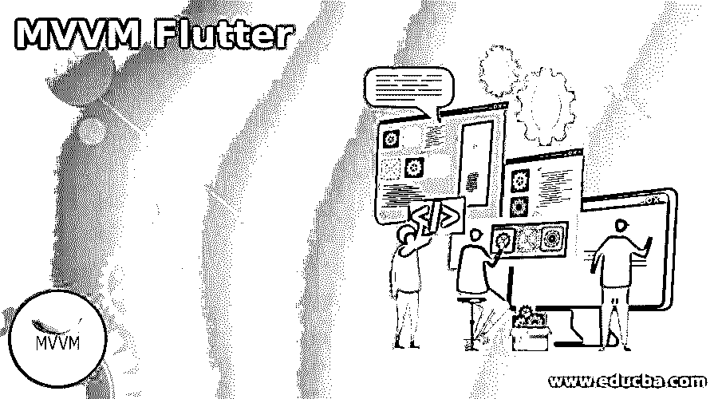
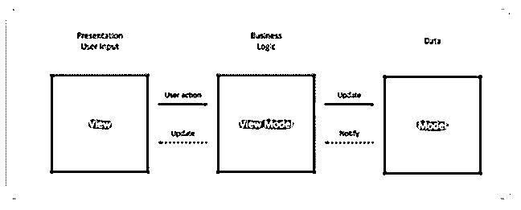
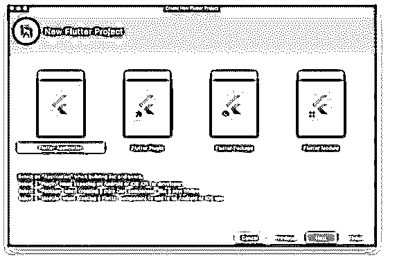
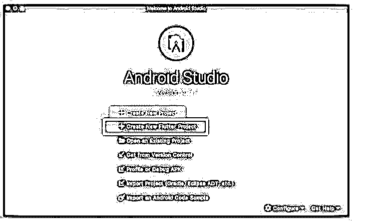
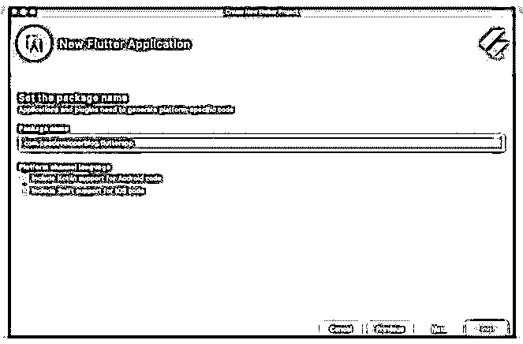
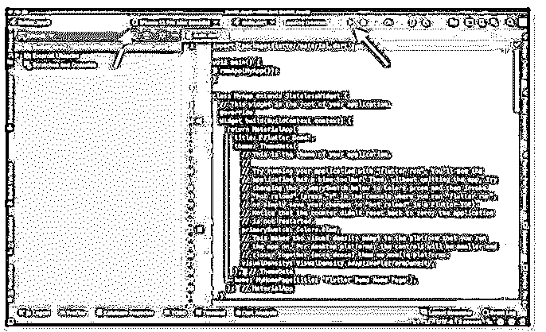
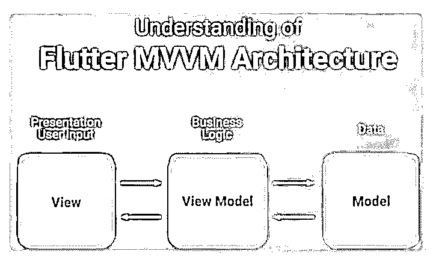

# MVVM 颤动

> 原文：<https://www.educba.com/mvvm-flutter/>




## MVVM 颤振介绍

MVVM(Model-View-ViewModel)Flutter 是使用基于属性的数据绑定来建立视图和视图模型之间的关系，并通过视图模型来修改视图的实现。颤振是跨平台的。它支持使用单一代码库编写 Android 和 iOS 应用程序。颤振声明性特征是 MVVM 设计模式的最佳候选。

### 什么是 MVVM 颤振？

MVVM(模型-视图-视图模型)由三个主要组件控制，它们是模型、视图和视图模型。关键组件有助于建立 MVVM 设计模式的构建块，每个组件都有不同的功能和职责，在应用程序的开发过程中，组件之间良好的交互起着关键的作用。在 MVVM 架构中，视图模型用于与模型通信，视图用于与视图模型交互以进行数据绑定。

<small>网页开发、编程语言、软件测试&其他</small>

### MVVM 在颤振中的应用

MVVM 涉及到视图模型和视图之间的数据绑定，这表明视图对象对视图模型进行命令。MVVM 是 MVC 的简化。

MVVM 颤振将如下所示:




最重要的是将逻辑从用户界面中分离出来。在 MVVM 中，视图与 ViewModel 交互进行数据绑定，ViewModel 与模型通信。为了更好地了解 MVVM 对 app 项目至关重要，仔细观察每一项数据也很重要。

让我们看看 MVVM 的组成部分如下:

*   **模型:**MVVM 模型的本质是在设计模式中实现业务逻辑，它作用于行动所需的数据源。MVVM 设计模式的模型数据用于表示实际时间数据，这些数据最终会在应用程序开发中使用。关于模型组件的事情是通过从数据库获取数据来在每个组件之间协同工作。模型只不过是存储架构的数据和相关逻辑的元素。
*   视图:视图只是一个 UI 组件，包括 CSS 和 HTML，在 MVVM，主要的东西是视图，它负责显示目的，如呈现设计层，它是应用程序的开放点。在进行交互时，MVVM 模型之间有一个受控的层级过程。视图数据实现了 UI-UX 设计的逻辑。
*   **ViewModel:**ViewModel 执行 MVVM 架构中链接到视图的命令和数据，将其记录为状态转换的数据。ViewModels 绑定到更多的模型，MVVM 中的 ViewModel 角色支持视图并像逻辑层一样工作。模型维护真实数据，视图部分汇总数据，将控制器作为两者之间的入口。

### 创建项目 MVVM 颤振

最初，为了创建这个示例中的 Flutter 应用程序，我们使用了 Android Studio 只需启动 Android Studio IDE，并在欢迎屏幕上选择创建新的 Flutter 项目选项。




接下来，选择新的颤振应用。




在下一个过程中，配置 Flutter 应用程序，并给出应用程序配置，如项目位置、存储位置、项目名称等等。


最后，给应用程序起一个与众不同的包名。它必须有一个唯一的名称，没有应用程序应该有相同的名称给我们。该包的名称将是该公司与应用程序名称的反向域名。




然后，选择完成按钮，android studio 将使用一些默认代码构建新的 Flutter 应用程序。




现有的代码已经是现成的代码；在上面的图像中，第一个红色箭头表示设备仿真器(如果已配置), Android 一次性设备仿真器可以选择一个并在设备仿真器上执行应用程序。另一个红色箭头表示在所选方式上构建 Flutter 应用程序的运行按钮。下面我们来看看易 Hello World App。

为了在 Flutter 中开发一个更简单的 Hello World 应用程序，我们需要删除默认显示的代码，并包含如下代码。

**代码:**

```
import 'package:flutter/material.dart';
void main() {
 runApp(MaterialApp(
  home: Scaffold(
   appBar: AppBar(
    title: Center(child: Text('My first app')),
   ),
   body: Text('Hello World'),
  )
  ),
 );
}
```

它在 Flutter 中创建了新的应用程序，并显示标题“我的第一个应用程序”和文本“Hello World”。为了更好地理解，请看下面的例子；在 Android 模拟器上执行上述代码时，显示如下。


### MVVM 颤振建筑

MVVM 架构之争是为了构建一个应用程序。执行视图组件所需的操作实际上转移到应用程序中分离的视图模型中的视图模型，生成模型，该模型反映了设计的逻辑，并且它已经在应用程序中实现。MVVM 颤振体系结构有三个基本组件，它们是模型、视图和视图模型。这些组件有助于建立 MVVM 设计模式。

*   **模型:**MVVM 设计模式的模型数据用于表示实时数据，最终在应用开发中得到启发。模型只不过是保存架构的数据和相关逻辑的元素。
*   **视图:**在 MVVM，最重要的是视图，它负责展示设计层等展示点，是应用的起点。
*   ViewModel:ViewModel 绑定到额外的模型，MVVM 的 ViewModel 的职责持有视图并像逻辑层一样工作。

每个组件都有自己的特性，因此它们有不同的角色和职责。当逻辑交互发生时，它起着关键作用。MVVM 的体系结构将视图行为与视图模型绑定在一起，视图模型与模型进行通信。

让我们看看下面的架构模型:




### 结论

在这篇文章里已经看到了 MVVM 飘动的例子；Flutter 应用程序不会使用指定的设计模式，该模式定义了设计取决于开发人员的要求。

### 推荐文章

这是一个 MVVM 颤振指南。这里我们分别讨论 MVVM 颤振和建筑项目的介绍、使用和创建。您也可以看看以下文章，了解更多信息–

1.  [MVVM 设计图案](https://www.educba.com/mvvm-design-pattern/)
2.  [MVVM 建筑](https://www.educba.com/mvvm-architecture/)
3.  [什么是 MVVM](https://www.educba.com/what-is-mvvm/)
4.  [MVVM 面试问题](https://www.educba.com/mvvm-interview-questions/)


