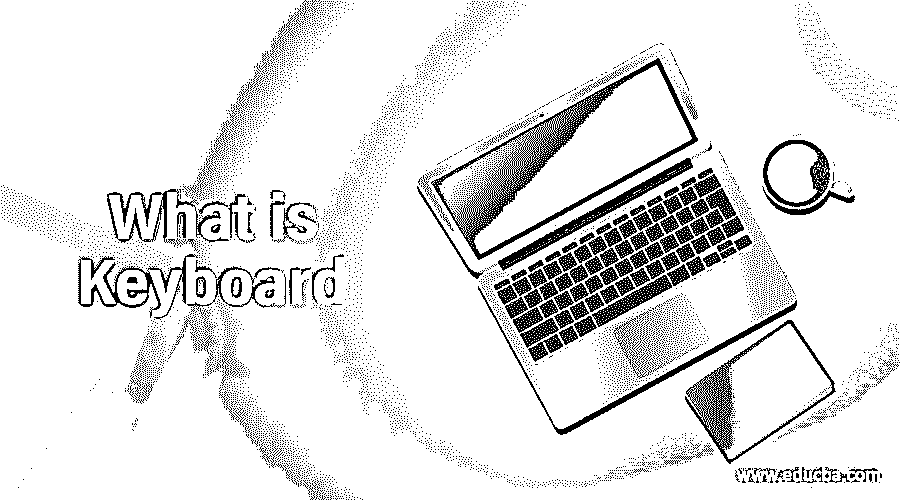

# 什么是键盘

> 原文：<https://www.educba.com/what-is-keyboard/>

## 键盘的定义

键盘是在数字、符号或字母的帮助下放置在输入设备上的一系列按钮或按键。键盘只能是数字型的，因此个人可以在大多数计算机键盘上轻松地将其输入计算机。它主要用于经常使用计算机软件进行计算或处理数字的人。主要的数字输入设备如自动售货机、销售点设备、数字门锁、密码锁和电话按钮电缆都与数字粘土一起使用。提供数字键盘。一排数字键位于计算机键盘的顶部，包括位于右侧的用于有效数据输入的独立数字键盘。

典型地，移动电话键盘是字母数字的，并且也便于电话号码的保存。用户将输入文本消息和姓名。另外，笔记本电脑、笔记本等键盘，并不是所有的电脑键盘都可以接入的，所以便携式电脑可以单独买一个外插键盘。

<small>网页开发、编程语言、软件测试&其他</small>

### 键盘的功能和用途

在计算机键盘的顶部还有其他数字键，在计算机的侧面，少量的小键盘具有与计算机接口方案相同的按钮。这种数量的键盘使得数字数据能够更有效地输入。此外，大多数人都是右撇子，所以数字键盘在键盘的右边，可以有效地输入。键盘出现在许多设备上，包括销售引擎、ATM、时钟、支付点、数字端口锁和用于选择和输入 pin 的组合锁。

### 键盘的按键布局

第一个键激活了许多收银机，0-9 列的平行键用于每个位置的机械计算器。小键盘始于 1901 年的标准加法机上。计算器包括排列成 0 和 9 行的键的数量，0 在左边，9 在右边。

现代四行系统始于 1911 年的 Sundstrand 添加机。计算器的键盘里没有标准设计一个小数点，四则算术运算(像，加，减，乘，除)，等号(=)。贝尔实验室的工业心理学家约翰·e·NJ 和默里山的卡林发明了一种按钮式电话键盘。数字 1 到 9 在电话键盘上是从左到右、从上到下排列的，没有一个数字在 789 的下面和中间排成一行。

#### 1.电话键盘

用于拨打电话号码的数字键盘可以安装在按钮上。电话键盘在 20 世纪 60 年代标准化，当时 DTMF(双音多频)信号系统被引入美国的贝尔网络。一个双音多频系统已经开发出来，用于被取代的机电开关系统。由于旋转拨号设备的广泛使用，在 20 世纪 90 年代，大多数电传键盘也被开发来产生电子环路断开脉冲。一些键盘也被用来产生 DTMF 或脉冲。

#### 2.电话键盘布局

数字键和计算器键盘本质上是不同的。在贝尔实验室，对这种布局测试了各种人为因素。机械计算器在 20 世纪 50 年代末并不流行，因为它们并不常用，而且很少有人体验过。只有在公共界面上，计算器才开始正常工作。今天的计算器普遍采用的布局是在 1960 年的一篇论文之后发现的。顶部一排有 1、2 和 3 个键，电话式比计算器快得多，底部一排有 1、2 和 3 个键，因为贝尔实验室的测试结果在任何情况下都是有保证的。

#### 3.字母映射

将字符和字母映射到数字的不同方式已经与键盘配置和电话拨号相联系。在丹麦和联合王国，方法是不同的。同样，它也不同于美国和澳大利亚。在 20 世纪 60 年代，当直接国际拨号被引入时，交换的字母数字代码在欧洲被停止。如果用户在丹麦电话上拨打 VIC 8900 号码，在英国电话上拨打该号码，结果是另一个。因此，当时没有使用新电话号码盘上的字母。

### 结论

在本文中，我们看到了键盘及其用法、功能和类型。我希望这篇文章对你有所帮助。

### 推荐文章

这是一本键盘指南。这里我们详细讨论键盘及其用法、功能和类型，以便更好地理解。您也可以看看以下文章，了解更多信息–

1.  [安卓键盘应用](https://www.educba.com/keyboard-apps-for-android/)
2.  [电脑键盘的种类](https://www.educba.com/types-of-computer-keyboard/)
3.  [Linux 键盘快捷键](https://www.educba.com/linux-keyboard-shortcuts/)
4.  [什么是鼠标？](https://www.educba.com/what-is-mouse/)

