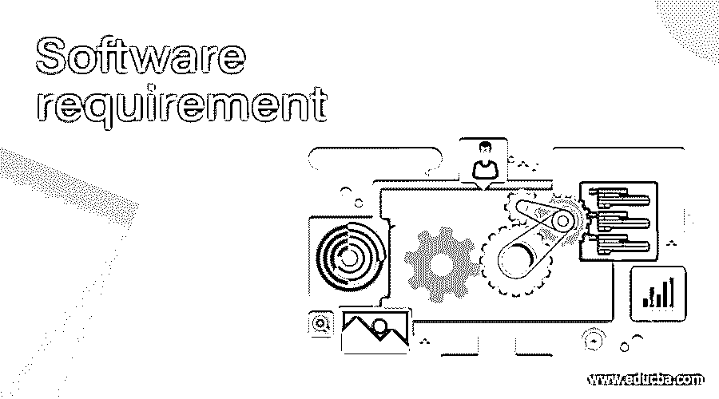

# 软件需求

> 原文：<https://www.educba.com/software-requirement/>

## 软件需求介绍

软件需求是用户解决问题或实现目标所需的条件。定义软件需求是开发生命周期的第一步。但是，在许多情况下，在建立正确的需求时不够小心。这会导致问题，在开发生命周期的后期，花费更多的时间和金钱来解决这些问题。这个。必须以系统的方式建立需求，以确保其准确性和完整性。例如，对任何车辆的要求可以是最大速度至少为 120mph，燃料箱应该具有至少 5 升的容积，等等。

### 软件需求列表

以下是各种软件要求的列表:

<small>网页开发、编程语言、软件测试&其他</small>

#### 1.功能需求

功能需求描述了信息的处理。功能需求是系统可以提供的服务..当给定特定输入时，系统的该做和不该做。它描述了系统在特定条件下应该做什么。比如银行软件有开户、销户、无金额、信贷金额、负载、政策等功能。

#### 2.非功能需求

非功能需求支持业务标准和业务环境。这些是应用于系统服务的约束。非功能性需求可能是用户界面的颜色、任何输入输出通信的速度、安全性等等。例如，系统的性能、可靠性、安全性。非功能性需求分为三类，如下所示

1.  产品需求:它陈述了产品的行为——性能、可靠性、可移植性、可用性。
2.  组织需求:它规定了在用户和开发者的组织中遵循的政策和过程——过程政策、实现政策和交付政策和过程。
3.  外部需求:它指定了系统和开发过程的外部因素——互操作性、道德规范。

#### 3.用户需求

用户需求也称为功能需求，因为它们陈述了用户期望系统具有什么功能。它描述了系统的服务和约束，以及自然语言和图表。每个人都可以阅读和理解用户需求。它作为业务目标。

#### 4.系统需求

系统需求详述用户需求，以获得一个系统应该做什么的更详细和精确的想法。它详细描述了系统的服务和约束。这对系统的设计和开发是很有用的。系统需求支持覆盖所有类的结构化表示。

假设以图书馆为例，功能需求是图书馆系统应该允许从图书馆借书。非功能性需求是图书馆系统应该提供允许用户借书的借阅功能。如果该书已经被借阅，或者如果该书在图书馆中不可用，或者如果用户已经借阅了最大数量的允许书籍，或者如果用户欠有任何罚款，则交易失败。

#### 5.软件文档

软件文档被称为 SRS(软件需求规范)。它列出了用户一贯陈述的所有需求。伟大的 SRS 带来伟大的产品。伟大的产品只能从伟大的规格中创造出来。现在的系统和软件是如此的复杂，以至于在知道你要构建什么之前就开始设计是愚蠢和冒险的。SRS 构成了客户和开发组织之间就软件产品预期要做什么达成一致的基础。它减少了开发工作。它也是成本估算和项目进度安排的基础。SRS 为验证和确认提供了基线。它促进了新软件向新环境的转移。它是软件改进的基础。

### SRS 的特性

*   完整:对此的简单判断是，它应该是软件设计者携带软件所需要的全部内容
*   一致:SRS 内部应该一致，并与其参考文件一致。
*   可验证的:提供量化要求，比如每次击键都应该在 100 毫秒内提供用户响应。
*   可修改:在多个地方有相同的需求可能没有错，但是会导致文档不可维护。
*   可追溯性:在大多数组织中，将 SRS 中的需求与更高层次的文档相一致有时是有用的。

### SRS 示例

*   **简介**

产品概述

目的

范围

参考

定义和缩写

*   **总体描述**

产品视角

产品功能

用户特征

一般限制

假设和依赖性

*   **具体要求**

外部接口要求

用户界面

硬件接口

软件界面

通信协议

内存限制

操作

产品功能

假设和依赖性

软件产品功能

软件系统属性

可靠性

有效性

安全性

可维护性

轻便

表演

数据库要求

其他要求

*   **附加材料**

### 结论

在本文中，我们讨论了各种软件需求，如功能性需求、非功能性需求、用户需求、系统需求和软件文档。我们还创建了一个示例 SRS 来更好地理解这个概念。

### 推荐文章

这是软件需求指南。在这里，我们讨论了各种软件需求，并创建了一个示例 SRS 来更好地理解这个概念。您也可以阅读以下文章，了解更多信息——

1.  [软件审查](https://www.educba.com/software-review/)
2.  [软件可靠性](https://www.educba.com/software-reliability/)
3.  [软件系统架构](https://www.educba.com/software-system-architecture/)
4.  [远程支持软件](https://www.educba.com/remote-support-softwares/)

