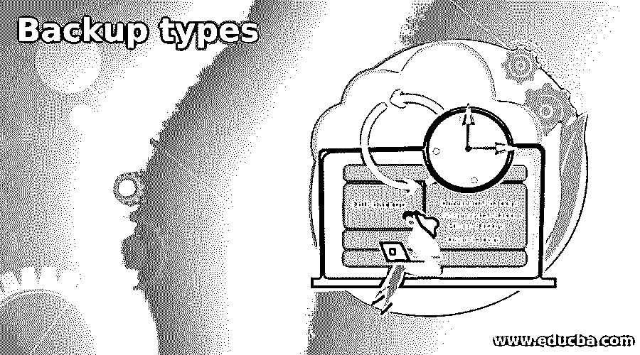

# 备份类型

> 原文：<https://www.educba.com/backup-types/>

## 备份类型介绍

企业可用的备份类型使他们能够制定更侧重于以下方面的数据备份策略:a .如何备份其组织的关键数据其组织的关键数据以防止数据丢失；b .数据需要备份的频率；c .将备份数据存储在本地、现场或非现场的何处；d .如果发生灾难，如何恢复数据；e .备份和恢复时使用的工具或方法，无论是供应商提供的工具、第三方工具还是用户管理的手动操作。

### 几种类型的备份

如上所述，备份类型更侧重于“如何”备份，而不是“备份什么”。因此，我们来详细研究一下各种类型的备份。

<small>网页开发、编程语言、软件测试&其他</small>

#### 1.完全备份

这是从文件、子文件夹、系统级文件夹或数据库级数据文件、重做日志、过程、控制文件中备份所有数据的最经典或传统的方式。每次启动完整备份时，将备份全部数据。

通常情况下，任何系统的完整备份都是随后进行增量或差异类型备份的第一步。但是，当碎片变得难以管理时，提交几次增量/差异备份，建议使用新的完整备份开始新的周期。

**优势**

*   在备份存储消耗不是很高的小型设置中，完整备份是首选。
*   管理完整备份既简单又容易。
*   恢复也很容易和快速，因为它遵循一个直接和简单的过程。
*   最新的媒体足以还原完整备份

**缺点**

*   这是一个缓慢而耗时的过程
*   存储空间的消耗相当高，并导致大量数据重复。
*   系统可用性可能是频繁进行完整备份的一个问题。

#### 2.差异备份

该系统包括备份早期完整备份和当前差异备份之间的增量变化。每次启动此备份时，都会重复相同的过程，这实质上意味着在循环中较早的差异运行中备份的文件也会被备份，从而导致某种程度的重复。因此，需要完全备份介质和最新的差异介质来完全还原系统。

**优势**

*   与完整备份相比，它需要更少的存储介质
*   速度更快，因为它仅备份早期完整备份和现在之间的增量更改
*   可以计划更频繁的备份，因为它需要备份的数据量较少
*   与增量备份相比，还原仍然更快，因为它涉及处理完整备份介质和最新的差异备份介质。

**缺点**

*   与增量备份相比
    *   它需要更多的存储空间，因为它包含周期中早期备份中备份的副本。
    *   备份速度也较慢，因为它处理的数据量较大
*   与完整备份相比
    *   恢复有点复杂，因为它必须使用完整备份和一个以上的媒体。
    *   由于上述原因，恢复需要更多的时间。

#### 3.增量备份

与差异备份一样，备份周期从完整备份开始，然后是多次增量备份。该系统包括备份在上次备份和当前备份之间创建的增量数据。对于第一次增量备份，最后一次运行是完全备份。

通过手动操作实现这一过程并不容易，理想的情况是通过供应商的工具或第三方软件进行管理。

**优势**

*   它占用的存储介质空间最少，因为要备份的数据量很少，而且要备份的数据中没有重复数据。
*   由于上述原因，备份所需的时间也很短。
*   可以计划许多频繁的备份，比如每天两次。
*   该系统用于数据库应用。

**缺点**

*   数据恢复非常麻烦，因为它涉及完整备份介质和当前周期中的后续增量备份。
*   由于上述原因，恢复速度也较慢。

#### 4.镜像备份

源系统的镜像保存在现场或非现场位置的另一个系统中。源系统初始拷贝的镜像映像会随着源系统的变化而频繁地自动更新。如果错误地从源系统中删除了任何文件，如果在更新间隔内没有检测到该文件，则该文件将在镜像副本中自动删除。这种镜像备份主要用于存储磁盘级别的备份，

### 应用程序备份(业务连续性规划)

#### 现场模型

在此设置中，源应用程序平台(主平台)的一个拷贝与辅助平台在同一位置的不同楼层或建筑中维护。主应用程序的初始完整副本被安装在辅助站点，并且主应用程序中的进一步改变由应用程序以同步模式在辅助站点中更新。因此，它可以保护主应用程序免受由于硬件故障、数据库损坏、软件故障和其他内部故障造成的任何灾难。

如果发生任何灾难，应用程序可以切换到辅助站点，而不会损失太多时间，并且可以确保业务连续性。此外，主系统可以在以后进行调整和恢复。但是，它不包括其他灾难，如停电或自然灾害，如洪水、地震和飓风，影响主要/辅助站点。

#### 场外模型

在此模型中，辅助站点在异地位置维护，并以异步模式定期自动更新。因此，它保护主站点免受洪水、地震、飓风、政治动乱等自然灾害的影响。;这种模式的唯一问题是主站点和辅助站点应该通过高带宽网络互连。

#### 云备份

这是一个高度现代化的设置，其中数据备份在云中完成，如果出现任何灾难，应用程序可以切换到云。许多云服务提供商都提供这种服务，如果谨慎使用，将会节省成本。

### 结论

面对如此多的数据备份选项，企业将不得不选择适合其数据战略和预算并保持业务连续性的方法。

### 推荐文章

这是备份类型指南。在这里，我们讨论的备份类型更侧重于“如何”备份，而不是“备份什么”。您也可以阅读以下文章，了解更多信息——

1.  [股票回购](https://www.educba.com/share-buyback/)
2.  [Azure 备份](https://www.educba.com/azure-backup/)
3.  [詹金斯备份](https://www.educba.com/jenkins-backup/)
4.  [MySQL 备份](https://www.educba.com/mysql-backup/)

