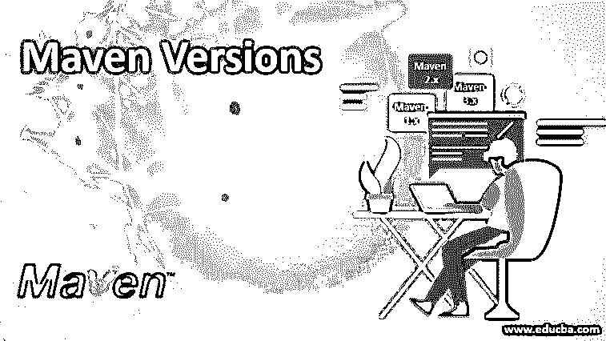

# Maven 版本

> 原文：<https://www.educba.com/maven-versions/>

## Maven 版本介绍

Maven 是一个可以用于项目开发管理和理解的工具。主要目标是从一个名为 pom.xml 的中心位置/文件控制所有活动，如构建、依赖关系管理、文档创建、站点和分发发布。pom 代表项目对象模型。除此之外，它还可以通过为构建过程和报告使用其他开发工具的插件来扩展。

maven 的起源可以追溯到开发人员在建立一个名为雅加达涡轮机项目的项目时面临许多复杂和困难。它由许多项目组成，每个项目都有自己的 Ant 构建文件，这些文件都有点不同，所有这些文件都需要在 VCS 进行检查，即版本控制系统，如 git 和 subversion。他们需要一种标准的方式来构建项目，并以一致的方式查看所有相关信息。需求还包括发布项目的更简单的方式，以及在所有项目中共享多个 jar 的方式。这是他们想出为基于 Java 的项目构建这样一个工具的地方。

<small>网页开发、编程语言、软件测试&其他</small>

Apache Maven 发布的最新推荐版本是 3.6.3。目标是提高性能、改善可用性、允许安全嵌入并确保与 Maven 2 的向后兼容性。maven 版本独立于可用的插件。插件的进一步发布将单独进行。

如需安装，请参考此链接，[https://maven.apache.org/install.html](https://maven.apache.org/install.html)

如果已经安装，可以通过在命令提示符下运行命令 mvn -v 来检查版本。确保 PATH 和 M2_HOME 环境变量设置正确。目前，Maven 版本可以分为三个，如下——Maven 1 . x——它已经过时，目前没有人使用。maven 2 . x——连这个版本都快结束了，还没用过。maven 3 . x–最新版本，建议使用。

### 带有特性的 Maven 版本

maven 的版本和特性如下所示:

#### 腹部 1.x

Maven 1 提出了一些基本且重要的特性和功能，如下所示-

##### Maven 版的特性

*   其中第一个也是最重要的一个是，通过使用 maven 1.x，我们不需要编写脚本文件来将项目数量构建到 JAR、WAR 或其他预定义的输出中。Maven 从
*   通过使用项目的相同元数据，它可以生成项目开发状态和文档以及您想要的所有其他参考的网站或 pdf
*   它与源代码控制系统的 VCS 集成在一起，并在标签的帮助下帮助发布过程。它还允许我们通过 JAR 格式单独发布项目，甚至发布到其他地方供其他人使用
*   Maven Repository 包含大量 jar 和其他依赖项，在开发我们的项目时可能会用到它们。维护中央存储库，下载和存储所需的 jar。这可以跨项目访问，向后兼容性问题也得到解决，因为它鼓励项目之间的通信。
*   它允许阿甘整合。Gump 是 apache 构建的第一个工具，它有助于向后兼容客户机，并能随时了解您的

#### 胃 2.x

Maven 2 完全重写。它不像 Maven 1 那样向后兼容。它无法执行 maven 1 插件。架构让 maven 更快更小。命令行执行变得更快，因为 maven 2 依赖于更少的依赖，这也有助于更小的分发。它改变了使用脚本为 maven 1 构建扩展的方式，对于 maven 2，它鼓励开发人员使用 java beans 和插件。以前，属性文件用于存储私有配置信息，如凭证(用户名和密码)。然而，Maven 2 带来了 settings.xml，它取代了属性文件。所有私有信息都在 pom.xml 中声明。

##### Maven 版的特性

*   它帮助我们建立一个遵循最佳实践的项目，这个项目结构良好，可以用很少的时间来完成
*   项目结构是一致的，这减少了新加入者理解项目所花费的时间
*   依赖性管理通过自动更新和可传递的依赖性或依赖性来容易地实现
*   我们可以同时进行多个项目
*   Maven Central Repository 为我们提供了许多库和元数据来实时维护最新版本的开源项目，因为它是一个开源工具，它是可扩展的，我们可以通过用 java 或脚本语言编写插件来做到这一点。
*   新特性可以用在很少或没有新特性的项目中
*   我们可以使用 ANT 任务在 maven 外部实现依赖性管理和部署。
*   不需要为构建项目编写脚本，因为 maven 遵循基于模型的构建，这有助于预定义输出，如 JAR、WAR 或其他基于项目元数据的发行版。
*   Maven 可以生成一个 pdf 网站，其中可以包含我们的任何文档，并通过使用构建的元数据将其添加到关于项目开发状态的标准报告中
*   Maven 与我们的版本控制系统(如 subversion 或 git)集成，根据有助于发布管理的标签来管理项目的发布。它还可以发布单个输出，如
*   Maven Repository 包含大量 jar 和其他依赖项，在开发我们的项目时可能会用到它们。维护中央存储库，下载和存储所需的 jar。这可以跨项目访问，向后兼容性问题也得到解决，因为它鼓励项目之间的通信。

#### 腹部 3.x

Maven 3 提供了 Maven 2 的所有功能。

##### Maven 版的特性

*   Maven 3 的周期为六周，与 eclipse 中的情况相同。这给了开发人员一个大致的想法，他们的错误将在几周内被修复，并在下一周可用
*   它为项目依赖和插件依赖提供了单独的存储库，而 Maven 2 为两者共享一个公共存储库，如果项目依赖被控制存储库锁定，这会导致插件依赖，从而导致问题
*   它支持并行构建。但是它限制插件在编译时被声明为线程安全的
*   更容易嵌入。它保持了命令行界面和集成开发之间的一致性
*   Maven 3 中的日志记录得到了改进。提到了项目的工件 Id，包括了插件的版本，并且通过添加新的行和
*   与 Maven 2 相比，建造所需的时间要少得多。它还需要更少的内存，因为更好
*   Maven 3 改进了 POM 有效性。它会检查结构是否正确，并在感觉我们声明的 xml 可能会在将来引起问题时通知我们。例如，如果没有提到插件版本或者多次提到相同的依赖项，它将显示一个错误。

可以说，整体 maven 将证明有助于为我们的项目有效和容易地维护项目结构、依赖性和发布。应该使用最新版本的 maven，这样您就可以利用新特性和错误修复。Maven 版本 3.6.3 是最新的，也是最推荐使用的版本。

### 推荐文章

这是一个 Maven 版本的指南。这里我们讨论 maven 的介绍和版本及其特性。您也可以阅读以下文章，了解更多信息——

1.  [休眠版本](https://www.educba.com/hibernate-versions/)
2.  [Spring Boot 版本](https://www.educba.com/spring-boot-versions/)
3.  [什么是 Maven 插件？](https://www.educba.com/what-is-maven-plugins/)
4.  [Maven 命令](https://www.educba.com/maven-commands/)