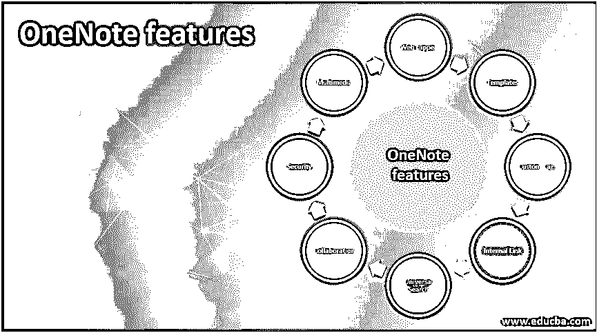

# OneNote 功能

> 原文：<https://www.educba.com/onenote-features/>

## OneNote 功能介绍

OneNote 功能使用户能够随时随地通过多种设备(如移动设备、笔记本电脑、使用 Android、Windows、MAC 等多种操作系统的标签)捕获他们的想法、观点、笔记、个人内容、博客、一般信息、联系人详细信息、绘图、网络链接、扫描、待办事项列表，并将捕获的信息以笔记本、分区、页面、混有图片的子页面、音频/视频剪辑、web 剪辑、包括手写笔记在内的多媒体文件的形式有组织地存储在一个数字笔记本中，并将其内容与其他软件集成，以增强用户体验并方便无缝搜索他们需要的任何信息

### OneNote 的功能

以下是下面提到的特性

<small>网页开发、编程语言、软件测试&其他</small>

#### 数据是如何组织的？

这是 OneNote 软件吸引人的功能之一。多种用户数据内容存储在这些数字笔记本中。初始软件安装会创建一个默认笔记本。之后，用户可以根据需要创建任意数量的笔记本，并为其命名。这些笔记本中的每一个都可以分成多个部分，每个部分都应该有唯一的名称。

每一节又分为几页。数据按照层次结构设计和数据分类方式存储在这些页面中。如果数据需要进一步分类，用户可以创建子页面并将数据存储在其中。用户可以根据需要定义笔记本的层次结构，并在其中存储数据。任何类型的数据都可以存储和检索。

#### Web 裁剪器

此功能有助于提取任何 web 数据，如视频、图片、PDF 文件、带有书签功能的完整或部分网页。提取的数据被剪辑到 OneNote 中，该工具允许用户编辑、批注并与其他人共享。用户也可以在离线模式下从任何设备查看这些数据。

#### 模板

该模板为各种类型的数据的 OneNote 页提供了标准的、内置的、预先确定的布局。这些模板使 OneNote 页面的外观、背景和布局保持一致，简化了用户设计文档的工作，并大大节省了时间。此外，用户可以使用这些模板在 OneNote 页中为新项目快速组织数据。

#### 自定义标签

分区、页面和子页提供了在 OneNote 笔记本中组织数据的有效方法。除此功能之外，OneNote 还提供了一个可视的自定义标记来对信息内容进行分类，以便更容易地对多个笔记本中的各个分区和页面进行识别、分类和上下文化。OneNote 有默认标签，也可以创建和谨慎使用自定义标签。

#### 内部链接

内部链接是 OneNote 的一项强大功能，它允许与同一笔记本或其他笔记本中的其他分区或页面进行链接。它有助于知识传播、加速学习和设计创新的解决方案。

#### 通用搜索

OneNote 允许在用户有权访问的所有笔记本中搜索字符串、文件或任何其他存储的数据组件，而无需单独打开和搜索笔记本。这一行动为用户节省了大量时间，增加了寻找信息的灵活性，并提高了生产率。该选项将用户带到一个搜索面板，在他们当前正在工作的笔记本上按 CTRL+E，接受要搜索的主题，并完成操作。按 CTRL+F 会将操作限制在当前页面内。

#### 合作

OneNote 通过页面标记/提示/通知/批注共享信息，同时更新存储的数据组件，即时查看最新的更改，从而允许用户之间进行完美的实时协作。它还保留了修订历史中所有更改的跟踪记录，并在需要时恢复旧数据。这种协作不再需要任何协作工具，例如在同一项目或组中工作的 OneNote 用户之间的电子邮件、聊天。

#### 安全性

该工具确保对存储在各种页面和子页面中的数据组件进行密码保护。根据项目设计，仅向正确的用户提供访问权限，访问级别(查看、添加、删除、更新)仅限于授权用户。通过笔记本、分区、页面、子页面等，OneNote 层次结构中的所有级别都提供数据保护。，使用各种加密标准。它还有一个功能，可以锁定在特定时间段内不被访问的数据组件，并将其保持在私有模式下。

#### 多媒体

OneNote 非常广泛地支持多媒体文件。会议记录可以直接发布到其页面上，并与同事轻松分享。这些多媒体文件作为任何会议的附加文件，并与会议记录链接。

#### 与其他软件产品的深度集成

OneNote 提供了与 Microsoft 产品(如 Outlook)的完美集成。OneNote 中可用的任何数据内容都可以轻松地与 Outlook 邮件进行交互，信息可以通过邮件无缝发送，而不必浏览屏幕和程序。

它可以使用插件和其他定制的接口与非微软程序集成。这些类型的集成有助于提高团队的生产力和敏捷性。

#### 便笺条

待办事项、要记住的事情、提示、片段、电话号码和日常活动中的许多小项目都可以创建为便笺，并粘贴在屏幕的任何部分。此外，这些笔记可以与 OneNote 中的数据集成，并且可以从任何设备上查看。

这是 Windows 10 套件中提供的一个单独的应用程序，它可以下载并与 OneNote 交互。

#### 灵活的内容管理

内容可以很容易地在容器中进行管理，多个容器中的内容可以合并到一个容器中。它们也可以根据需要分成多个容器。合并和拆分容器的操作非常简单。

#### 多方面的

*   将网页内容从一种语言翻译成另一种语言。
*   将手写笔记转换成标准文本。
*   OCR(光学字符识别)设备，用于将文档、照片转换为文本
*   处理数学方程

### 结论

OneNote 提供了许多功能来有效地管理项目、小组和工作组中的数据内容。它是全面的，与其他应用程序很好地集成，是部署在所有代最终用户设备中的易于使用的工具。

### 推荐文章

这是 OneNote 功能指南。在这里，我们将详细讨论 OneNote 的功能以及说明和信息。您也可以阅读以下文章，了解更多信息——

1.  [电报特征](https://www.educba.com/telegram-features/)
2.  [角度特征](https://www.educba.com/angular-features/)
3.  [ASP.NET 的特色](https://www.educba.com/features-of-asp-dot-net/)
4.  [如何释放 OneNote 的潜能](https://www.educba.com/how-to-unlock-the-potential-of-onenote/)

