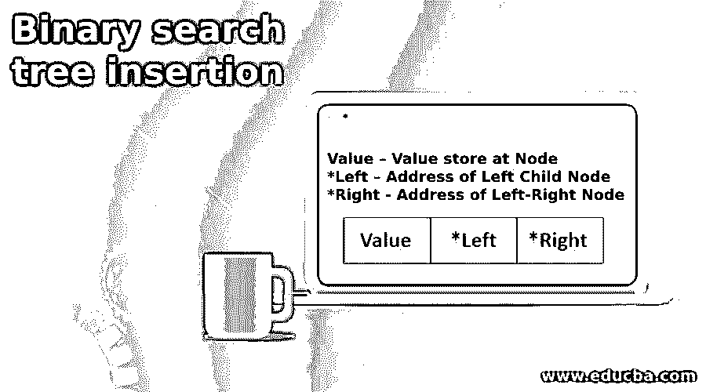
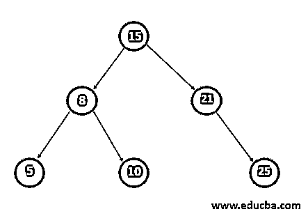
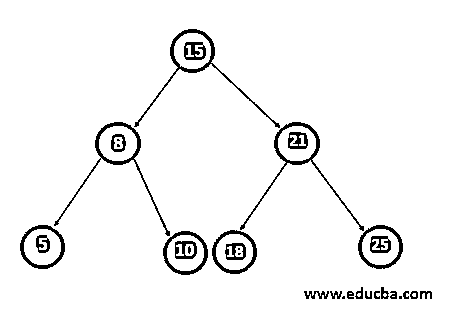
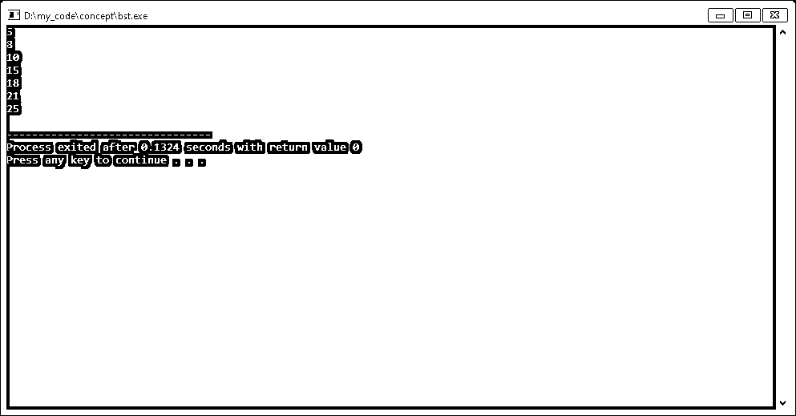

# 二叉查找树插入

> 原文：<https://www.educba.com/binary-search-tree-insertion/>

## 二叉查找树插入简介

以下文章提供了二叉查找树插入的概要。二叉查找树是一棵带有一些附加条件的二叉树。先来了解一下第一棵二叉树，二叉树是一种每个节点最多有两个子节点或者每个节点最多连接两个子树的数据结构。

二叉查找树是二叉树的一个特例，其中左子节点的值应该小于父节点，而父节点的右子节点的值应该大于父节点。其中父节点是当前节点，左右子节点是其地址存储在二叉查找树的当前节点中的节点。

<small>网页开发、编程语言、软件测试&其他</small>

插入是二叉查找树的操作之一，在该操作中，在任何叶节点插入一个新值，记住二叉查找树的属性保持不变。

**语法**:-

让我们了解一下二叉查找树中节点的结构。在二叉查找树节点有三个组成部分。

1.  **值**–存储在节点的值
2.  ***左侧**–左侧子节点的地址
3.  ***右**–左右节点的地址

### 如何执行二叉查找树插入？

在二叉查找树中，左子树中的所有值总是小于节点值，右子树中的所有值总是大于节点值。因此，二叉查找树上的有序遍历给出了一个排序的值列表。

在二叉查找树的主要业务是:-:-

1.  在二叉查找树找到任何有价值的东西。
2.  在二叉查找树寻找最大价值。在二叉查找树中，最右边的叶节点值总是最大值。
3.  找出二叉查找树的最小值。在二叉查找树最左边的叶节点值总是最小的。
4.  在二叉树中插入:-

我们执行插入操作，在二叉查找树中插入任意值。在二叉查找树中，任何值都将插入叶节点，并应遵循二叉查找树的属性。要插入值，首先检查节点，看节点是否为空。如果节点为空，那么我们更新节点值以插入值。简单地说，我们必须找到插入值的节点将成为子节点的叶节点。

如果一个节点不为空，那么我们将插入的值与节点的值进行比较。如果一个节点的值将大于插入值，那么我们移动到该节点的左边的子节点，并做同样的检查节点是否为空。

如果一个节点的值小于插入值，那么我们移动到该节点的右边的子节点。现在我们用例子来理解这一点。

二叉查找树中插入操作的时间复杂度是 O(H ),其中 H 是二叉查找树的深度。在最坏情况下，二分搜索法的深度等于二叉查找树中的总节点数。

### 二叉查找树插入的例子

让我们采用如图所示的现有二叉查找树，并插入值 18。

二叉查找树中的每个节点都包含一个与插入值进行比较的值。创建一个 InsertNode 函数，该函数接受节点的指针和要插入的值，并返回更新后的节点。

**第一步。**在给定的示例中，调用 InsertNode 函数并传递现有二叉查找树的根节点和值 18。现在在 InsertNode 函数中，因为 root 不为空，所以接下来，我们将插入值与根节点进行比较。正如我们所见，根节点的值是 15，插入的值是 18，哪个更大。所以我们递归地调用 InsertNode 并传递 root 的右子节点和插入值。它将返回更新后的根节点的右子节点。

第二步。现在，在此，根节点不为空，因此我们将插入与根节点进行比较。根节点值是 21。请比较插入值 18。现在插入的值小于根节点值。所以这一次我们递归调用 InsertNode 并传递 root 的左子节点和插入值。它将返回更新后的根节点的左子节点。

**第三步。**现在，正如我们在上面的图中看到的，根节点是空的，所以我们更新值以插入值并返回更新的根节点。

**第四步。**这样，所有递归调用都将完成，为了检查插入的值，我们对这个二叉查找树执行有序遍历，它将按排序顺序返回所有值。

### 二叉查找树的优势

在二叉查找树，分类和搜索操作非常高效。我们可以在时间复杂度为 O(H)的二叉查找树中找到任何值，其中 H 是二叉查找树的最大深度。类似地，我们可以通过获取最左边和最右边的叶子节点的值来获取树的最小值和最大值。

**实施:**

`struct BSTNode    {
int value;               // element value
struct BSTNode * left;   //To store address of left child
struct BSTNode * right;  //To store address of right child
};
struct BSTNode *InsertNode(struct BSTNode *root,int data){
if(root == NULL){
root = (struct BSTNode*)malloc(sizeof(struct BSTNode));
root->value=data;
root->left=NULL;
root->right=NULL;
}
else{
if(data<root->value){
root->left=InsertNode(root->left,data);
}
else if(data>root->value){
root->right=InsertNode(root->right,data);
}
}
return root;
}
void displayTreeInorder(struct BSTNode *root){
if(root!=NULL){
displayTreeInorder(root->left);
cout<<root->value<<endl;
displayTreeInorder(root->right);
}
}
int main(){
BSTNode *root=NULL;
root=InsertNode(root,15);
root=InsertNode(root,21);
root=InsertNode(root,8);
root=InsertNode(root,25);
root=InsertNode(root,10);
displayTreeInorder(root);`

**输出:-**

### 结论

二叉查找树是使用一次有序遍历得到排序数组的解决方案。内存取自二叉查找树，二叉树也是一样。二叉查找树是搜索和排序算法中的一个重要概念。

### 推荐文章

这是一个二叉查找树插入指南。在这里，我们讨论如何执行二叉查找树插入以及例子。您也可以看看以下文章，了解更多信息–

1.  [二分搜索法 C++](https://www.educba.com/binary-search-c-plus-plus/)
2.  [Java 中的 BinarySearch()](https://www.educba.com/binarysearch-in-java/)
3.  [Java 中的二叉树是什么？](https://www.educba.com/what-is-a-binary-tree-in-java/)
4.  [二元期权交易](https://www.educba.com/binary-options-trading/)

