# 快速排序算法

> 原文：<https://www.educba.com/quick-sort-algorithm/>

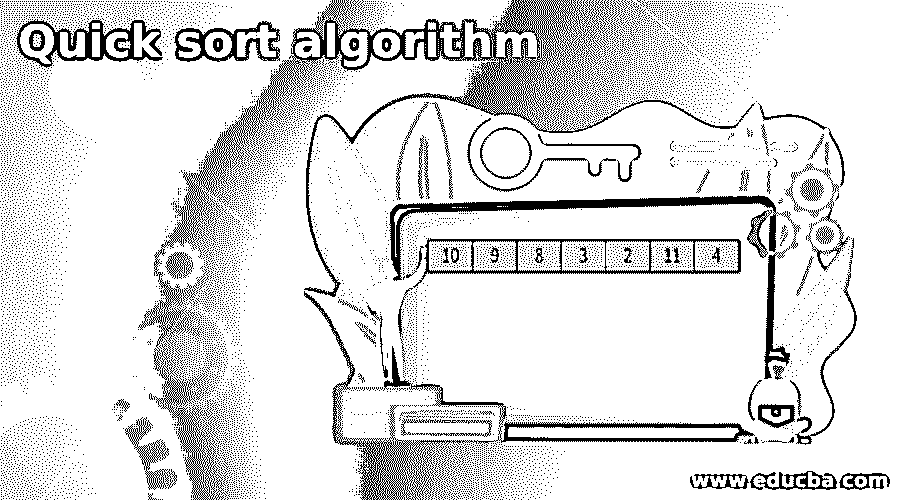

## 快速排序算法简介

快速排序是一种排序技术，它对给定范围的元素进行排序，并以排序后的顺序返回该范围作为输出。该算法将一个数组作为输入，并将其分成许多子数组，直到它匹配一个合适的条件，合并元素，然后返回一个排序后的数组。

快速排序遵循分而治之的方法，因为 pivot 元素首先将数字范围划分为子数组，然后在最后一步通过收集所有数字返回一个排序后的数组。

<small>网页开发、编程语言、软件测试&其他</small>

### 快速排序算法是如何工作的？

在讨论算法之前，让我们以一个包含 7 个元素的数组为例，看看快速排序是如何工作的。

输入数组如下图所示。

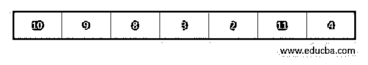

1.快速排序的第一步包括选择一个元素作为枢纽元素。pivot 元素是数组中的一个元素，它被选择作为一系列数字的除法。如果我们选择“n”作为 pivot 元素，那么数组中小于“n”的数字位于 n 的左侧，大于 n 的数字位于 pivot 元素的右侧。这就是为什么我们快速排序的第一步是选择一个元素作为枢纽元素。可以通过多种方式选择 pivot 元素，下面列出了一些方式:

*   选择第一个元素作为轴心。
*   选择最后一个元素作为轴心。
*   选择一个随机元素作为轴心。
*   选择中间点作为轴心。

在我们的示例中，让我们选择最后一个元素作为 pivot 元素，并继续这个过程。

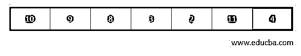

2.快速排序的基本过程是一个分区()。在选择了 pivot 元素之后，我们需要通过将小于 pivot 的元素移动到 pivot 的左侧，将大于 pivot 的元素移动到 pivot 的右侧来重新排列元素。

流程如下所示:

*   指针必须固定在 pivot 元素上。

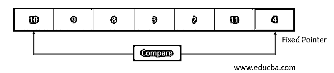

*   然后将枢纽元素与开始时的元素进行比较。

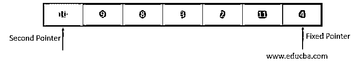

*   如果元素大于轴心，则为该元素设置第二个指针。现在，将 pivot 元素与其他元素进行比较。如果找到一个比支点小的元素，那么它将与第二个指针中的更大的元素交换。

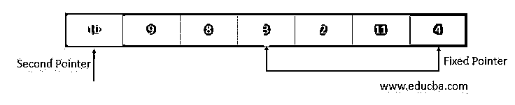

*   同样的过程继续将下一个更大的元素设置为第二个指针。并且它与下一个更小的元素交换。

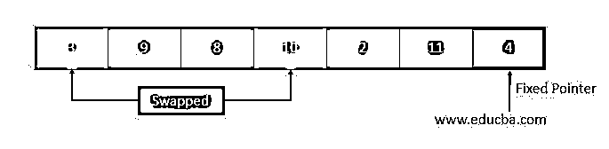

*   该过程将继续，直到到达倒数第二个元素。

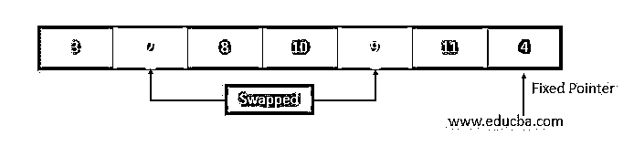

*   当到达倒数第二个元素时，pivot 元素将与第二个指针交换。

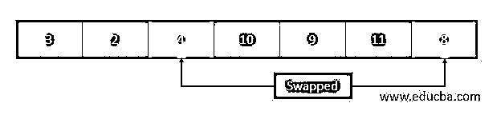

3.现在，数组被分成两部分，第一部分的元素数小于主元数，第二部分的元素数大于主元数。

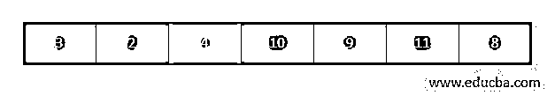

*   分别为左右子数组选择枢纽元素，并对每个部分递归调用上述过程，直到每个子数组形成单个元素。当这一点发生时，数组已经排序，最终的数组如下所示。

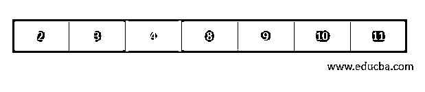

### 快速排序算法

在进入快速排序的实际实现之前，让我们看一下算法。

**第一步:**将一个元素视为 pivot 元素。

**第二步:**将数组中最低和最高的索引赋给 low 和 high 变量，并在 QuickSort 函数中传递。

**步骤 3:** 递增 low，直到 array[low]大于 pivot，然后停止。

**步骤 4:** 递减高，直到 array[high]小于 pivot，然后停止。

步骤 5: 交换低电平和高电平，重复该过程，直到倒数第二个元素。

步骤 6: 交换 pivot 和倒数第二个元素，然后你会得到一个完成第一个分区的数组。

**步骤 7:** 对得到的两个数组重复相同的过程，直到不能再分割数组为止。

### **快速排序源代码**

`# Quick sort in Python
# function to find the partition position
def arraypartition(array, low, high):
# choose the last element as pivot
pivot = array[high] # second pointer for greater element
i = low - 1
# traverse through all elements by comparing each element with pivot
for j in range(low, high):
if array[j] <= pivot:
# if element smaller than pivot is found then swap it with the greater element    pointed by i
i = i + 1
# swapping element at i with element at j
(array[i], array[j]) = (array[j], array[i])
# swap the pivot element with the greater element specified by i
(array[i + 1], array[high]) = (array[high], array[i + 1])
# return the position of partition
return i + 1
# function to perform quicksort
def quickSort(array, low, high):
if low < high:
# find pivot element such that
# element smaller than pivot are on the left
# element greater than pivot are on the right
pi = arraypartition(array, low, high)
# recursive call on the left of pivot
quickSort(array, low, pi - 1)
# recursive call on the right of pivot
quickSort(array, pi + 1, high)
array = [10, 9, 8, 3, 2, 11, 4] print("The Unsorted Array is: ")
print(array)
quickSort(array, 0, len(array) - 1)
print('Sorted Array in Ascending Order:')
print(array)`

**输出:**

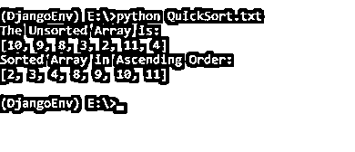

### 时间复杂性

#### 最坏情况的复杂性

当 pivot 元素是数组中所有元素中最大或最小的元素时，最坏情况的复杂度为 O(n 2 )。这导致了枢纽元素位于数组末尾的情况。

#### 最佳情况复杂性

当枢纽元素位于数组的中间或中间元素附近时，最佳情况复杂度为 O(n*log n)。

#### 平均案例复杂性

当我们没有精确地得到阵列的均匀平衡的分区时，平均情况复杂度为 O(n*log n)。

### 结论

*   快速排序遵循分而治之的方法，对给定范围的元素进行排序，并以排序后的顺序返回该范围作为输出。
*   pivot 元素是数组中的一个元素，它被选择作为一系列数字的除法。
*   您可以选择任何元素作为透视元素。

### 推荐文章

这是一个快速排序算法的指南。这里我们讨论快速排序算法如何与代码和输出一起工作。您也可以看看以下文章，了解更多信息–

1.  [C 语言中的 DFS 算法](https://www.educba.com/dfs-algorithm-in-c/)
2.  [极大极小算法](https://www.educba.com/minimax-algorithm/)
3.  [RSA 算法](https://www.educba.com/rsa-algorithm/)
4.  [画线算法](https://www.educba.com/line-drawing-algorithm/)

