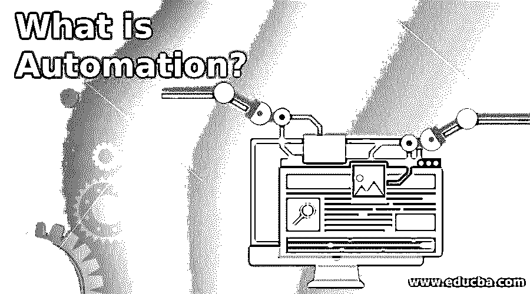

# 什么是自动化？

> 原文：<https://www.educba.com/what-is-automation/>

## 自动化简介

自动化被定义为这样一种技术的发展过程，这种技术可以帮助生产货物、物品和各种服务。这个过程有助于监控先前由人类完成的生产。自动化过程可以在不同的部门进行，如运输、国防、制造、运营、公用事业、信息技术和设施部门以及许多其他部门。自动化过程主要是为了减少人力和节省生产时间，从而提高生产率和生产的准确性。

### 为什么我们需要自动化？

由于自动化过程有益于工业和个人，所以它在不同的部门进行，并且在商品生产中需要这种过程。该流程的一些需求描述如下:

<small>网页开发、编程语言、软件测试&其他</small>

1.  这是必要的，因为它有助于提高劳动生产率。通过应用这一过程，商品和服务的生产率提高了，劳动生产率也提高了。这个过程很重要，因为我们可以在更短的时间内获得更好的产出。
2.  许多组织都需要它，因为它有助于降低劳动力成本。如果这个过程没有在组织中应用，它将增加投资成本，从而影响组织的发展。因此，为了减少这种情况，流程必须减少手动工作，并使组织中执行的流程自动化。
3.  这是必要的，因为它有助于克服组织中劳动力短缺的问题。自动化过程有助于使组织过程自动化，从而消除对劳动力的依赖，这有助于减少劳动力短缺问题。在任何组织中，总有一个影响组织生产率的劳动力可用性问题。这个问题的解决方法是过程。
4.  应用该过程的另一个重要的必要因素是在该组织中工作的工人的安全。这可以应用于执行那些在组织中具有高伤害风险的操作。例如，在金属工业中，熔化铁的操作可以自动化，以减少受伤的风险并保护工人免受伤害。
5.  组织需要自动化过程，因为它有助于提高产品质量，并有助于改进组织中执行的制造过程。
6.  由于自动化过程速度快，有助于提高组织的生产率，因此按时交付产品是必要的。自动化过程有助于提高产品和服务的生产率，而不影响质量。
7.  另一个至关重要的因素是，对于组织来说，自动化过程对于执行那些不能手工完成的操作是必要的。工业中进行的一些操作需要自动化。举个例子，举一些重的货物，这需要一些过程。

### 自动化的重要性

许多行业和组织总是关注投资成本和生产率，以获取自身利益。自动化过程对于这些组织降低安装成本和提高生产率非常重要。自动化过程有助于实现行业和组织提供的商品和服务的高水平生产率。自动化的一些重要因素描述如下:

1.  这个过程很重要，因为它有助于提高生产率，有助于改进组织的生产过程。产品的质量、生产时间、生产成本所有这些因素都受到工艺的影响。
2.  有益于所有类型的组织，并有助于实现市场需求，按时生产商品和服务。

### 自动化的使用

自动化过程的用途描述如下:

1.  用于 IT 部门开发如此多的应用程序，以减少人力。
2.  用于食品部门生产大量食品。
3.  自动化过程在金属工业中用于提升重物和其他不能手动完成且需要自动化过程的操作。

### 自动化的优势

自动化过程对组织有几个好处。下面介绍了一些优点:

#### 1.提高可用性

由于自动化过程有助于降低生产成本和生产时间，因此它有助于系统随时可用，并且过程可以连续执行。过程不会自动改变，一旦设计出来，它会产生相同的结果，而不会影响质量。与手动操作相比，该过程还有助于灾难恢复。

#### 2.更高的可靠性

自动化流程有助于提高组织运营的可靠性。由于该过程产生的结果是相同的，因此消除了产生错误结果的风险，并且总是产生正确的结果。通过执行该过程，可以消除手动操作，这将增加系统可靠性并帮助组织产生更好的结果。

#### 3.降低成本

该过程对于组织是有利的，因为它有助于减少劳动力数量，从而降低劳动力成本，使操作自动化，使得不需要对那些减少劳动并提高生产率的过程进行连续监控。随着几个过程的自动化，这将有利于组织和行业降低投资成本，提高生产率。

#### 4.更好的性能

自动化流程有助于在更短的时间内快速完成操作。与自动化流程相比，手动操作需要更多时间，并且需要持续监控才能获得更好的结果。自动化流程消除了这种依赖性，并有助于实现组织所需的准确性。

### 结论

自动化过程在各个行业的应用日益增加，因为它有助于行业改善市场。该工艺有助于实现更高水平的生产率，有助于降低生产成本，并节省时间。它还有助于消除对人工的依赖，并使所有的组织操作自动化。在不久的将来，该流程将成为所有类型组织的强制性流程。

### 推荐文章

这是一本关于什么是自动化的指南。在这里，我们讨论了自动化的重要性、用途、几个优点以及为什么我们需要自动化。您也可以看看以下文章，了解更多信息–

1.  [自动化测试流程](https://www.educba.com/automation-testing-process/)
2.  [自动化测试的好处](https://www.educba.com/benefits-of-automation-testing/)
3.  什么是测试自动化框架？
4.  [自动化测试工具](https://www.educba.com/automation-testing-tools/)

