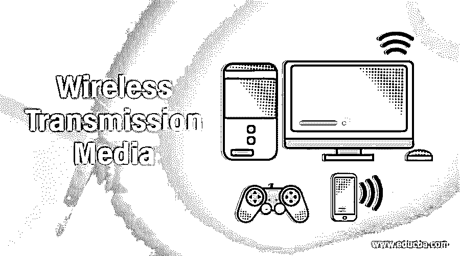

# 无线传输媒体

> 原文：<https://www.educba.com/wireless-transmission-media/>

## 无线传输媒体介绍

非导向介质的模式是无线传输。两个或更多设备之间没有物理链路，无线通信之间没有无线通信。无线信号通过空气传播，并由合适的天线处理。当天线安装在设备或无线电路上时，数字数据被转换成无线电信号，并分布在其整个频谱上。在接收器的另一端，信号被传输并转换成数字数据。如果你站得离想和你说话的人太远，你就听不到她说什么，因为她发出的声波达不到你的耳朵。无线视线网络系统面临类似的限制。当发射和接收间隔太大，信号无法进入时，通信线路就中断了，信息(电力、数据或信息信号)就失去了目的地。

### 无线传输介质是如何工作的？

无线媒体可以通过无线电波或计算机上的红外线发送数据。红外线是一种传输红外线信号的无线媒体。广播无线电是一种无线媒体，它长距离传送无线电信号，例如在城镇、地区和国家之间，短距离传送，例如在办公室或家中。移动性是一种无线电传输方法，通常用于移动通信，尤其是调制解调器和移动电话。微波是高速信号传输无线电波。卫星通信是一种环境，其中微波信号从地面站发射，信号被放大，并通过各种各样的地面站分发。

<small>网页开发、编程语言、软件测试&其他</small>

不同类型的无线传输介质如下所示

*   **光传输:**光或光信令是可用于数据传输的最强电磁频谱。这是通过激光实现的。由于频光的使用，发送者和接收者必须都在视线内，而且只能在一条直线上。由于激光传输是单向的，激光器和光电探测器必须位于接触的两端。激光束通常为 1 mm 长，以便两个接收器与每个激光源正确匹配。激光无法穿透墙壁、雨水或厚厚的星云等障碍物。激光束通常会因热量、大气温度或轨道温度的变化而变形。
*   **红外透射:**在可见光谱的光和微波中，有一种红外波。频率范围为 300 GHz 至 430 THz，波长为 700 NM 至 1mm。红外波用于像电视和远程联络这样的极短距离的通信。红外线沿直线传播，因此具有固有的方向性。由于频谱较高，红外线无法穿透墙状屏障。
*   **微波传输:**100 MHz 以上的电磁波可以直接传输，通过波束将信号发送到特定的电台。因为微波是沿直线运动的，所以所有的发射器和接收器必须严格地在一条直线上。电波聚焦在微波天线上形成脉冲。多个天线可以对齐，如上图所示。微波不会像屏障一样穿透墙壁，它们的频率更高。
    *   **无线电传输:**波长从 1 mm-10 万 km，频率从 3 Hz(极低频)到 300 GHz(特高频)不等，可以穿过一个区域的墙壁和结构。六个波段分开了无线电频率。低频无线电波能够穿过墙壁，而较高的无线电频率可以直线穿过并反弹。高频无线电波提供了更大的能量。
*   **短距离无线媒体:**这可以促进几米到几英里或几公里之间的联系。无线网络是一种常见现象。以下是无线短距离通信的类型:
    *   **蓝牙:**蓝牙使用个人区域网络，如手机连接、笔记本电脑连接、便携式相机等。
    *   **Wi-max:** Wi-Max 反映了全球微波互联互通。该网络建立在城域网(MAN)中，并由 Wi-Max 覆盖。有线电视和 DSL 互联网就是例子。

### 推荐文章

这是无线传输媒体指南。这里我们也讨论一下无线传输媒体的介绍和工作原理？并附有解释。您也可以看看以下文章，了解更多信息–

1.  [传输模式](https://www.educba.com/transmission-modes/)
2.  [路由器类型](https://www.educba.com/types-of-routers/)
3.  [什么是 WAP](https://www.educba.com/what-is-wap/)
4.  [GPRS 架构](https://www.educba.com/gprs-architecture/)

