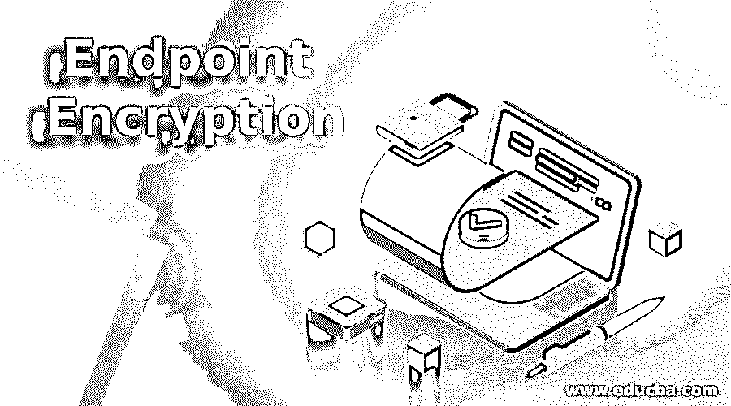

# 端点加密

> 原文：<https://www.educba.com/endpoint-encryption/>

## 什么是端点加密？

软件端点加密可保护设备硬盘、服务器或其他网络端点(如 SD 存储卡、外部硬盘、USB 闪存驱动器等)上的数据。端点加密有两种方式。首先，计算机上的文件或数据被加密。好处是每个文件都是加密的，并且当它从源机器移动到另一个设备时将继续加密。缺点是每个文件都需要单独加密。第二种方法也称为完全磁盘加密。整个硬盘都是用这种方法加密的。这种方法在设备被盗或发生故障的情况下特别有用，因为磁盘上的所有内容都会自动得到保护。加密磁盘上的每个文件都被转移到单独的设备或闪存驱动器，因此不再加密。这种解决办法行不通。

组织需要加密其数据的原因可能有很多。例如，在制药或软件开发等高科技公司，他们的研究需要受到保护，以免受到竞争对手的攻击。患者和客户数据需要加密，以符合政府对医疗保健和金融服务等监管部门的要求。PCI-DSS 要求零售商加密消费者的信用卡数据，以避免未经授权的使用。数据安全 PCI-DSS 信息安全也关系到不受控制的组织。数据泄露会导致负面广告、业务损失以及合作伙伴或消费者诉讼。价格昂贵。此外，根据 Ponemon Institute 的 2018 年数据泄露成本报告，每条丢失或被盗的机密和敏感信息记录的平均成本同比上升 4.8%，达到 148 美元。这项措施可能会让一个组织因 100，000 条记录的中型违规而损失 1，500 万美元。

<small>网页开发、编程语言、软件测试&其他</small>

### 端点加密管理

IT 部门将使用强大的加密解决方案集中管理所有加密终端，包括不同供应商的加密。例如，McAfee Complete Protection —高级 IT 部门可以从单一控制台跟踪和检查加密端点，并管理加密策略和密钥。在 OS X 和 Windows 上的 Apple FileVault encryption 以及 McAfee 自己的加密软件等设备上，IT 人员可以管理本机编码。这比连续在几个控制台之间切换要好。支持多家供应商加密产品的终端安全解决方案有助于降低管理开销和成本。此外，中央控制台提供了对所有端点的更好的可见性，并在每个端点上使用加密。当笔记本电脑或闪存驱动器丢失或被盗时，公司可能会以此来表明合规性。

端点加密软件可以包含许多管理功能，例如:

*   自动登记端点的缺失可能被禁用。
*   计算机代理被自动配置为执行加密策略。
*   创建和实施统一的加密策略。
*   混合加密的环境支持。
*   加密软件

#### 1.检查站喷砂剂

Check Point 提供了许多威胁安全功能，包括喷砂代理中的全磁盘加密。

Check Point 喷砂剂的特性

*   预启动安全功能保证设备启动磁盘时不会试图修改数据。
*   完整的软件包提供反恶意软件、VPN 和安全攻击。

#### 2.McAfee 全面的数据保护

除了全面的磁盘保护，McAfee 的全面数据安全还提供了高级数据和系统控制。

McAfee 完整数据的功能

*   为苹果 FileVault 和微软 BitLocker 的 macOS 和 Windows 系统加密提供控制和管理覆盖
*   提供数据访问规则的数据丢失保护(DLP)是一项关键优势，也是该产品包的一部分。

#### 3.Microsoft BitLocker

对于 Windows 用户，BitLocker 是为全磁盘加密提供优化的操作系统解决方案的默认选择

Microsoft Bitlocker 的功能

*   BitLocker 是微软 Windows 的默认集成替代方案，对于许多用户来说，这是一个简单明了的选择。
*   Microsoft BitLocker 管理和监控(MBAM)是一个可选工具，用于集中管理超出个人桌面使用范围的分布式业务部署。
*   作为其简单易用功能的一部分，网络激活功能可以在 Windows PC 连接到内部网络时自动启动

#### 4.Sophos 安全加密

SafeGuard 通过额外的管理功能扩展了 Windows BitLocker 和 macOSFileVault 的本机功能

Sophos 安全加密的特点

*   另一个基本功能是从控制面板的角度进行报告，帮助管理员实施法规强制加密策略
*   中央管理功能使管理员能够跨各种设备监控完整的磁盘加密，这是 SafeGuard 的核心价值。

### 结论

在本文中，我们已经了解了什么是端点加密软件，它如何与各种端点加密软件一起工作。您可以根据自己的需求选择任何一种。我希望这篇文章对你有所帮助。

### 推荐文章

这是一份端点加密指南。在这里，我们还将讨论什么是终端加密软件，它如何与各种终端加密软件一起工作。您也可以看看以下文章，了解更多信息–

1.  [PHP 加密](https://www.educba.com/php-encryption/)
2.  [埃尔加马尔加密](https://www.educba.com/elgamal-encryption/)
3.  [不对称加密](https://www.educba.com/asymmetric-encryption/)
4.  [加密算法](https://www.educba.com/encryption-algorithm/)

