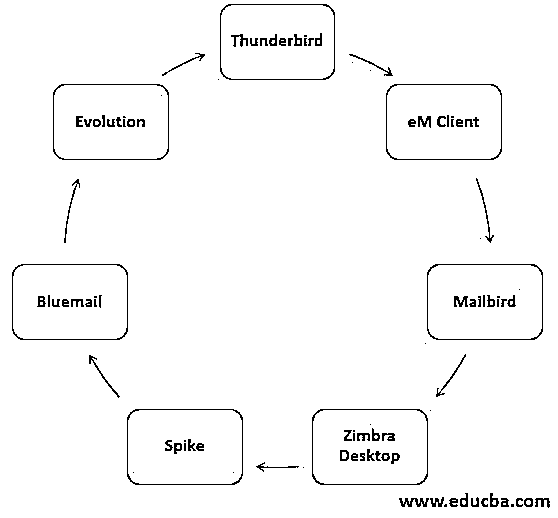

# Outlook 备选方案

> 原文：<https://www.educba.com/outlook-alternative/>

## Outlook 备选方案介绍

微软电子邮件系统，帮助接收和发送电子邮件给不同的人，无论是在同一个域系统或在不同的域系统被称为 Outlook。在微软系统中，outlook 电子邮件是内置的，电子邮件应用程序可以在 Windows 系统中顺利运行。它可以作为独立版本使用，也可以与 Microsoft office 软件包一起使用。Outlook 具有日历、任务管理器、联系人和便笺更新功能，可以节省时间并将所有信息集成到一个应用程序中。由于易于使用，outlook 是商业用途中最常分类的电子邮件应用程序。

### 7 大前景选择

Outlook 有一定的局限性，如成本、可靠性和支持问题，以及与其他应用程序的集成较少。这使得客户考虑易于使用且便宜的替代品。

<small>网页开发、编程语言、软件测试&其他</small>

#### 1.雷鸟

由 Mozilla Firefox 提供的雷鸟适用于所有操作系统。基本版是免费提供的，它的大部分功能让个人和公司着迷，成为 Outlook 的替代产品。几个插件是可用的，以便该应用程序可以用于任务管理器，日历，笔记更新就像 Outlook 一样。UI 简单明了，让用户更好地理解应用程序，而不是查看文档。可以很容易地对消息进行分类，这有助于用户查找相关的邮件。当应用程序更新时，插件也应该更新，以使其正常工作。

#### 2.eM 客户端

可以在 Windows 和 Mac 系统中使用的私人和企业电子邮件客户端称为 eM 客户端。除了邮箱、联系人和日历的标准功能，即时消息功能也可以在应用程序中使用。这有助于发送更少的商业信息并立即收集详细信息。这里需要注意的重要一点是，该应用程序仅对私人用户免费，不对企业用户免费。更新会自动进行，每次更新后用户都会有新的功能。其他电子邮件应用程序也在该应用程序中同步，并借助 SSL 标准确保安全性。

#### 3.邮鸟

邮箱界面简单有效，用户可以很容易地找到任务。用户可以轻松定制工具栏，甚至可以将 WhatsApp 添加到工具栏中。所有的邮箱可以集成在一起，这样用户就可以很容易地从一个邮箱中查看邮件。另外，LinkedIn 可以连接，以便可以在邮箱本身中启用网络平台。可以为每个邮箱指定颜色代码，以便于识别。由于许多应用程序可以链接到 mailbird，我们可以称之为多功能平台。该应用程序有免费版和付费版。免费版缺少了一些功能，但它值得拥有 mailbird 应用程序。

#### 4.Zimbra 桌面

虽然我们不能说这是一个合适的 outlook 替代方案，但这是一个用于邮箱检查联系人和日历的普通替代方案。这是一个与云集成的邮箱，因此可以在线和离线访问邮件。删除的邮件可以在 30 天内从回收站中恢复。可以与属于同一公司的人共享消息，因此可以以有效的方式进行通信。与其他邮箱相比，它的主题较少。语言不能轻易改变，因为它会抛出一些错误。

#### 5.长钉

我们可以称 Spike 为对话邮件应用程序，因为它集成了 messenger 应用程序和传统邮箱。这适用于所有操作系统，并且可以连接到云服务。它可以连接到文件管理器，以便收集文件并发送给团队成员。现代标准可以与应用程序协作，因此安全性更高。这对私人用户是免费的，但对企业来说，这是昂贵的。跨平台集成对应用程序有好处，而且作为 Outlook 的替代方案，它工作得很好。通知可以在这个应用程序中定制，因为 messenger 是集成的，我们可以通过电子邮件发送语音消息。

#### 6\. Bluemail

任何数量的邮箱都可以与 Bluemail 集成，blue mail 还支持群发邮件。bluemail 可以使用多个账户。可以为电子邮件通知设置提醒，并且可以过滤掉不使用的电子邮件。android 手机、mac 手机或平板电脑以及操作系统都支持邮件。可以通过加密来提供安全性，并且可以通过改变窗口来容易地改变主题。多个邮箱可以在应用程序中协作。可以将邮件标记为稍后阅读或稍后发送回复。邮箱里也有智能推送通知。

#### 7.演变

Linux 用户大多使用 Evolution 作为 outlook 的替代品，因为它在操作系统中运行良好。该应用程序支持 outlook 的所有功能，如日历、组、联系人和许多其他选项。此外，它可以与微软服务器相关联，以便可以在邮箱中收集新闻。可以应用电子邮件过滤器来避免垃圾邮件。外观就像 outlook，outlook 用户可以满意地使用带有 evolution 的 Linux 操作系统。邮箱提供个人和专业支持，支持多个服务器将邮件从一个发件箱顺畅地发送到其他收件箱。用户界面很容易理解，它与许多邮箱连接。对消息进行加密，因此邮件受到保护。

不同的观点互相拆台。许多其他选择，如 Pegasus，Sea Monkey，G Suite 也可以通过电子邮件与客户进行交互。我们不能将 Gmail 称为 outlook 的替代品，因为 Gmail 更多地是供个人使用，而 outlook 是为专业用途设计的。微软支持上面讨论的大部分电子邮件。

### 推荐文章

这是 Outlook 替代方案的指南。在这里，我们还讨论了简介和前 7 个 outlook 备选方案以及解释。您也可以看看以下文章，了解更多信息–

1.  [分享替代方案](https://www.educba.com/shareit-alternatives/)
2.  [操作系统替代品](https://www.educba.com/os-alternatives/)
3.  什么是 Basecamp？
4.  [安卓替代品](https://www.educba.com/android-alternatives/)

