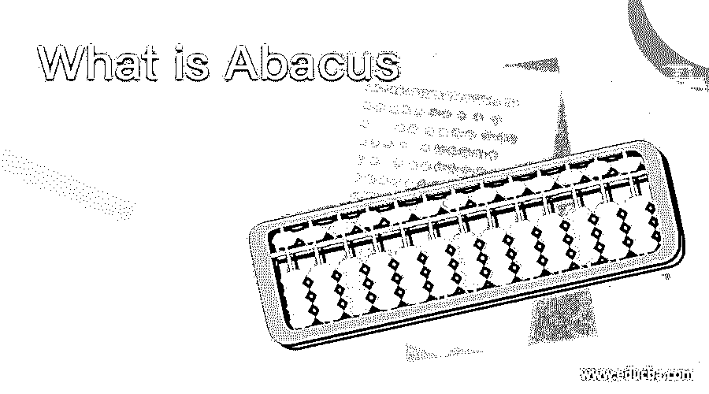

# 什么是算盘

> 原文：<https://www.educba.com/what-is-abacus/>

## 珠算入门

算盘是一种机械装置，通常被称为计数板，用于快速测量数字方程。它最初是在数千年前发明的，用于进行算术计算，现在仍普遍用于大脑生长程序。该名称取自拉丁语表达式——abax 或——bacon。它由一个矩形结构组成，珠子在上面垂直排列的杆上上下移动。算盘的主要目标是提高儿童的智力。算盘不仅仅进行计算，它还能让使用者计算出计算结果。

### 我们为什么使用算盘？

在古代，没有计算器、计算器或用于计算的类型和记录，它足够精确地进行算术计算。相比之下，人们习惯称脚趾和手指或者泥土中的石头。这些技术对于长时间的计算来说是不够的，所以它在当时被使用。

<small>网页开发、编程语言、软件测试&其他</small>

### 算盘的功能

我们身体的运动神经和感觉神经将来自身体的输入传送到大脑，同样地。人类的头部使用感觉器官工作。大脑接受器官输入。因此，珠子以这种方式排列。当孩子们用指尖调节时，神经末梢受到刺激，大脑中的所有细胞都受到刺激。当使用左手时，大脑右侧的细胞受到刺激。当使用右手时，大脑的左侧细胞受到刺激。左脑的运作解释，右脑的活动可视化。大脑的左右两侧现在也在一起运作，并帮助整个大脑的成长。

### 历史

“算盘”这个词是公元前 300 年至 500 年间引入的一种坚固的算术工具。算盘这个词来源于拉丁语“abax”或者“阿巴昆”。它在发明时经过了多个国家。算盘是一种新的中国算盘，有 2/5 副，但有点硬；取而代之的是日本的佐罗班，并得到了著名数学家关小和的支持。为了把珠算成 1/4 层，Seki Kowa 从顶层和底层各取了一颗珠子。索罗班的算盘其实是用的。在全球化之后，它变得司空见惯，因为在一个论坛上存在着激烈的全球竞争。各国的教育也受到了影响。它加强了对算术的总体理解，也增加了问题的解决和更快的计算技能。

### 算盘的种类

以下是下面提到的几种类型。

1.  **线条算盘:**久而久之就成了线条陡峭的统治板。在印度、埃及、希腊、罗马和其他非常古老的文化中，它被广泛使用。萨拉米斯是算盘线的常见例子，保存在雅典博物馆。它包括一块画有线条的白色大理石板。
2.  **尘算盘:**常用于以裹有细沙或灰尘的板状来计量。沙子被分成两条线，在两条线中定义不同数量的位置。对于用线画出的许多标记，确定了数字和数量。这种形式的最初计算器可能被美索不达米亚文明使用过。
3.  中国古代算盘:在结构和计算方法上，它与古老的凹槽算盘非常相似。下图描绘了一本推测中国早期算盘的书。这本书叫《数学论文》，许由写于 1700 年前，陈銮写于 300 年前。
4.  **带凹槽的算盘:**除了一排排的算盘外，罗马人还进行了极其精密的布局。每个上野都有一个追踪器，在下野有四个计数器。此外，添加了一些其他计数器，可以简化分数的测量。

### 优势

1.  许多著名的医生已经研究了被称为数字大脑的大脑左半球，它提供分析并管理测量、批判性推理、阅读、写作等。
2.  它支持正统观念、阅读和写作能力差的诵读困难儿童。诵读困难的孩子应该意识到，这增强了他们的数字能力。
3.  数学条件的进步不仅有帮助，而且有助于提高整体学术水平。
4.  因为它鼓励数学，所以它提供了基于估计的科目的信心。

### 推荐文章

这是一个什么是算盘的指南，我们在这里讨论为什么我们使用算盘，以及它的用途，类型，功能，历史和优势。您也可以阅读以下文章，了解更多信息——

1.  [甲骨文运算符](https://www.educba.com/oracle-operators/)
2.  [软件审查](https://www.educba.com/software-review/)
3.  [软件指标](https://www.educba.com/software-metrics/)
4.  [Oracle 中的左连接](https://www.educba.com/left-join-in-oracle/)

