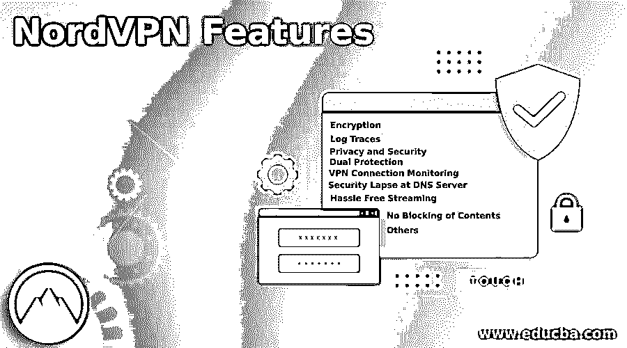

# NordVPN 功能

> 原文：<https://www.educba.com/nordvpn-features/>

## NordVPN 功能介绍

NordVPN 功能解决了用户在互联网接入方面的主要问题，例如他们被跟踪，他们的浏览数据将被出售给不受欢迎的人。黑客会窃取他们的机密信息，如密码、银行账户信息、税务信息。一个国家可以访问他们的在线交易日志，并牵连他们。互联网服务提供商会向他们勒索赎金，因为他们会了解他们的在线行为，并失去个人自由。通过任何 VPN 浏览互联网都会增加不必要的开销，并影响所访问应用程序的性能和稳定性。VPN 不允许 24 x 7 全天候的互联网访问。

### 各种 NordVPN 功能

以下是 NordVPN 的各种功能:

<small>网页开发、编程语言、软件测试&其他</small>

用户可以通过 VPN 服务提供商提供的安全隧道访问公共互联网，这使用户感觉像在自己的专用网络中浏览。

NordVPN 是 VPN 社区中的顶级玩家之一，其特点是:

#### 1.加密

*   每当用户尝试连接到 web 时，安装在用户的笔记本电脑/台式机/智能手机中的 VPN 客户端会与 VPN 服务器建立联系，并提供身份验证详细信息。一旦通过认证，VPN 就创建一个安全的隧道，数据包被加密并通过隧道经由互联网服务提供商发送到网络服务器。在数据包到达 Web 服务器之前，数据被解密。类似地，数据以同样的加密方式从 web 服务器传回给用户。
*   通过这种加密，某些关键信息，如用户的身份，IP 地址，位置的细节是掩盖了 ISP，可能的黑客试图干预和国家对用户的浏览历史。VPN 会将用户的位置、IP 详情更改为 VPN 服务器的位置、IP 详情，对 ISP/web 服务器的访问会携带新的 IP 详情，用户的身份得到很好的保护。密码、银行/财务详细信息、医疗信息、个人对话、邮件信息和许多其他数据在离开最终用户设备之前都会被加密。NordVPN 使用最先进的加密标准，如多个政府机构批准的 256 位密钥高级加密标准。在 VPN 隧道创建期间，它使用了三种安全协议，即 OpenVPN、Nordlynx、IKEv2/IPsec。

#### 2.日志跟踪

*   通过 VPN 设计和加密保护个人身份和数据免受 ISP 和黑客的攻击。但是 VPN 服务器可以访问用户在网络中的浏览历史或活动日志，如访问的网站/软件、互联网连接的时间和持续时间、IP 地址、上传/下载的文件、传输的字节和服务器细节。
*   在选择 VPN 之前，用户必须评估 VPN 服务提供商部署的工具，以跟踪信息、收集的浏览数据列表、地理位置/州法律和法律要求。
*   NordVPN 没有维护任何日志数据，审计机构对其进行了验证。总部设在巴拿马，该国没有法律义务保留用户的日志，它方便地避开了美国和欧洲地区的日志记录是强制性的。

#### 3.隐私和安全

*   NordVPN 安全软件 CyberSec 阻止访问熟悉托管间谍软件、恶意软件和任何其他恶意代码的已识别网站。CyberSec 在 DNS 层的持续监视阻止了对易受攻击网站的访问。它还阻止广告弹出窗口、视频广告和广告内容，并确保无广告的互联网观看。
*   CyberSec 通过断开与命令中心的通信，防止用户的系统参与分布式拒绝服务(DDOS)攻击，即使系统已经感染了恶意软件。

#### 4.双重保护

*   双 VPN 和双加密通过使黑客攻击的难度增加一倍来保护黑客的高度敏感和关键数据。在这种架构中，数据通过 VPN 服务器路由，在已经加密的数据上添加额外的加密。因此，双重加密的数据安全地通过网络，在被传送到 Web 层之前，在另一个 VPN 服务器上被解密。
*   这种方法完全保护了数据，也确保了用户身份的隐私得到严格维护。

#### 5.VPN 连接监控

*   NordVPN 会持续监控与 VPN 服务器的连接是否始终处于开启状态，如果连接出现任何问题，将会阻止对互联网的访问，从而避免网络中的数据泄露。这种被称为 VPN Kill Switch 的监视器充当了额外的防御层，以防止数据的意外丢失。只有禁用 VPN 切断开关后，被阻止的互联网连接才会重新建立。
*   有一个选项可以在系统级别为系统中运行的所有应用程序或在应用程序级别启用 Kill switch。此外，用户还有另一种选择，即始终或仅在工作时间或有时在需要时保持断路开关监控。

#### 6.DNS 服务器的安全漏洞

*   如果在 internet 访问中使用了任何 VPN，流量将通过安全的 VPN 隧道和 VPN 服务指定的 DNS 服务器进行路由。DNS 服务器解密 URL (https://www。Amazon.com)并将其转换为 Web 服务器的实际 IP 地址。有时由于错误使用 Windows 软件或重置系统首选项或错误的 VPN 设置，系统可能会连接到公共域服务器，而不是通过 VPN 服务连接到指定的 DNS 服务器，这可能会导致安全失效。
*   NordVPN 服务确保互联网连接只通过它指定的 DNS 服务器，而连接不会蔓延到公共服务器。

#### 7.无障碍流媒体

NordVPN 确保用户在任何时间、任何地点、以较低的带宽观看视频内容时不会遇到任何困难。

#### 8.不阻止内容

网飞和亚马逊等内容提供商也为 VPN 用户屏蔽基于地区的内容。NordVPN 解决了网飞和亚马逊的这类屏蔽问题，并为其用户提供了无中断服务。

#### 9.其他人

*   NordVPN 允许一个帐户使用 6 台带有任何操作系统的设备。
*   网速总是很快。
*   它提供了一种设施，使专用 IP 能够安全地进行高价值的金融交易。
*   全天候支持(24 x 7)。

### 结论

花在 NordVPN 服务上的钱是值得的。用户通过 NordVPN 获得安全、便捷、快速的互联网接入。

### 推荐文章

这是 NordVPN 功能指南。为了更好地理解，我们在这里讨论 NordVPN 的简介和各种功能。您也可以看看以下文章，了解更多信息–

1.  [VPN 隧道](https://www.educba.com/vpn-tunneling/)
2.  [安卓 VPN 应用](https://www.educba.com/vpn-applications-for-android/)
3.  [个人电脑的 VPN 应用](https://www.educba.com/vpn-applications-for-pc/)
4.  [我们为什么使用 VPN？](https://www.educba.com/why-we-use-vpn/)

