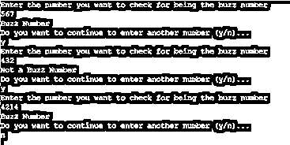
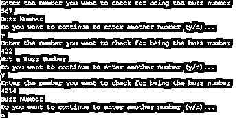

# 嗡嗡声号码

> 原文：<https://www.educba.com/buzz-number/>

## Buzz number 简介

蜂音数被定义为数列中的一种特殊形式，该数列要么以 7 结尾，要么能被 7 整除。这个数是娱乐数论中存在的各种其他数之一。巴兹数存在的这一数学分支是为了娱乐而开发的运算或逻辑。这些数字经常充当大脑的食物，是纯数学分支的一部分，处理整数和整数值函数。与蜂音数密切相关的一些数是质数，意味着该数在整个数系中只能被 2 整除，即 1 和该数本身。

### Buzz 数字背后的逻辑

到目前为止，我们知道 Buzz 数是娱乐数学的一部分，并且没有明确区分什么属于娱乐数学的类型。它更多的是作为日常工作甚至是玩游戏的一种消遣。这些娱乐性的数学数字是数学智力题、游戏甚至测验的重要组成部分。在许多技术访谈中，可能会问一个数字的逻辑是一个 buzz 数字，以测试编码时可能遵循的数学运算的实现逻辑。如果开发者清楚模或余数的概念以及如何用它来找到一个数的最后一位，那么在寻找一个蜂音数时测试的逻辑是理解的。这样做是为了确定最后一个数字是否是 7。例如，当一个数除以 10 时，生成的余数是该数的最后一位。没有人需要检查这个数字是否等于 7，看这个数字是否以 7 结尾。如果它给出的余数是 7，我们确认我们传递的数字是一个 buzz 数字。

<small>网页开发、编程语言、软件测试&其他</small>

测试的另一个逻辑是开发者是否知道除法规则，即开发者是否知道除法规则。这意味着，如果一个数是整除的，其模应该等于零。现在，用同样的逻辑，我们看看这个数除以 7 是否得到余数 0。因此，如果这个逻辑单独成立，我们说一个数是一个蜂音数。此外，按照逻辑，如果满足任何规则，即被 7 整除或最后一位数字是 7，它应该返回一个正值。

最后一个逻辑是创建一个 OR 条件，上面的两个检查都通过这个 OR 条件，这样即使其中一个条件为真，我们也会得到一个真值。如果两个条件都为真，那么也返回一个真布尔值。

### 怎么查巴兹的号码？

理解蜂音数字背后的逻辑在前面的部分中已经很好理解了。这里我们将把它放入伪代码中，使 Java 或 C++，或 python 中的代码生成得到简化。

1.  首先，将数字作为输入。
2.  接下来，我们创建两个标志，一个标志如果数字以 7 结尾，另一个标志是否能被 7 整除。
3.  张贴前面的步骤；我们首先使用 first 检查 10 的模，并检查模是否等于 7。如果是，我们使用该标志检查以 7 结尾的数字是否等于 1，否则为 0。
4.  接下来，我们检查模 7，并检查一个值是否等于 0。如果是，我们使用这个标志来检查 7 的整除是否等于 1，否则为 0。
5.  然后，使用 OR 语句最终将上述标志的输出作为 Boolean 返回类型返回，在驱动程序代码的 if 循环中检查该类型，以在控制台中打印所需的语句！

### 例子

下面提到了不同的例子:

#### 示例#1

在 C++中寻找蜂音号码

**语法**

`#include <cmath>
#include <iostream>
using namespace std;
// Function to check Buzz number with Boolean return type
bool isBuzzNum(int num)
{
int flag_lastdig7, flag_divby7;
if (num % 10 == 7)
flag_lastdig7 = 1;
else
flag_lastdig7 = 0;
if (num % 7 == 0)
flag_divby7 = 1;
else
flag_divby7 = 0;
return ( flag_lastdig7==1 || flag_divby7 == 1);
}
int main(void)
{
int num;
char choice;
do{
cout << "Enter the number you want to check for being the buzz number\n";
cin >> num;
if (isBuzzNum(num))
cout << "Buzz Number\n";
else
cout << "Not a Buzz Number\n";
cout << "Do you want to continue to enter another number (y/n)...\n";
cin >> choice;
}while(choice=='y' || choice =='Y');
}`

**输出:**

#### 实施例 2

在 Python 中查找 Buzz 号

**语法**

`def isBuzzNum(num) :
if (num % 10 == 7):
flag_lastdig7 = 1
else:
flag_lastdig7 = 0
if (num % 7 == 0):
flag_divby7 = 1
else:
flag_divby7 = 0
return ( flag_lastdig7==1 or flag_divby7 == 1)
choice ='y'
while(choice=='y' or choice =='Y'):
print("Enter the number you want to check for being the buzz number")
num = int(input())
if (isBuzzNum(num)):
print("Buzz Number")
else:
print("Not a Buzz Number")
print("Do you want to continue to enter another number (y/n)...")
choice = input()`

**输出:** 

#### 实施例 3

在 Java 中查找 Buzz 号码

**语法**

`import java.util.*;
public class Main {
static int flag_lastdig7, flag_divby7;
// Function to check Buzz number with Boolean return type
static boolean isBuzzNum(int num)
{
if (num % 10 == 7)
flag_lastdig7 = 1;
else
flag_lastdig7 = 0;
if (num % 7 == 0)
flag_divby7 = 1;
else
flag_divby7 = 0;
return ( flag_lastdig7==1 || flag_divby7 == 1);
}
// Main method
public static void main(String args[])
{
int n;
char choice;
Scanner sc= new Scanner(System.in);
do{
System.out.println("Enter the number you want to check for being the buzz number");
n= sc.nextInt();
if (isBuzzNum(n))
System.out.println("Buzz Number");
else
System.out.println("Not a Buzz Number");
System.out.println("Do you want to continue to enter another number (y/n)...");
choice= sc.next().charAt(0);
}while(choice=='y' || choice =='Y');
}
}`

**输出:**

### 结论

在本文中，我们研究了 Buzz number 的逻辑和实现。然而，人们可以很容易地找到使用相同代码的其他应用程序，这些应用程序可以是任何娱乐数学的一部分，如拼图或游戏！

### 推荐文章

这是一个巴斯号指南。在这里，我们讨论蜂音数的逻辑和实现，以及示例和输出。您也可以看看以下文章，了解更多信息–

1.  [伪代码算法](https://www.educba.com/pseudocode-algorithm/)
2.  [Python 伪代码](https://www.educba.com/python-pseudocode/)
3.  [Linux 错误代码](https://www.educba.com/linux-error-codes/)
4.  [PHP json_decode](https://www.educba.com/php-json_decode/)

