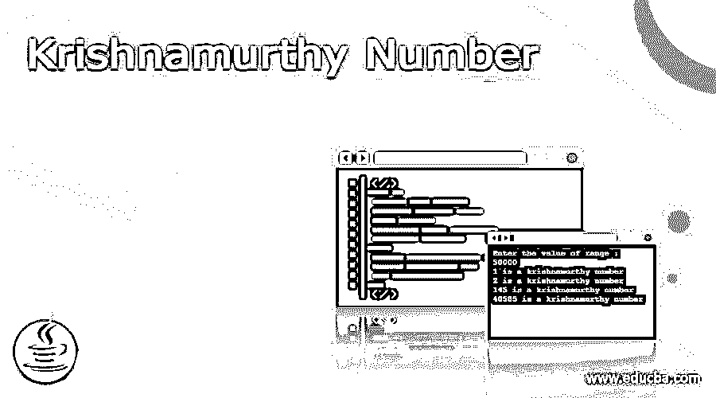
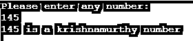
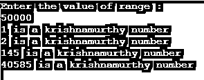

# 克里希那穆提数

> 原文：<https://www.educba.com/krishnamurthy-number/>

## 克里希那穆提数简介

Krishnamurthy 数被定义为一个数，它是通过将单个数字的阶乘求和等于该数本身而得到的，在 Java 中，这个数也被称为特殊数和强数，它可以是“N”个数字，它是通过将该数分解成其相应的数字，然后找到这些数字的阶乘来计算的，如果阶乘与该数相同，则这是一个 Krishnamurthy 数， 一个数的阶乘意味着它是从 1 到该数的所有数字的乘积，阶乘用感叹号(！idspnonenote)表示。 ).所以在这个话题中，我们将学习克里希那穆提数。

### 克里希那穆提数背后的逻辑

正如我们在上面看到的 Krishnamurthy 数的定义，所以如果一个数的阶乘之和等于原数，那么这个数叫做特殊数。因此，让我们看看我们将如何得到这个数字，以及背后的逻辑是什么。

<small>网页开发、编程语言、软件测试&其他</small>

这些数背后的逻辑是，为了得到一个强数，我们必须遵循一些规则，首先我们必须分解这个数，然后计算这个数的每个数字的阶乘，然后对我们得到的阶乘求和，我们还会得到一个数，如果这个数与前一个数完全相同，那么它就是一个 Krishnamurthy 数或强数，但是如果这个数与前一个数不匹配，那么它就不是一个 Krishnamurthy 数。

让我们来看看下列数字的图解，

*   1 = 1!= 1，在这种情况下，1(一)的阶乘就是 1(一)本身，它匹配前面的数；因此它是一个数字。
*   2 = 2*1 = 2，同样在这个中，2 的阶乘是 2 本身，它匹配前面的数；因此它是一个克里希那穆提数。
*   145，它有三个数字，所以我们必须打破数字，并计算每个的阶乘。

1! = 1 = 1

4! = 4*3*2*1 = 24

5! = 5*4*3*2*1 = 120

阶乘相加= 1+24+120 = 145

我们得到一个新的数，它也和之前的数一样，因此它也是一个克里希那穆提数。

*   40585 有五个数字，让我们把它们分开，计算它们的阶乘，

4! = 4*3*2*1 = 24

0! = 1 = 1

5! = 5*4*3*2*1 = 120

8! = 8*7*6*5*4*3*2*1 = 40320

5! = 5*4*3*2*1 = 120

通过加阶乘，24+1+120+40320+120 = 40585，这样这个数就和前面的数差不多了；因此它也是一个数字。

从以上几点或对数字的解释中，我们可以理解克里希那穆提数背后的逻辑。

### 怎么查克里希那穆提数？

如果原数的阶乘位数之和等于该数本身，则称该数为一个数。

下面是几个步骤，我们可以用它们来检查这个数字是否是一个数字。

*   首先，取任意一个数字
*   然后将数字分解成数字
*   然后找出每个数字的阶乘
*   之后，将每个数字的阶乘相加，并存储在另一个变量中。
*   如果每个数字的阶乘之和等于原数，那么这个数就是克里希那穆提数。

例如:

*   让我们取一个数字 145，它有三个数字 1、4 和 5，我们必须如下计算每个数字的阶乘，

阶乘是，

1! = 1 = 1

4! = 4*3*2*1 = 24

5! = 5*4*3*2*1 = 120

1 的阶乘是 1，4 的阶乘是 24，5 的阶乘是 120，所以如果我们把这些阶乘求和为，

1+24+120 = 145，阶乘的和与我们之前的数完全相同，因此我们可以说它是一个 Krishnamurthy 数。

*   现在，对于另一个数字 36，它有两个数字，3 和 6，所以首先，我们将找出 3 和 6 的阶乘，

3! = 3*2*1 = 6

6! = 6*5*4*3*2*1 = 720

当我们将这个阶乘求和为 6+720 = 726 时，得到的阶乘为 6 和 720，不等于前面的数 36，所以在这种情况下，我们可以说这样的数不是数，也不是强数。

### 克里希那穆提数的例子

下面提到了不同的例子:

#### 示例#1

**代码:**

`import java.util.*;
import java.io.*;
import java.util.Scanner;
class Knumber
{
static int facto(int number)
{
int j = 1;
while (number != 0)
{
j = j * number;
number--;
}
return j;
}
static boolean checkNumb(int number)
{
int add = 0;
int tempNum = number;
while (tempNum != 0)
{
add = add + facto(tempNum % 10);
tempNum = tempNum / 10;
}
if(add == number)
return true;
else
return false;
}
public static void main(String[] args)
{
int n;
Scanner sc = new Scanner(System.in);
System.out.println("Please enter any number:");
n = sc.nextInt();
if (checkNumb(n))
System.out.println(n + " is a krishnamurthy number");
else
System.out.println(n + "This is not a krishnamurthy number");
}
}`

**输出:**

上面的程序是我们编写的，用来检查输入的数是否是克里希那穆提数。编译后，我们输入任何数字；它会显示这个数字是不是克里希那穆提。

#### 实施例 2

**代码:**

`import java.util.*;
import java.io.*;
import java.util.Scanner;
class FindKnumber
{
public static void main(String args[])
{
int range;
Scanner sc=new Scanner(System.in);
System.out.println("Enter the value of range :");
range = sc.nextInt();
for(int i = 1; i <= range; i++)
checkNum(i);
}
static int fact(int number)
{
int f = 1;
while (number != 0) {
f = f * number;
number--;
}
return f;
}
static void checkNum(int number)
{
int add = 0;
int tempNumb = number;
while (tempNumb != 0)
{
add = add + fact(tempNumb % 10);
tempNumb = tempNumb / 10;
}
if(add == number)
System.out.println(number + " is a krishnamurthy number");
}
}`

**输出:**

上面的程序是从给定的范围内寻找数字；编译后，我们必须输入数值范围，然后输出该范围内的数字。

### 结论

在这篇文章中，我们得出结论，Krishnamurthy 数也称为强数和特殊数，或者它也可以称为 Peterson 数，因为我们只找到 1 到 1000 的三个强数，以找到它背后有阶乘概念和一些逻辑的数。

### 推荐文章

这是克里希那穆提数的指南。这里我们讨论如何检查克里希那穆提数以及例子和输出。您也可以看看以下文章，了解更多信息–

1.  [C 语言中的完全数](https://www.educba.com/perfect-number-in-c/)
2.  [Lua tonumber](https://www.educba.com/lua-tonumber/)
3.  [JavaScript 号](https://www.educba.com/javascript-number/)
4.  [Golang 随机数](https://www.educba.com/golang-random-number/)

