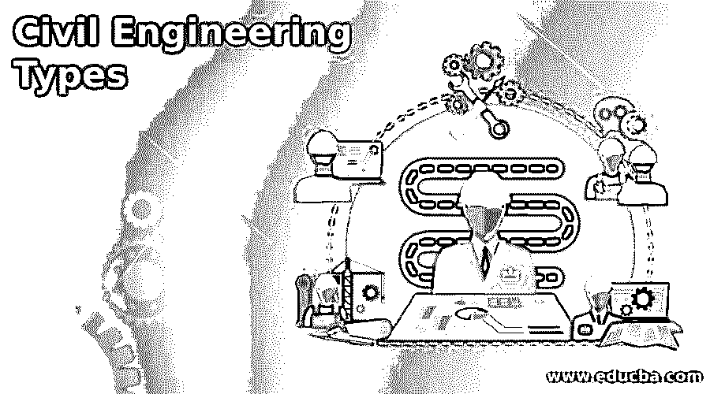

# 土木工程类型

> 原文：<https://www.educba.com/civil-engineering-types/>

## 土木工程导论

以下文章提供了土木工程类型的概述。在世界范围内，土木工程被认为是最重要的工程领域之一。设计、管理、建设和维护在一个国家的发展中起着至关重要作用的基础设施&支持现代社会，都是这个行业使命的一部分。这一类包括一长串建筑项目。作为我们社会的创新者，土木工程师处于最前沿。你可以看到，土木工程不仅仅是建造物质结构。

### 土木工程的类型

以下给出了各种土木工程类型:

<small>网页开发、编程语言、软件测试&其他</small>

#### 1.环境工程

这个分支学科的重点是寻找保护人口稠密地区和防止污染影响自然世界的方法。环境工程师分析并开发各种环境问题的解决方案。固体废物处理和管理、水源净化、空气质量改善和其他任务属于他们的权限范围。要在这一领域取得成功，需要对大气科学和水文学有扎实的理解。

#### 2.岩土工程

岩土工程是土木工程的另一个重要分支。他们检查一个地区的岩石和土壤，该地区的土木结构要么已经存在，要么计划在未来建造，他们进行分析。为了安全地设计结构和建筑，这些工程师必须精通土壤学、材料学以及相关的力学和水力学。

#### 3.运输工程

作为土木工程学科，运输工程仍然是最有影响力的学科之一。他们设计、建造和维护世界各地所有类型的公共交通系统，包括公路、铁路线(包括通勤列车)以及港口和机场。

他们的目标是通过这些措施改善整体交通流量，减少交通拥堵，并尽可能降低事故发生的风险。或者，可以设计新系统或修改现有系统。因此，工程师必须考虑各种因素，如新系统的经济、政治和伦理影响。

#### 4.结构工程学

研究和分析桥梁、海洋、天桥和其他建筑设计是结构工程的一部分。除了美观之外，工程师们还必须确保建筑的安全性、耐用性和实用性。为此，有必要确定可能作用在结构上的载荷、力和应力。当工程师在设计一栋建筑时，他们必须考虑许多因素。例如，成本和可施工性，以及强度和稳定性都是需要考虑的因素。这包括地震、洪水和强风。

#### 5.施工工程学

管理和监督建筑项目是建筑工程师的主要职责。规划和建设只是过程的一部分，材料运输和场地开发也包括在内。除了评估后勤业务之外，他们还可能每天负责审查合同和协调承包商。他们还必须确保项目及时高效地完成。任何土木工程项目都需要建筑工程师，无论是铺设新道路还是建造新建筑。

#### 6.采矿工程师

石油、金属和天然气只是采矿工程师负责评估的自然资源的一部分。为了确定在该地点完成开采是否安全，他们权衡了这些风险因素。此外，采矿工程师必须确定特定地点的商业价值。

#### 7.水利工程

水工程是研究水如何与基础设施相互作用，以及我们如何利用它来为我们服务。它侧重于在类似洪水的情况下改变水流方向的方法，如何通过建造和使用大坝来正确储存水，以及如何使用工程技术来传输地下水和建造对农村和城市都有用的必要水道。

#### 8.轮机工程

船舶和其他水上设备的设计、建造和修理是轮机工程师的主要职责。这个职位需要对物理学有深入的理解，以便创造出耐用的运输方式。这个人可以在海洋工程师的帮助下设计和建造军舰、游艇或深海钻探设备。

#### 9.规划工程师

规划工程师负责推荐最佳施工策略。通过计算一个项目的潜在成本，并将其与完成该项目所需的材料、人力和时间进行比较，他们能够做出这一决定。在密切关注安全标准的同时，规划工程师的工作包括为项目的实施寻找和实施具有成本效益的措施。

### 结论

在本文中，我们看到了各种类型的土木工程。

### 推荐文章

这是一本土木工程类型指南。这里我们分别讨论入门和各种土木工程类型。您也可以看看以下文章，了解更多信息–

1.  [什么是软件工程？](https://www.educba.com/what-is-software-engineering/)
2.  [软件工程中的凝聚力](https://www.educba.com/cohesion-in-software-engineering/)
3.  [系统工程](https://www.educba.com/system-engineering/)
4.  [软件维护](https://www.educba.com/software-maintenance/)

