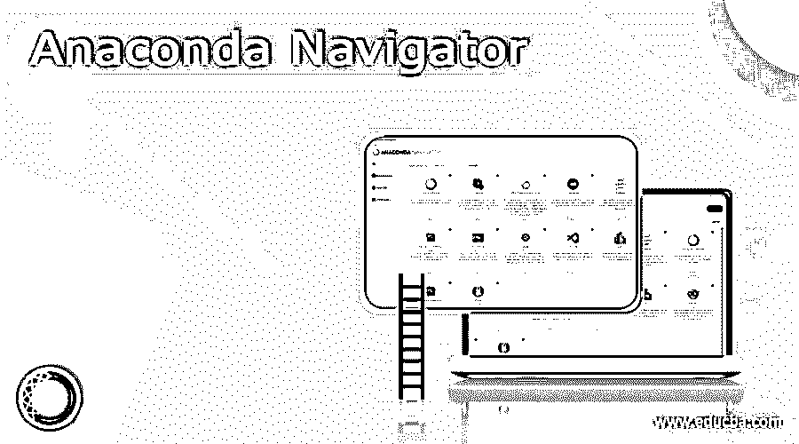
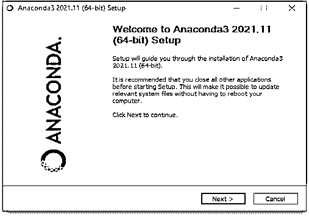
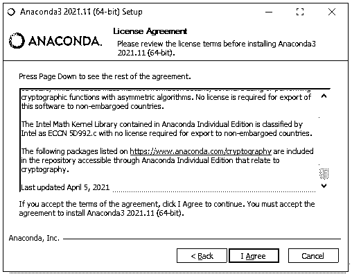
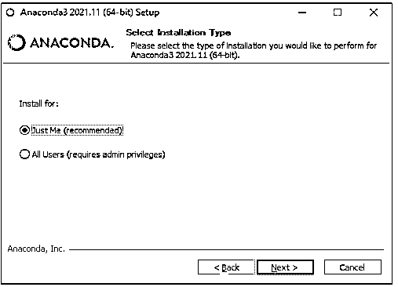
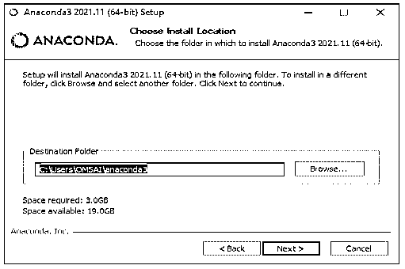
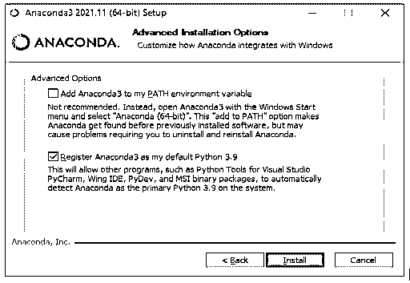
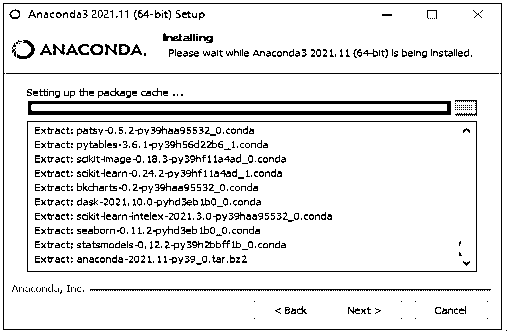
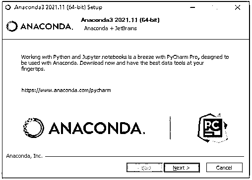
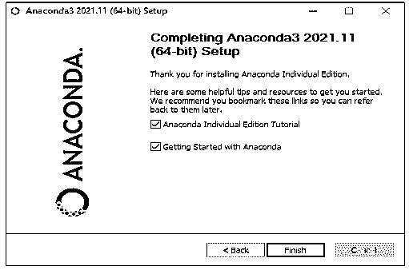
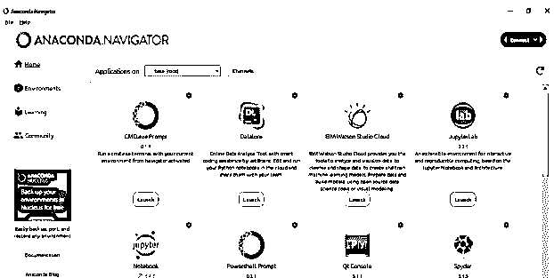

# 巨蟒领航员

> 原文：<https://www.educba.com/anaconda-navigator/>

## Anaconda 导航器的定义

Anaconda Navigator 是 Anaconda 发行版附带的一个桌面图形用户界面，它允许我们运行程序和管理 Anaconda 包、环境和通道，而无需使用命令行命令。可以在 Anaconda.org 上或者使用 Navigator 在本地 Anaconda 存储库中找到这些包。它与 Windows、Mac OS X 和 Linux 兼容。许多科学软件包依赖于其他程序的特定版本来运行。

### 什么是 Anaconda Navigator？

*   数据科学家经常使用许多软件的不同版本，并使用不同的环境隔离这些版本。
*   Anaconda 是一个包和环境管理器，可以从命令行运行。这有助于数据科学家确保每个包的每个版本都有它需要的所有依赖项，并正常工作。
*   Navigator 是一个点击式界面，用于处理包和环境，无需在终端窗口中键入 anaconda 指令。我们可以使用它来搜索包，将它们安装到环境中，执行它们，并从导航器中更新它们。
*   Jupyter 笔记本也可以这样使用。Jupyter 笔记本是一个流行的系统，它允许我们将代码、描述性文本、输出、图形和交互界面集成到一个笔记本文件中，我们可以在 web 浏览器中编辑、查看和使用该文件。
*   Anaconda 是一个开源软件包，包括 Jupyter、spyder 和其他用于大规模数据处理、数据分析和科学计算的工具。Anaconda 支持 r 和 Python。
*   Python 是用 Spyder 实现的。在 spyder 中，我们可以使用 opencv for python。anaconda 包管理系统跟踪包的版本。Anaconda 必须安装后才能使用。
*   Anaconda 是 Python 和 R 编程语言发行版，旨在使科学计算(如数据科学、机器学习应用程序、大规模数据处理和预测分析)中的包管理和部署更容易。
*   对于 Windows、Linux 和 MacOS，发行版提供了数据科学包。Anaconda 发行版或 Anaconda 个人版是 Anaconda，Inc .的两个产品，而 Anaconda Team Edition 和 Anaconda Enterprise Edition 都不是免费的，是 Anaconda，Inc .的另外两个产品。
*   Anaconda 的包管理系统跟踪包的版本。这个包管理器被剥离出来作为一个独特的开源包，因为它本身是有价值的，不仅仅是对 Python。
*   Miniconda 是 Anaconda 的一个最小的引导版本，只包含 conda、Python、它们的依赖项和一些其他的包。
*   Anaconda 发行版中默认安装了 250 多个包，还有 7500 多个开源包以及 conda 包和虚拟环境管理器可以从 PyPI 下载。作为命令行界面的图形化替代，Anaconda Navigator 也包括在内。
*   conda 和 pip 的主要区别在于如何封装依赖关系被维护，这是 Python 数据科学的一个关键难点，也是 conda 存在的基础。
*   Conda 检查当前环境，包括安装的所有内容，以及指定的任何版本限制，确定如何安装一组兼容的依赖项，如果不可能，则发出警告。
*   使用 conda install 命令，用户可以从 Anaconda 存储库、Anaconda Cloud 或者他们自己的私有存储库或镜像中单独安装开源包。
*   Anaconda，Inc .在 Anaconda 存储库中编译和构建软件包，并分发 Windows 32/64 位、Linux 64 位和 MacOS 64 位的二进制文件。
*   可以使用 conda build 命令创建定制包，并通过 Anaconda Cloud、PyPI 或其他存储库与其他人共享。
*   默认情况下，Anaconda2 附带 Python 2.7，而默认情况下，Anaconda3 附带 Python 3.7。但是，anaconda 提供的任何 Python 版本都可以用来构建新环境。

### 如何安装 anaconda navigator？

以下步骤显示了如何在 windows 操作系统上安装 anaconda navigator。

<small>网页开发、编程语言、软件测试&其他</small>

1)下载 anaconda navigator 的最新版本。下载时，我们需要确保下载的是 python 3.7 版本。

2)下载安装程序文件后。以管理员权限打开相同的。它将打开安装程序窗口。单击 next 按钮开始 anaconda navigator 安装过程。

3)打开安装程序后，接受许可协议。

4)接受许可协议后，选择安装类型。我们已将安装类型选择为“仅我”。

5)选择安装类型后，选择安装位置。

6)选择安装位置后，下一步是选择高级安装选项。

7)选择高级安装选项后，单击安装并检查安装过程的进度。

8)单击“下一步”下载并安装 PyCharm。PyCharm 建议在安装 anaconda navigator 的时候安装。

9)完成安装–

10)打开 anaconda navigator 来检查 GUI。

### 巨蟒领航员期货

以下是 anaconda navigator 的未来。

*   Anaconda navigator 包含了几乎所有必需的库。做一个数据科学项目笔记本很简单。
*   Anaconda Navigator 具有足够的适应性，可以在各种 Python 上下文中工作，以满足我们的需求。论坛活动在社区中随处可见。
*   用户界面简单明了，易于操作。制作一个 Jupyter 笔记本是很棒的，因为它是一个通过逐行运行来学习 Python 脚本的极好工具。
*   Anaconda Navigator 允许我们快速访问文档和文件夹。Spyder 的代码自动建议棒极了。
*   Jupyter、Spider、R 和其他重要的数据科学和编程工具在 Anaconda 中都有。
*   Anaconda 命令提示符允许方便地使用和安装大量 Python 库。
*   众所周知的 Anaconda 产品 Jupyter Notebook，至今仍是学生练习编码最伟大、最人性化的产品之一。
*   Anaconda navigator 使 Jupyter、Spyder、R 和 QT 控制台等软件可以访问。Anaconda 很容易设置，即使我们没有太多的技术技能。Jupyter 使浏览文件和添加新库变得简单。

### 结论

Python 是用 Spyder 实现的。在 spyder 中，我们可以使用 OpenCV for python。Anaconda Navigator 是 Anaconda 发行版附带的一个桌面图形用户界面(GUI ),它允许我们运行程序并管理 Anaconda 包、环境和通道，而无需使用命令行命令。

### 推荐文章

这是一个指南蟒蛇导航。这里我们讨论定义，什么是 anaconda navigator，如何安装 anaconda navigator，代码实现的例子。您也可以看看以下文章，了解更多信息–

1.  [蟒蛇版](https://www.educba.com/anaconda-version/)
2.  [安装 Anaconda Python](https://www.educba.com/install-anaconda-python/)
3.  [Python 内存错误](https://www.educba.com/python-memory-error/)
4.  [Python Widgets](https://www.educba.com/python-widgets/)

