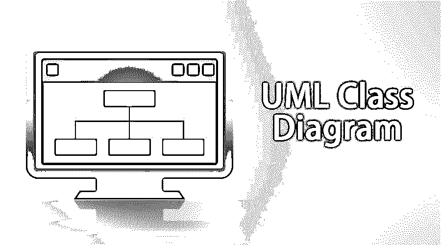
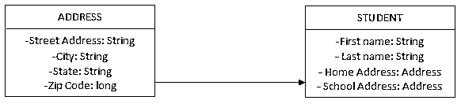

# UML 类图

> 原文：<https://www.educba.com/uml-class-diagram/>

## UML 类图

在理解(统一建模语言)UML 类图之前，我们必须理解面向对象的设计和分析。面向对象主要研究作为对象的实时实体及其关系。[对象的高效分析](https://www.educba.com/how-to-use-vba-in-reporting-and-analysis/)从识别开始，接着是功能，接着是关系，最后产生设计。

上述面向对象的分析过程可以详细描述如下

<small>网页开发、编程语言、软件测试&其他</small>

1.  **物体识别**–目的是以适当的方式描述物体。然后，应该用职责来标识对象。责任是对象执行的功能。
2.  面向对象设计(Object-Oriented Design)——这是将需求与责任结合起来并提出软件系统工作设计的阶段。
3.  **面向对象实现**——这是使用 [C++、Java](https://www.educba.com/c-plus-plus-vs-java/) 等实现软件设计的编程阶段。一种面向对象的编程语言。

一张图片胜过千言万语，UML(统一建模语言)通过对软件系统建模，最好地反映了语句的含义。

### 什么是 UML 类图？

UML 类图或统一建模语言图是用于可视化系统的通用建模语言；尤其是面向对象的系统。它是业界公认的标准语言，用于可视化、指定、记录和构建软件系统的工件。UML 是由对象管理组织(OMG)开创的，UML 的第一个版本 1.0 规范于 1997 年 1 月发布。

UML 是所有建模语言的联合，如用例图、类图、对象图、序列图、协作图、状态图、活动图、组件图、部署图等等。这是业界已经采用并接受的真正非常大而好的标准。

### UML 的显著特征–

*   它不是一种编程语言。它是一种建模语言。它不同于其他的编程语言，如 C、C++、Java、COBOL 等。
*   统一建模语言是一种用来表示软件产品蓝图的图形化语言。
*   尽管统一建模语言(UML)是为了表示软件系统而开发的，但它也可以很好地扩展到这个范围之外，以建模非软件系统。举个例子——一个 UML 图，显示了一个工厂的制造单元的流程，等等。
*   UML 图是，不是代码或程序本身。但是有相当多的工具使用这些 UML 图作为输入来生成代码或程序。
*   UML 图与面向对象的分析和设计密切相关。

### UML 在面向对象设计中的作用

为了构建处理实时对象的软件产品，为了更好地了解面向对象的设计，为了更好地理解面向对象的设计，我们将面向对象的设计转换成统一的建模语言，这些语言是代表整个软件系统的图表。这就是为什么在处理 UML 之前学习 OOP 概念是非常重要的。

### 统一建模语言的构建模块和类图类型

正如我们所知，UML 对实时系统进行建模，使用 UML 的构建块来制作概念模型是很重要的，这些构建块是

*   东西
*   关系
*   图表

#### 事情-

事物是统一建模语言(UML)的原子单位，它们可以细分为

1.  **结构**–这些是模型的静态部分。它们是表示物理和概念元素的单元，如类、接口、用例、组件或[节点](https://www.educba.com/node-commands/)。
2.  **行为**–这些是 UML 中定义某种交互、消息交换或流程方向的东西。
3.  **分组**–这是一种将 UML 模型的元素分组在一起的方式。比如一个包或者一个模块或者一个库。
4.  **注解**——注解是本质上提供信息的东西，比如标题、备注、描述或对其他 UML 事物或组件的评论。

#### 关系-

统一建模语言中的关系表示两个 UML 事物之间的依赖或功能或关联。UML 中有四种关系，如下所示

1.  **依赖关系**

这是两个 UML 事物之间的关联，如果一个发生变化，那么另一个也会发生变化。

1.  关联
    这代表了特定功能中不同组件的参与，并连接了 UML 的元素。有多种类型的关联
    1.  **聚合**–这是统一建模语言的两个组件之间的一种“是一部分”的关系。在 UML 方式中，它用一个清晰的菱形来表示。
    2.  **Composition**–这是一种“完全由”统一建模语言的两个组件之间的关系。这是一个更强大的聚合版本，各部分作为一个整体生存或死亡。一个组件的任何变化都会直接影响到另一个组件。按照 UML 标准，它用一个黑色的菱形(或者一个带阴影的菱形)来表示。
2.  一般化
    这取决于层次结构，其中关系被定义为一个 UML 元素，以属于一个定义起来更一般化的组。这基本上是继承的概念。
3.  这是两个 UML 元素之间的关系，其中一个元素定义了一个任务，另一个元素实现了它(换句话说，就是实现了它)。这是模仿面向对象编程的接口概念。

#### 图表–

将上述所有组件结合起来，给出整个软件系统有意义的逻辑视图，这就是我们所说的图。这些图表将有不同的形状，我们可以定义自己的含义。例如，我们可以定义一个正方形来表示静态数据，定义一个平行四边形来定义一个循环。

### 关于类图的更多信息

UML 类图的主要组件。类图可以用来表示关系、类、接口、继承、协作和关联。简而言之，类图描述了不同类型的对象以及它们之间的静态关系。

我们试着画一个学生的班级图，看看效果如何。

从上面的图表中，您可以看到有一个名为 Student 的类，它具有不同的属性，如名字、姓氏、家庭地址、学校地址，对于具有相同通用结构的地址，它继承自另一个名为 address 的类，后者定义了地址的数据结构。因此，人们可以理解这两者之间的关系(依赖性)。如果类中有任何方法来实现任何功能，那么它们也将包含在同一个类图矩形中，并带有关于参数和返回值的详细信息。

### 使用 UML 类图

我们如何设计类？

*   最重要的一步是从项目规范或需求中识别类。名词是潜在的类、对象、场。动词是类的潜在方法或职责。
*   然后你用矩形、菱形、椭圆形等形状画出所有的组件。
*   随后解决组件之间的依赖性或关系。

### UML 类图的优势

1.  UML 有助于发现相关的数据和属性。
2.  它还帮助我们理解系统中组件(实体)之间的关系，如果发现关系过于笨拙或依赖，我们还可以优化它。
3.  UML 简化了复杂软件的设计，也有助于 OOPs 的实现。
4.  它通过用一些图形和图示来表示整个系统，大大减轻了解释的负担，否则这些图形和图示可能很难理解。
5.  它给出了正在构建的整个系统的逻辑视图。

### UML 类图的缺点

1.  统一建模语言不是算法计算的首选，因为它不是数据驱动的。它大多只关注建模或设计。
2.  它可以给出一个通用的类和流表示，但是 UML 不能通过给定问题中的步骤的对象流找到对象。

### 人工智能中的统一建模语言

人工智能领域的问题通常很复杂。一个人需要大量的知识和技术来运用这些知识来解决问题。尽管有各种新的表示知识(事实)的方式存在，统一建模语言仍然是一个很好的标准。

在人工智能术语中，有两种类型的 UML 实体。

1.  **事实**——现实世界中的真相。就像面向对象设计中的对象/类一样。
2.  **表示**——以某种形式主义表示事实。这就是我们操纵事实的地方。

构建这些实体的一种方式是在知识层面，在这一层面，事实被描述为非正式的口语。前老虎是一只狗的名字。另一种方式是在符号层面，在这个层面上，知识层面的事实的表示是根据可以被程序转换、处理或操纵的符号来定义的。

### 这对你的职业生涯有什么帮助

一个问题出现了，从职业的角度来看，已经非常古老的 UML 是否仍然与我们相关。答案是肯定的。UML 在任何类型的项目中都非常有用，尤其是大型项目。序列图帮助两个模块理解它们的流程，用例图帮助显示产品的有用性和功能性，组件图显示产品架构。基本上，UML 向我们展示了正在构建的软件系统的全貌。

在某种意义上，UML 被高级软件架构师和首席工程师大量使用，以向开发人员简要说明需要开发什么。并且本文中的一节还描述了它在人工智能领域的用途。所以，是的，拥有关于 UML 的知识在你的职业生涯中非常有用。

### 学习 UML 最好的方法是什么？

嗯，请遵循以下步骤

1.  一开始不要参考 OMG 规范。以后的时间点参考一下！
2.  从 educba 等在线资源中学习 UML 的基础知识。
3.  学习绘制和标记统一建模语言图的符号。
4.  用多个例子进行同样的练习！
5.  最后，尝试使用一些工具将统一建模语言转换成实际的[代码](https://www.educba.com/how-to-learn-to-code/)。

### 创建统一建模语言的工具

有很多工具可以用来绘制统一的建模语言。以下是一些例子

1.  **紫罗兰-**它是免费的，可以在 http://horstmann.com/violet/-[找到](http://horstmann.com/violet/)
2.  **可视化范例 UML 套件**——它是付费的。它有几天的试用期，可以在 http://visual-paradigm.com/的[找到](http://visual-paradigm.com/)
3.  **理性的玫瑰——**这可以在 http://rational.com/[找到](http://rational.com/)

### 结论

总之，可以说 UML(统一建模语言)可以被定义为一种建模语言，用于对所有可能的复杂软件系统和复杂实际系统进行建模。

### 推荐文章

这是 UML 类图的指南。这里我们讨论了 UML 类图的优点和缺点，类图的工作类型，角色和特性。您也可以浏览我们推荐的其他文章，了解更多信息——

1.  [什么是软件开发？](https://www.educba.com/what-is-software-development/)
2.  [系统设计面试问题](https://www.educba.com/system-design/)
3.  [数据建模成功的 9 个工具(免费)](https://www.educba.com/9-best-data-modeling-tools/)
4.  [软件工程面试问题](https://www.educba.com/software-engineering-interview-questions/)

