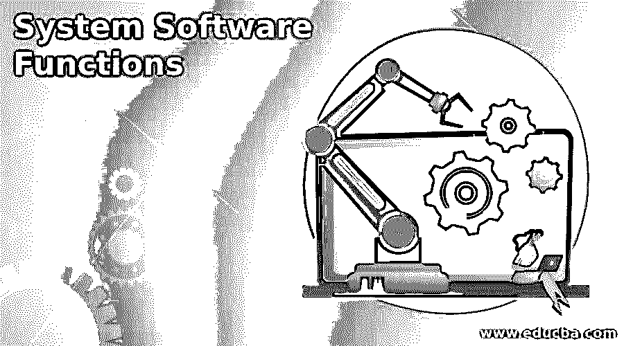

# 系统软件功能

> 原文：<https://www.educba.com/system-software-functions/>

## 系统软件功能介绍

系统软件功能是由操作系统执行的功能和任务。特别是，当你考虑一个系统时，它有两种类型的功能:系统软件功能，也称为操作系统功能。另一类是应用软件功能。应用软件功能是指根据开发人员在开发应用程序时编写的指令和命令执行的功能，而系统软件功能是由您在设备上使用的操作系统在内部定义和执行的。

### 不同类型的系统软件功能

下面给出了不同类型的系统软件功能:

<small>网页开发、编程语言、软件测试&其他</small>

在任何给定的操作系统中，由它执行的功能和操作可以大致分为以下三种类型的功能:

*   资源分配
*   监测活动
*   磁盘和文件管理

总的来说，系统软件功能中包含的功能如下:

*   硬件根据需要分配给各个程序。
*   调度处理器上的程序，以便以线性和系统的方式执行它们。
*   根据程序的要求，将内存分配给每个单独的程序。
*   程序需要的输入和输出设备是一次分配的。
*   用户交互是通过理解用户的期望和需求，并用适当的消息或任务来回应他们来完成的。
*   管理程序和数据的所有文件都存储在辅助存储设备上。
*   内存中存在的文件目录得到维护，并且提供了对文件数据的访问。
*   通过分配、指派和提供汇编器、编译器、内存、解释器和其他东西来保持软件和用户之间的协调。
*   维护系统各种资源的安全性和访问权限。

#### 1.资源分配

操作系统的系统软件功能负责维护系统中的流量，并决定特定程序将使用的资源的持续时间和数量。

*   **时间:**时间在 CPU 内部以毫秒为单位计量，充当时间片。为每个将由 CPU 执行的任务分配特定数量的时间片。每当分配的时间超过，另一个进程或任务被允许执行。在这种情况下，前一个任务需要等到这个任务完成它的时间段。由于时间片非常小，很难检测它们是否完全由系统软件在内部共享和管理。此外，可以为任务分配优先级；在这种情况下，与具有较低优先级的任务相比，具有较高优先级的任务(也称为前一轮任务)被执行并被给予更多的时间片，所述具有较低优先级的任务是被分配了较少数量的时间片的后台任务。
*   **内存:**需要分配给多个任务共享的内存数量明显有限。这种内存管理也是由系统软件完成的，所有等待的数据都可以临时存储在一个缓冲区中。但是在这里，系统在处理缓冲区时需要格外小心，因为它不应该在任何时候导致数据丢失。这种情况下使用的另一种解决方案是虚拟内存。此外，交换过程是，如果内存芯片已满，则数据被调出到硬盘。
*   **输入和输出设备:**管理控制流的责任也由系统软件来完成，在系统软件中，所有读写操作的请求都由磁盘、打印机和磁带来管理。打印假脱机过程也是这样完成的，其中数据被临时写入打印机可以进一步访问打印的文件中。这是因为打印机不能一次打印那么多数据，处理器的时间片不应该浪费在等待打印机打印上。因此，假脱机打印是优化设备的好方法。

#### 2.监测活动

应该适当地维护系统安全性和性能。

*   **系统性能:**系统性能需要包含的两个关键参数包括 CPU 利用率和响应时间。当输入给系统时，响应所花费的时间应该尽可能的短，而 CPU 的利用率取决于 CPU 工作的时间和 CPU 的空闲时间。
*   **系统安全性:**必须维护用户凭证，包括用户 id 或名称和密码，以便在可能有多个用户访问系统时，仅允许许可用户登录和注销会话，从而维护安全性。

#### 3.磁盘和文件管理

维护文件的轨迹以及它们在磁盘上的存储位置是一项基本功能。这将提高系统的性能，因为当需要某个特定文件时，如果系统不知道该文件的保存位置，则需要花费大量时间来搜索和检索该文件，这将影响性能。这就是为什么系统提供创建适当的目录和其他文件管理功能，包括创建新文件、删除、重命名、剪切、复制和粘贴文件，这有助于用户正确管理存储和隔离他们的文件。

这里的另一项规定是将可用硬盘分成多个分区，也称为虚拟磁盘，这有助于维护文件的存储。

### 结论

系统软件执行多种功能:内存管理、输入和输出资源管理、时间和内存性能和管理，以及磁盘和文件管理。

### 推荐文章

这是系统软件功能指南。这里我们讨论系统软件功能的介绍和不同类型。您也可以看看以下文章，了解更多信息–

1.  [嵌入式系统应用](https://www.educba.com/embedded-systems-applications/)
2.  [系统型号](https://www.educba.com/system-models/)
3.  [系统工程](https://www.educba.com/system-engineering/)
4.  [软件分类](https://www.educba.com/software-classification/)

