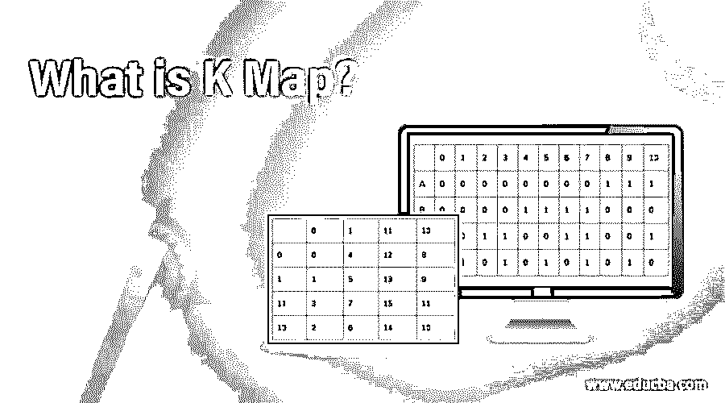
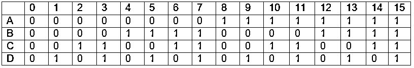
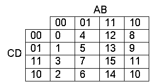
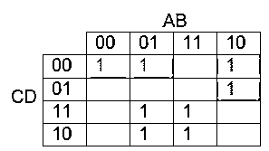

# 什么是 k 线图？

> 原文：<https://www.educba.com/what-is-k-map/>

## k 线图简介

k 图是一个流行的术语，它的完整形式是卡诺图，它被进一步缩写为 KM。K 图的主要功能是使布尔代数表达式变得简单。它在最小化布尔表达式时使用了一种图形风格。k 图避免了使用复杂的布尔定理和机动方程的需要。KM 可以被认为是真值表的一个不同的临时版本。这种方法可以很容易地用两到四个变量最小化布尔表达式。五到六个变量的表达式可以很容易地解决，再多就非常困难了。

K map 通过使用可视化技术避免了大量计算的使用。它利用人类的自然本能，轻松地解释视觉模式，从而避免复杂的计算。此外，它消除了竞争条件，并实现了快速解决。在进入实际的方法之前，让我们先了解一些基础知识。

<small>网页开发、编程语言、软件测试&其他</small>

### k 线图讲解

下面给出了 k 图的解释:

#### 1.布尔表达式

布尔表达式是一个语句，在求值时，要么有真值，要么有假值。在此表达式中，您可以将任何数据与另一个数据进行比较，以确定是否相等、是否大于或小于。布尔数据将具有

*   布尔值，如是或否、真或假、开和关
*   公式或变量
*   产生结果的功能
*   比较运算之外的值

例 A >50，B < 25，(A+B+C) < (D+E+F)，A 能走，水是热的，每个表达式结果处于真或假的状态。

#### 2.逻辑运算符

借助于连接符，可以将单个表达式连接起来，形成复合表达式，并对新的表达式求值。各种连接器

*   如果所有单独的表达式都为真，AND (&&)将产生真状态
*   如果其中至少有一个为真，OR (||)将产生真状态
*   如果至少其中一个条件为真，而不是所有条件都为真，则“异或”( ^)会产生真状态
*   不是(！)将假重置为真，反之亦然
*   Implication()逻辑上适用

#### 3.真值表

真值表以表示布尔代数、函数和命题演算的二维数学表的形式表示布尔逻辑。该表中的每一行都表示问题中所有命题的真值组合。这是一个图表，显示了一个有复合表达式的问题中所有布尔表达式的值的所有可能的排列和组合，逐行显示其真值。

如果在一个给定的问题中有两个命题，那么将有四行包含每个组合可能的真值、假值和真值。同样，三个命题真值表会有八种组合，四个命题会有十六行。

### 它是如何工作的？

使用布尔代数技术简化表达式是麻烦的，因为人们必须记住许多公式，并且这种方法提供的解决方案是次优的。然而，解决方案不是最小的，尽管它看起来是最小的。卡诺图为最小化布尔表达式提供了一种简单而直接的方法。在 KM 提供的图形化方法中，将所有具有公因数的表达式分组在一起，从而消除了多余的变量。

首先创建具有表达式的各个值的所有可能组合的真值表，并且将所有组合的真值结果移动到称为 k 图的二维数组的单元中。每个单元格代表真值表中某一行的真值结果。理想的 1 或 0 组是从这个网格形成的，这个网格以规范形式表示来自父真值表的逻辑。这些组用于生成最小布尔表达式。

KM 提供了一个简化的逻辑结构，可以用最少的逻辑门来实现。知识管理的两个主要类别

*   与门进给或门-乘积和表达式
*   或门进料和门 Sumsexpression 的产品

后置最小化以上两类的规范形式可以直接用逻辑运算符 AND & OR 来实现。

### 地图示例

四元函数的真值表及其真值

下面给出了这个真值表 k 图网格。列标题或行标题的顺序应该是这样的，只有一位有变化，它被称为循环码。

特定组合的函数值被移动到 K 图网格的相应单元。例如，最小项映射为值 1，最大项映射为值 0。

最小项函数 f(A，B，C，D)= (0，4，6，7，8，9，14，15)。

为了简化表达式，形成了正方形或矩形大小的 3 种标准形式，它们是具有值“1”的相邻单元。

*   **黄组:**列智 B 不变，A 变。按行 C 保持不变，D 发生变化，因此这个表单的 minterm 的结果是 BC。
*   **蓝色组:**列方向 A 保持不变，B 发生变化，行方向 CD 保持不变，该表单的最小项的结果是 A'C'D' ( A C D 有零)
*   **绿组:**列方向，AB 不变，行方向，C 不变，D 变化。结果是 AB'C' ( B C 有零)
*   K 图的简化解是最小项 f (A，B，C，D) = BC + A'C'D' + AB'C '

### 推荐文章

这是一个什么是 k 线图的指南？.在这里我们也讨论一下入门和它是如何工作的？以及一个例子。您也可以看看以下文章，了解更多信息–

1.  [什么是 Nmap？](https://www.educba.com/what-is-nmap/)
2.  [功率 BI 热图](https://www.educba.com/power-bi-heat-map/)
3.  [HashSet vs HashMap](https://www.educba.com/hashset-vs-hashmap/)
4.  [Java 迭代图](https://www.educba.com/java-iterate-map/)

