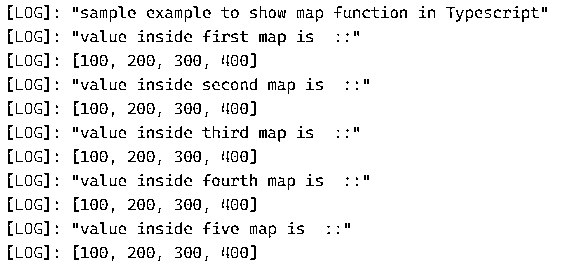

# 打字稿地图

> 原文：<https://www.educba.com/typescript-map/>

## 打字稿映射简介

TypeScript 中的 map 函数用于从现有调用数组中获取新数组。通过使用 map 函数，我们可以对数组元素执行任何操作，并创建一个新的数组。这个新创建的数组可以有也可以没有键值对。如果我们想为数组元素分配一个键，那么我们可以通过使用 TypeScript 中的 map 函数来实现；此外，map 是 TypeScript 中可用的内置函数，因此我们不需要在应用程序中包含其他一些库。简而言之，它将包含来自调用数组的所有结果元素。在下一节中，我们将更详细地讨论 map 函数，以便更好地理解它。

**语法**

<small>网页开发、编程语言、软件测试&其他</small>

正如我们已经讨论过的，它是 TypeScript 中可用的内置函数；它还将一些参数作为输入参数，用于执行进一步的操作。让我们看看它的语法，以便更好地理解这个函数，以及如何在编程时使用它，见下文；

`your_arrray_variable.map(callback[, thisObject])`

在上面的语法行中，我们可以看到我们在这个函数中传递了两个参数，而且，我们可以在我们创建的任何数组上调用这个 map 函数。这个回调函数将返回新的数组元素。为了更好地理解这个函数，让我们看一个初学者练习语法，见下文；

**举例:**

`myarr.map(value);`

在上面几行代码中，我们可以看到它很容易使用。在下一节中，我们将详细了解它的工作原理以及如何在编程中实现它。

### TypeScript 中的 map 函数是如何工作的？

现在我们知道 map 函数总是在执行完操作后返回新的数组。map 函数将两个参数作为输入。我们也可以在调用数组元素中执行操作。然后这个函数将返回包含结果的新数组。我们也可以让它们成为键值对。本节将详细介绍 map 函数签名，以及它将哪些参数作为输入，以及它将返回什么值。下面我们来详细看看；

### 方法签名

your _ array _ variable . map(callback[，thisObject]):这里我们赋两个值作为这里的参数。一个是回调函数，另一个是 thisObject。

**1。回调:**这个回调函数负责生成新创建的数组。每次当前时间迭代时，它都会为数组创建一个新值。

**2。thisObject:** 此参数为对象参数。

**3。返回类型:**map 函数每次都会返回新创建的数组。这个数组将包含当前数组中的所有元素。如果我们执行任何函数，那么它会相应地计算新值并返回给我们。

现在我们将看到一个示例来理解 map 函数的内部工作原理。这个示例帮助我们更好地理解它，并向我们展示了如何在编程时使用它。见下文；

**举例:**

`const myarr = [100, 200, 300, 400];
const mymap = myarr.map(x => x);
console.log(mymap);`

正如您在上面几行代码中看到的，我们正在尝试使用 TypeScript 中的 map 函数。正如我们已经知道的，它是 TypeScript 中可用的内置函数，所以我们不需要为此包含任何库。同样，在上面的代码中，我们没有包含任何库。首先，我们创建一个类型为 integer 的数组，并给它们赋值以进行打印。在这之后，我们立即从 TypeScript 中调用 map 函数。这个函数有两个参数，一个是对象，另一个是回调函数。这个回调函数将用新的对象将结果准备到数组中，该对象将指向被迭代的数组中的当前元素。我们也可以使用这个函数来打印和查看数组值。同样，通过使用这个函数，我们可以创建一个键和值对的映射。我们给它们起了个名字叫‘x’；这个“x”将指向数组中的当前值。在此之后，map 函数将创建一个新的数组，并将它们保存在这个数组中。我们创建了一个名为“mymap”的新数组；这将只包含与上述数组相同的元素。

在 TypeScript 中使用 map 函数时要记住的几点:

1.这个函数有两个参数。

2.可以在数组上调用它。

3.它总是会返回一个新创建的数组。

4.我们可以通过使用 map 函数 form TypeScript 对数组的每个元素执行操作。

### 类型脚本映射的示例

1.在本例中，我们尝试使用 Typescript 中的 map 函数。这里我们已经创建了多个数组，然后我们尝试从 map 函数创建一个新的数组，并将数组中的值打印在控制台日志上。这是一个适合初学者的示例。

**举例:**

`console.log("sample example to show map function in Typescript");
let myarr1 = [100, 200, 300, 400];
let myarr2= [100, 200, 300, 400];
let myarr3= [100, 200, 300, 400];
let myarr4 = [100, 200, 300, 400];
let myarr5 = [100, 200, 300, 400];
let mymap1 = myarr1.map(x => x);
let mymap2 = myarr2.map(x => x);
let mymap3 = myarr3.map(x => x);
let mymap4 = myarr4.map(x => x);
let mymap5 = myarr5.map(x => x);
console.log("value inside first map is  ::");
console.log (mymap1);
console.log("value inside second map is  ::");
console.log (mymap2);
console.log("value inside third map is  ::");
console.log (mymap3);
console.log("value inside fourth map is  ::");
console.log (mymap4);
console.log("value inside five map is  ::");
console.log (mymap5);`

**输出:**

### 结论

通过使用 TypeScript 中的 map 函数，我们可以通过对每个数组元素进行一些修改来从现有数组创建一个新数组。它还将迭代数组，并像 TypeScript 中的 foreach 循环一样帮助我们查看数组的元素。

### 推荐文章

这是打字稿映射的指南。在这里，我们将讨论 map 函数在 TypeScript 中是如何工作的，以及示例和输出。您也可以看看以下文章，了解更多信息–

1.  [打字稿版本](https://www.educba.com/typescript-versions/)
2.  [如何安装 Typescript](https://www.educba.com/install-typescript/)
3.  [什么是 TypeScript？](https://www.educba.com/what-is-typescript/)
4.  [打字稿类型](https://www.educba.com/typescript-types/)

