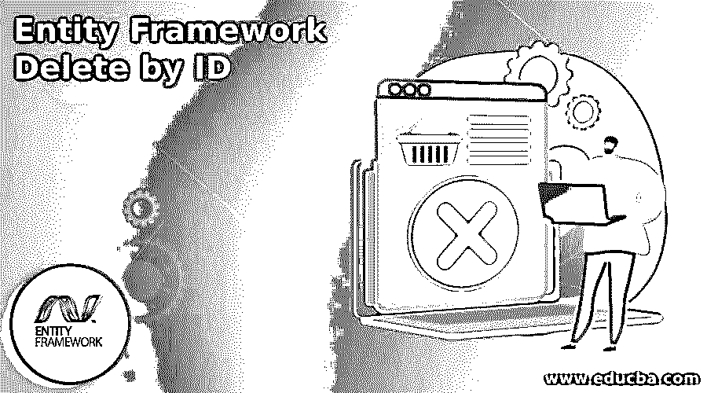
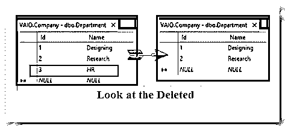

# 按 ID 删除实体框架

> 原文：<https://www.educba.com/entity-framework-delete-by-id/>

## 实体框架简介按 ID 删除

实体框架“按 ID 删除”用于根据 ID 删除记录；我们可以使用 Remove 或 RemoveRange 方法将其定位为 Delete。在断开连接的场景中，我们可以将其附加到上下文中，并将其标记为删除状态。通过调用 SaveChanges，它将把删除查询发送到数据库。

### 按 Id 删除实体框架概述

实体框架在数据库中为 EntityState 标记为 Deleted 的实体创建并运行 Delete 语句。要删除实体，使用 DbContextRemove()方法。让我们看看下面的例子，它根据 ID 删除部门，如下所示:

<small>网页开发、编程语言、软件测试&其他</small>

var deptObj =新部门()

{

Id = 1005

};

使用(var dbContext = new CampusDB())

{

dbContext。移除(deptObj)；

等待 dbContext。SaveChangesAsync()；

}

一旦对 department 实体调用了 Remove()方法，实体框架就会将第 3 个 rd ID 的 EntityState 标记为 Deleted。所以在调用 SaveChangesAsync()方法的同时，从数据库中删除了部门的第 3 rd 记录。

### 如何用实体框架按 Id 删除？

要删除记录，如果一个实体与其他实体有一对多或一对一等关系，则删除相关数据，一旦删除根实体，就会配置关系。通过使用实体框架核心的 Fluent API 来定义引用约束选项，有 4 种类型:

*   **ClientSetNull**–这些外键(FK)属性将被设置为 Null。ClientSetNull 是默认值。
*   **级联**–在这种情况下，相关实体也被删除。
*   **限制**–这可以防止级联删除
*   **set Null**–外键(FK)属性将被设置为 Null。

在应用程序中，打开**数据库上下文文件**，用 OnDelete()方法设置引用约束。在 OnDelete()方法中，将 DeleteBehavior 设置为 Cascade。看下面的代码如下，

模型创建上受保护的覆盖 void(模型构建器模型构建器)

{

模型构建器。实体<employeemaster>(实体= ></employeemaster>

{

实体。属性(e => e.EmpDesig)

.is 必选()

.HasMaxLength(25)

.ISU nicode(false)；

实体。属性(e => e.EmpName)

.is 必选()

.HasMaxLength(100)

.ISU nicode(false)；

实体。HasOne(d => d.DepartmentMaster)

.WithMany(p => p.EmployeeMaster)

.has foreign key(d = > d . department masterid)

.OnDelete(DeleteBehavior。级联)

.HasConstraintName(" FK _ 雇员马斯特 _ 部门马斯特")；

});

}

到目前为止，在删除 DepartmentMaster 表中的记录时，EmployeeMaster 表中的相关记录也会自动删除。请看下面的代码，我们删除了部门的第 7 个ID，这样，在第 7 个部门的所有员工也会被自动删除。

使用(var dbcontext = new CampusDB())

{

Department deptObj = dbcontext。部门。其中(a => a.Id == 7)。包含(x => x.Employee)。FirstOrDefault()；

dbcontext。移除(deptObj)；

等待 dbcontext。SaveChangesAsync()；

}

### 实体框架删除记录

在删除记录的实体框架中，我们需要分析如何删除依赖于记录的实体，该记录处于连接场景还是断开场景。对于连接场景，我们需要使用 **Remove** 或 **RemoveRange** 方法来将记录标记为已删除，而在断开场景中，我们可以将它连接到上下文，并将状态设置为已删除。通过调用 **SaveChanges** ，它将向数据库发送删除查询。让我们看看下面的两个场景，

关联场景–在关联场景中，删除过程非常简单，从数据库中查询部门实体。调用 Remove()方法并将 Department 对象发送到删除状态。在 EF 中，变更跟踪将实体标记为已删除。最后， **SaveChanges** ()方法使用删除查询从数据库中删除部门。

deptObj 部；

//在连接的场景中删除

using(campus context db context = new campus context())

{

dbContext。Database.Log =控制台。WriteLine

deptObj = dbContext。department . Where(d = > d . deptobjt _ Name = = " HR ")。first()；

dbContext。dept obj)；

dbContext.SaveChanges()：

控制台。WriteLine("部门{0} ({1})被删除"，deptObj.deptObjt_Name，deptObj。部门)；

控制台。read key()；

}

在 SQL 查询中，我们通过使用以下语句进行删除，

删除[dbo]。[部门]其中([部门标识]=@0)

断开场景–在断开场景中，最初我们检索部门实体，断开(关闭)上下文，然后打开新的上下文以利用数据库。点**删除状态**的入口方法。如果模型没有出现在上下文中，那么进入方法被包括到上下文中，并将状态标记为删除。

deptObj 部；

//在断开连接的情况下删除

using(campus context db context = new campus context())

{

dbContext .Database.Log = Console。WriteLine

deptObj = db context . departments . where(d = > d . Name = = " Development ")。first()；

}

using(campus context db context = new campus context())

{

dbContext .Database.Log = Console。WriteLine

dbContext。条目(deptObj)。状态=系统。data . entity . entity state . deleted；

dbContext .SaveChanges()：

}

### 删除记录而不从数据库加载

使用主键删除实体，而不从数据库中加载。让我们看看下面的例子，它显示了在不加载数据库的情况下删除记录。让我们创建新的部门实体，并将部门 ID 设为 2。然后将它附加到上下文中，并找出被删除的状态。方法 SaveChanges 实体框架将删除该部门。

public void deleted disconnectedwithoutloading()

{

deptObj 部；

deptObj = new Department(){ DepartmentID = 2 }；

使用(campus context db = new campus context())

{

db。Database.Log =控制台。WriteLine

db。条目(deptObj)。状态=系统。data . entity . entity state . deleted；

db。save changes()；

}

控制台。WriteLine("此处部门{0}被删除"，deptObj。DepartmentID)；

控制台。read key()；

}

### 删除多个记录

若要删除多条记录，请使用 DbSet 的 RemoveRange 方法，这样可以一次删除多条记录。让我们看看下面的例子，它从数据库中删除了部门 id 3。在连接的场景中，实体框架一次只向数据库发送一个删除查询，因此我们需要删除 100 条记录。EF 将发出 100 条删除语句，

public void DeleteMultipleRecordsConnected()

{

//删除多条记录

using(campus context db context = new campus context())

{

dbContext。Database.Log =控制台。WriteLine

List <department>deps = dbContext。部门。采取(2)。to list()；</department>

dbContext。deps . remove range(deps)；

尝试

{

dbContext.SaveChanges()：

}

捕捉(例外 e)

{

控制台。WriteLine(电子邮件)；

}

}

控制台。read key()；

}

查看下面的代码，在断开连接的情况下删除多条记录，

public void DeleteMultipleRecords _ Disconnected()

{

List <department>deptObj =新列表<department>()；</department></department>

deptObj。添加(新部门{ dept _ ID = 1 })；

deptObj。添加(新部门{ dept _ ID = 2 })；

//在断开连接的情况下删除多条记录

using(campus context db context = new campus context())

{

dbContext。Database.Log =控制台。WriteLine

dbContext。条目(deptObj)。状态=系统。data . entity . entity state . deleted；

尝试

{

dbContext.SaveChanges()：

}

捕捉(例外 e)

{

控制台。WriteLine(电子邮件)；

}

}

控制台。read key()；

}

### 结论

在本文中，我们已经了解了如何在实体框架中删除基于 ID 的记录，通过 Remove 或 RemoveRange 方法可以应用 ID 删除。希望这篇文章有助于您理解编程。

### 推荐文章

这是一个按 ID 删除实体框架的指南。这里我们讨论了入门，如何用实体框架按 Id 删除？代码实现示例。您也可以浏览我们推荐的其他文章，了解更多信息——

1.  [实体框架 NuGet](https://www.educba.com/entity-framework-nuget/)
2.  [实体框架核心数据库-第一期](https://www.educba.com/entity-framework-core-database-first/)
3.  [实体框架迁移](https://www.educba.com/entity-framework-migration/)
4.  [实体框架核心](https://www.educba.com/entity-framework-core/)

