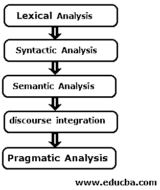

# 什么是 NLP？

> 原文：<https://www.educba.com/what-is-nlp/>

## 自然语言处理简介

NLP 代表自然语言处理。这是人工智能(AI)的一个子领域或分支，使计算机能够理解人类语言，并以有价值的方式处理它们。它涉及人类口语(自然语言)如英语和计算机之间的交互。

### 什么是 NLP？

自然语言处理帮助计算机观察、分析、理解自然语言或人类口语，并从中获取有价值的意义。开发人员可以使用[自然语言处理](https://www.educba.com/what-is-natural-language-processing/) (NLP)来执行翻译、自动摘要、关系提取、语音识别、命名实体识别、主题分割和情感分析等任务。

<small>网页开发、编程语言、软件测试&其他</small>

然而，NLP 应用是困难的或具有挑战性的，因为计算机需要人类使用诸如 Java、Python 等编程语言与之交互。，它们是结构化的和明确的。但是人类的口语是模棱两可的，随着地域或社会的变化而变化；因此，训练计算机理解自然语言变得很困难。

### 了解 NLP

自然语言处理面临的困难很多；因此在计算机科学中它被描述为困难。NLP 面临的一个主要问题是许多单词有多重含义。这些很容易被人类识别，但对计算机来说却很难。例如，单词“board”可以表示砧板、黑板或董事会。这种区别可以通过它前面的句子或 board 周围的词来理解。

*   他是董事会主席。
*   她在黑板上解决了这个问题。

人类很容易理解，第一句话中的“board”指的是董事会，第二句话中的“board”指的是黑板，但计算机并非如此。

尽管有这些困难，计算机正在增强它们理解人类语言的能力。各种语言领域的知识有助于加速这一过程:

*   **形态学:**是从基本的或原始的单位来研究词的构成。
*   **语素:**是指语言中的基本意义单位。
*   音韵学:研究声音的系统。
*   **句法:**是指词和短语排列成句子的方式。
*   **语义:**是指单词和句子的意思。
*   **语用学:**是指在不同的情境下理解、解释、运用句子。
*   **话语:**指前一句话如何影响后一句话的意思或解释。
*   **世界知识:**指关于世界的一般知识。

### 使用 NLP

自然语言处理的过程可以分三步完成:

*   首先，语音到文本的过程
*   词性标注
*   文本到语音转换

让我们一步一步来看:

#### 1.语音转文本过程

它是指阅读人类或自然语言的书面文本。它是对计算机接收到的作为输入的自然语言进行分析和理解的过程。计算机使用[各种算法](https://www.educba.com/what-is-an-algorithm/)或内置的统计模型来执行语音识别，这有助于将接收到的自然语言转换为编程语言。这是通过执行词法分析来完成的，词法分析将整个接收到的数据分成小的句子或单词。

#### 2.词性标注或词类歧义消除

在这个过程中，名词、形容词、动词、时态等语法形式。使用被称为句法分析的词典规则来识别。它还得出文本的确切或词典意义，称为语义分析**。**最后，它还执行语篇整合，根据前一句话解释句子的意思。

#### 3.文本到语音转换

在这个步骤中，编程语言中的文本被转换成对用户有价值的文本或听觉格式。

### NLP 的优势

下面给出了 NLP 的优点:

*   自动摘要
*   共指消解
*   话语分析
*   减轻语法学习的负担
*   不需要培训
*   允许非程序员与计算系统交互
*   可以解释输入的常见同义词
*   更好、更高效的结果
*   搜索处理告诉用户确切的意思
*   更多的[数据挖掘意味着](https://www.educba.com/what-is-data-mining/)更多的增长数据
*   可以执行复杂的搜索
*   语境理解

### 所需技能

下面给出了所需的技能:

*   编程技能
*   关于机器学习的知识
*   常见的 NLP 问题
*   NLP 工具
*   理解研究论文的能力
*   构建原型
*   学习新东西的能力
*   [软件工程技能](https://www.educba.com/software-engineering-interview-questions/)
*   概率与统计
*   语言知识
*   递归神经网络

### 我们为什么要使用 NLP？

*   用于机器翻译
*   对于自动摘要
*   用于情感分析
*   对于文本分类
*   用于回答问题
*   用于语言建模
*   对于语音识别
*   用于字幕生成
*   用于命名实体识别(NER)
*   对于词性标注
*   对于语义解析
*   对于释义检测
*   对于字符识别
*   用于拼写检查
*   对于聊天机器人
*   为客户服务
*   用于市场情报

### 这项技术将如何帮助你的职业发展？

自然语言处理领域日益增长的应用和兴趣为专门从事机器学习、计算语言学和数据科学的专业人员创造了各种机会。像谷歌、脸书、复地集团、索尼爱立信、美林证券、英国航空公司、塞恩斯伯里、摩根大通、凯尔特人、美国运通、安永等大公司雇佣自然语言处理分析师和专家。

与自然语言处理相关的各种工作角色有 NLP 科学家、NLP 工程师、NLP 架构师、NLP 应用研究科学家、认知数据科学家、语音艺术家等等。自然语言处理相关工作的平均工资从每年 76343 美元到每年 142912 美元不等。

### 结论

如果你对与计算系统交互感兴趣，并且有编程和语言学知识，学习自然语言处理是有价值的。此外，由于数据的增加和与计算机交互的需要，对自然语言处理的需求与日俱增，各种工作机会带着优厚的待遇进入市场。因此，自然语言处理在未来有很大的发展空间。

### 推荐文章

这是什么是 NLP 的指南？在这里，我们讨论了 NLP 的基本概念、范围、技能、职业发展和优势。您也可以浏览我们推荐的其他文章，了解更多信息——

1.  [数据可视化工具](https://www.educba.com/data-visualization-tools/)
2.  [什么是 MySQL 数据库](https://www.educba.com/what-is-mysql-database/)
3.  [Hadoop 数据库](https://www.educba.com/hadoop-database/)
4.  [什么是大数据技术？](https://www.educba.com/what-is-big-data-technology/)

