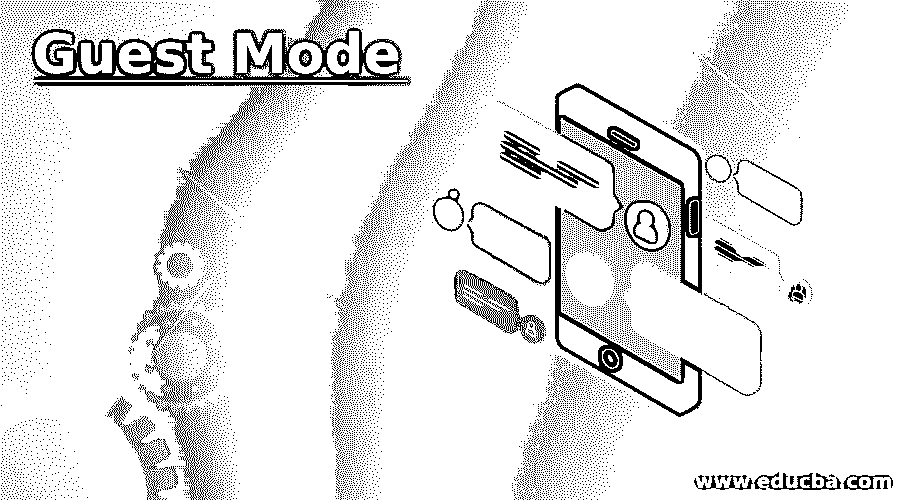

# 来宾模式

> 原文：<https://www.educba.com/guest-mode/>

## 来宾模式介绍

访客模式是 Google Chrome 提供的附加功能，有助于创建多个个人资料，在这些个人资料中，书签、密码、浏览历史记录和其他细节可以为每种类型的用户单独保存。创建的配置文件是永久使用的，在每个配置文件之间切换也很容易。个人资料可以在谷歌浏览器提供的访客模式下维护。

### 成分

它有助于在不提供任何个人信息的情况下使用网络浏览器。例如，没有 cookie 数据作为浏览历史存储在其中。

<small>网页开发、编程语言、软件测试&其他</small>

有两个组件:

*   **强制:**用户需要下载文件，以强制类型启用。
*   **正常:**在正常方法中，用户可以从网络浏览器直接启用。

### 来宾模式的使用

下面给出了几种用途:

*   它的主要用途是当其他人想使用用户计算机系统时。当个人从其他个人客户模式借用系统时，没有浏览历史的痕迹。
*   它可以用于多个用户访问同一个计算机系统的情况，例如在图书馆和网吧。如在其中，没有浏览历史数据；这有助于轻松浏览。
*   谷歌 chrome 访客模式也被用作一种高级安全功能，因为当用户关闭浏览器时，浏览器中不会存储任何数据。当用户打开浏览器时，会话是新的，所有以前的数据都将被删除，就像浏览历史记录一样。
*   用户无法访问书签、设置、扩展和许多功能。

### 优势

下面是提到的优点:

*   第一个优点是客人用户远离专用局域网(LAN)。作为来宾登录的用户无权查看任何以太网连接的设备。客人用户没有权限查看 Wi-Fi 设备。来宾用户无法访问 NAS 设备。
*   对以来宾模式登录系统的用户没有限制。此功能有助于提高灵活性，因为多个用户可以轻松访问系统。但是，有一个要求，因为这种模式下的 web 浏览器不存储浏览历史。
*   访客用户与中央网络分离，并且彼此隔离。在该系统中，没有像网站那样存储浏览活动，在网站中，互联网服务提供商的用户登录详细信息和其他 cookies 针对每种类型的用户单独保存。
*   它提供了一个安全的环境，当用户以来宾模式登录系统时可以进行浏览。当用户使用像咖啡馆或图书馆这样的公共计算机时，使用浏览器将是不安全的，因为它可能具有重要的细节，如用户的网站和其他重要信息。当用户作为来宾登录时，所有这些重要类型的信息都不会被存储为特定会话的 cookies 或浏览历史。
*   另一个主要优势是，通过启用访客模式，我们可以轻松地将我们的系统提供给其他人使用，用户的个人信息不会受到外界的影响。此外，当用户通过关闭 web 浏览器终止会话时，访客模式会话的历史被自动删除。

### 如何启用来宾模式？

有两种方法可以启用它，一种是强制模式，另一种是正常模式。

为了强制启用访客模式，下面提到了一些步骤:

*   第一步是下载 ZIP 存档。接下来，用户必须单击 Download ZIP archive 选项，自动下载 ZIP 文件。
*   接下来就是解压下载的 ZIP 文件，用户可以直接将解压后的文件放在桌面或者任何个人文件夹中。
*   下一步是取消阻止文件，以便用户可以访问它们。
*   下一步是单击该文件，以便它可以帮助启用它。
*   还提供了一个可以处理禁用选项的文件。用户必须点击该文件才能禁用谷歌浏览器的访客模式。

要以正常方式启用访客模式，请执行以下步骤:

*   启用访客模式的第一步是主机的设置。
*   接下来，用户需要打开 Google Home 应用程序。
*   下一步是点击设备的设置选项。
*   其中有一个名为“设备设置”的类别，其中有一个名为“访客模式”的选项，用户需要单击该选项。
*   然后，用户需要启用它，并准备好上网冲浪，而不用担心存储浏览历史。
*   来宾连接到来宾模式。
*   下一步是打开任何支持 Chromecast 的应用程序，然后用户必须点击 cast 按钮。
*   下一步是选择附近的设备选项，用户需要按照提示进行连接。
*   然后，用户需要提供 PIN 来连接。

### 结论

访客模式是 Google Chrome 网络浏览器提供的一种模式。用户不需要提供任何个人信息来登录系统，并且用户需要启用访客模式来访问网络浏览器。它广泛应用于公共系统中，在公共系统中，多个用户将同一个系统用于个人用途。

### 推荐文章

这是来宾模式的指南。这里我们讨论一下简介、组件、用途、优点，以及如何启用来宾模式？您也可以看看以下文章，了解更多信息–

1.  [CPU 虚拟化](https://www.educba.com/cpu-virtualization/)
2.  [安卓棒棒糖](https://www.educba.com/android-lollipop/)
3.  [安卓事实](https://www.educba.com/android-facts/)
4.  [什么是主机？](https://www.educba.com/what-is-hosting/)

