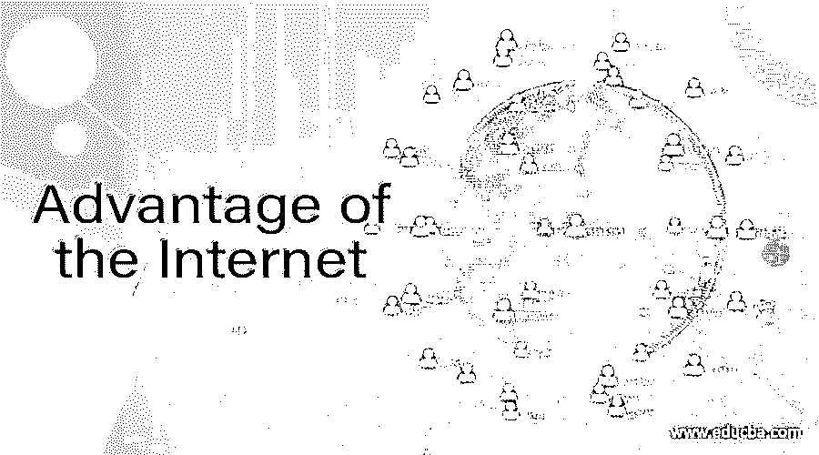

# 互联网的优势

> 原文：<https://www.educba.com/advantage-of-the-internet/>

## 介绍互联网的优势

互联网的优势被定义为连接世界上各种信息的全球网络的优势的讨论，使得不同设施的数据可以被了解并用于世界的发展，以及通过不同协议的互连和标准化完成的网络连接，使得信息或数据从一个人或系统到另一个人或系统的传输而不是物理传输，从而所花费的时间被大大减少。

### 互联网的优势

互联网的优势如下:

<small>网页开发、编程语言、软件测试&其他</small>

#### 1.连通性和更快的通信

互联网有助于以电子邮件的形式发送信件和更快地交流。收到一封信需要几天甚至几个月的日子已经一去不复返了。现在，在互联网的帮助下，只需点击一下，电子邮件就能同时发送和接收。此外，即使人们身处世界上最遥远的地方，也可以通过网上聊天和群组的形式保持联系。此外，可以通过互联网创建社区论坛，以形成不同的兴趣小组来分享想法和发展社区。

#### 2.信息和知识

在过去，书籍是收集信息的唯一形式，图书馆在发展个人知识方面发挥着至关重要的作用。现在，只需轻轻一点，整个世界的信息就呈现在我们面前，我们可以在短时间内浏览各种信息，并随着知识的积累而成长。这会花费更少的时间和资源。任何问题都可以通过搜索引擎得到回答，如果信息收集者发现信息不够充分，他们也可以添加信息。这对学生和研究人员来说是一件幸事，因为他们不需要花太多时间看书。此外，知识可以通过不同网站上的视频获得，这有助于加强个人的学习。

#### 3.映射和联系人

另一个重要的优势是全球定位系统。即使一个人在世界的任何地方，在 GPS 的帮助下也很容易追踪到他们，并收集到同一个人的地址。创建联系人并追踪他们只需几秒钟的时间。另外，如果我们想去一个我们不确定的地方，我们可以在搜索引擎上搜索位置，并用我们的位置指引地图。互联网上的地图会带我们去那个地方。它不需要任何物理地图或事先联系的地方。在互联网的帮助下，生活变得很容易。此外，这些地图还能帮助我们获得更多关于我们所在位置的信息，以便我们从同一个地方获得所需的任何服务。如果我们搬到一个新的地方，这使得任务变得容易。

#### 4.创造就业机会

虽然由于互联网的出现，一些工作岗位已经失去，但也为那些熟悉互联网使用的人创造了一些其他的工作岗位。这使得人们学习新技术，并为那些不熟悉互联网的人提供服务。此外，人们可以创建信息和地图，使互联网更值得信赖。这将帮助人们，并为那些有兴趣这样做的人创造就业机会。艺术已经得到了改善，因为全世界的爱好者都可以欣赏互联网上的人才。这将改善艺术家和作家的生活。几种艺术形式可以通过互联网销售到世界任何地方。

#### 5.银行和账单支付

银行活动可以很容易地在网上完成，除了需要个人签名的服务之外，用户不需要访问银行分支机构。事先，必须了解欺诈行为，并将其记录下来。网上银行交易很容易。如果我们需要向任何人汇款，都可以在网上完成，对方当天就会收到钱。此外，账单支付可以在网上进行，无论是电费、水费还是任何账单。这些革命使生活变得简单了。用户不需要去任何地方付账，也不需要浪费时间。点击银行是许多网上银行平台的口号，因为这项服务有助于减少银行的繁忙时间。通过互联网汇款和收款很容易。

#### 6.电子商务

在全球范围内，购买杂货、服装或物品都可以在网上完成。人们不需要访问商店并选择商品，因为所有商品都将通过互联网显示，并且顾客可以从显示的商品中选择感兴趣的商品。这将有助于节省个人时间。在大多数情况下，送货会送到客户的地址。这将一如既往地为个人省钱；他们将享受网上购物的折扣。店主更喜欢顾客在网上购物，因为商店的数量可以减少。

#### 7.商务和在家工作选项

生意可以在网上完成，通过互联网轻松地销售货物和接收货物到仓库。这将使用户通过互联网赚钱。此外，通过互联网，可以访问全球劳动力，使员工的生活变得轻松。他们可以在家工作，舒适，照顾家庭而不会失业。

此外，互联网有更多的优势，如娱乐，各种组织的资金，物联网，与朋友联系，等等。但是，也有一定的缺点，如成瘾，网络犯罪，欺凌，和更少的人际交往。因此，年轻人和成年人应该确认正确的互联网使用，以使事情不那么复杂。

### 推荐文章

这是一本关于互联网优势的指南。在这里，我们讨论了互联网的一系列优势，以及娱乐、资金和物联网等更多优势。您也可以看看以下文章，了解更多信息–

1.  [互联网的使用](https://www.educba.com/uses-of-internet/)
2.  [什么是互联网应用](https://www.educba.com/what-is-internet-application/)
3.  [商业互联网的使用](https://www.educba.com/uses-of-internet-for-business/)
4.  [网络营销工具](https://www.educba.com/internet-marketing-tool/)

