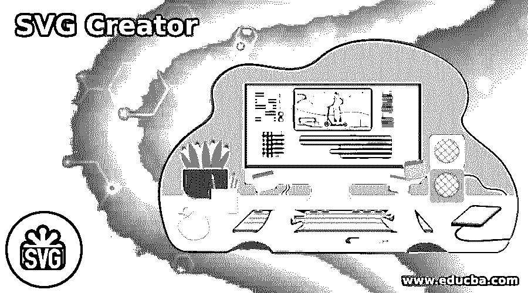
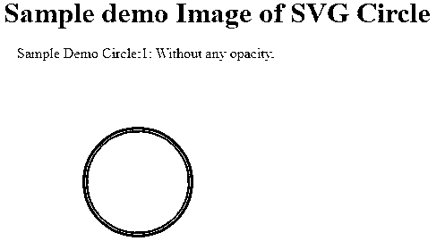
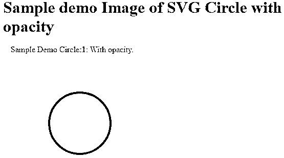
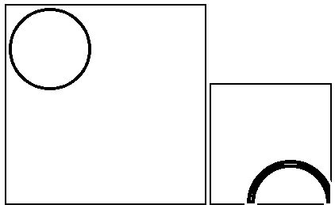
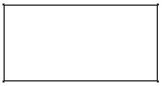
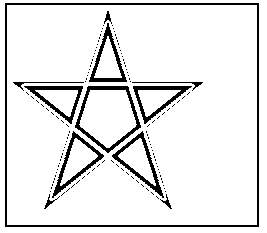

# SVG 整流器

> 原文：<https://www.educba.com/svg-creator/>

## SVG Creator 简介

SVG creator 是一个免费、开源的在线工具，兼容所有类型的浏览器，或者我们可以说我们可以流畅地运行 SVG。它用于根据我们的要求在指定的 web 浏览器区域内编辑图形图像，无需第三方工具或软件。在 SVG creator 中，我们可以在网站上创建或显示二维图像和不同类型的图表。我们还可以显示矢量文件，这有助于在不损害图像分辨率的情况下缩放图像；这是 SVG creator 的优势之一。

### SVG 创建者概述

多功能矢量图形(SVG)是一种基于 XML 的矢量图片设计，用于借助智能和活动的两层插图。SVG creator 是 3W 开发的开源免费工具。

<small>网页开发、编程语言、软件测试&其他</small>

SVG 图片以矢量设计为特征，保存在 XML 文本文档中。通过这种方式，SVG 图片可以在不损失价值的情况下进行缩放，并且可以查看、归档、预先安排和压缩 SVG 记录。此外，XML 文本文档可以用文字处理器或矢量插图编辑器制作和修改，并由最常用的互联网浏览器交付。

### Svg 创建者属性

现在我们来看看 SVG creator 的不同属性如下。

**SVG 圆:**这是 SVG 的一个属性，用来画给定点和半径的圆。

**语法**

`<circle
cx =”It is used to specify the value of X axis coordinate”
cy=” It is used to specify the value of Y axis coordinate”
cr=”It is used to specify the length if radius”>
</circle>`

**解释**

在上面的语法中，我们使用了三个不同的属性如下图所示 circleX，circleY 用于指定圆的 X 和 Y 坐标，表示点；cr 用于定义圆的半径。

**例子**

现在让我们看一个 circle 元素的例子，这样我们就可以了解如下的属性。

`<html>
<title>Welcome in SVG Circle Element</title>
<body>
<h1>Sample demo Image of SVG Circle</h1>
<SVG width="700" height="700">
<g>
<text x="15" y="11" fill="red" >Sample Demo Circle:1: Without any opacity.</text>
<circle cx="150" cy="150" r="60" stroke="green"
stroke-width="4" fill="rgb(124,0,124)"></circle>
</g>
</SVG>
</body>
</html>`

**解释**

在上面的例子中，我们试图实现 SVG circle 元素，如下所示；这里，我们使用三个属性，cx、cy 和 r，我们已经讨论过了。此外，在这个例子中，我们试图绘制没有任何不透明的圆。最后，我们通过下面的屏幕截图展示了上述实现的最终输出。

现在让我们来看看同样的例子，不透明度如下。

`<html>
<title>Welcome in SVG Circle Element </title>
<body>
<h1>Sample demo Image of SVG Circle with opacity</h1>
<SVG width="700" height="700">
<g>
<text x="15" y="11" fill="red" >Sample Demo Circle:1: With opacity.</text>
<circle cx="150" cy="150" r="60" stroke="green"
style="fill:rgb(124,0,124);stroke-width:4;
stroke:rgb(0,0,0);stroke-opacity:0.8;opacity:0.8"></circle>
</g>
</SVG>
</body>
</html>`

**解释**

在上面的例子中，我们尝试用不透明度画圆；这里，我们添加了一个属性，stroke-opacity with value，如上面的代码所示。最后，我们通过下面的屏幕截图展示了上述实现的最终输出。

现在让我们看看 SVG 视图框属性示例，如下所示。

澄清它的另一个方法是，视图框质量中的前两个组织描述了<svg>组件左上角的客户方向，后两个组织描述了右下角的客户方向。<svg>内的空间被解读为从上方通过的方向向右下角扩展，方便了查看框。</svg></svg>

`<!DOCTYPE html>
<html>
<head>
<title>SVG With ViewBox</title>

</head>
<body>
<!-- Code for without viewBox -->
<SVG width="250" height="250">
<circle cx="55" cy="55" r="50"
stroke="#011" stroke-width="4"
fill="none"/>
</SVG>
<!-- Code for with viewBox -->
<SVG width="150" height="150" viewBox="0 0 30 30">
<circle cx="20" cy="30" r="10" stroke="#000"
stroke-width="2" fill="none"/>
</SVG>
</body>
</html>`

**解释**

在这个例子中，方形框显示了带有视图框和不带视图框属性的 SVG 的轮廓。以上两个代码的输出是相同的，但唯一的区别是规模或维度。在这个例子中，我们使用了上面代码中显示的四个属性，比如带有宽度和高度的 X 和 Y 坐标。我们用下面的截图展示了上述实现的最终结果。

现在让我们看看 SVG 矩形的例子，如下所示。

**例子**

`<!DOCTYPE html>
<html>
<head>
<title>Welcome in SVG Rectangle</title>

</head>
<body>
<SVG width="300" height="150">
<rect width="300" height="150" stroke="green" stroke-width="3" fill="yellow" />
</SVG>
</body>
</html>`

**解释**

在上面的例子中，我们试图画出矩形；这里，我们使用两个属性 width 和 height 来绘制矩形。在本例中，我们将宽度定义为 300，高度定义为 150。我们用下面的截图展示了上述实现的最终结果。

现在让我们看一个多边形的例子如下。

**例子**

`<!DOCTYPE html>
<html>
<head>
<title>Welcome in SVG Polygon</title>

</head>
<body>
<SVG height="220" width="250">
<polygon points="101, 11 41,199 191,79 11,79 161,199"
style="fill:green; stroke: orange; stroke-width:4;fill-rule:zero;" />
</SVG>
</body>
</html>`

**解释**

在上面的例子中，我们试图实现多边形；在这个例子中，我们定义了不同的属性来绘制多边形，如上面的代码所示。我们用下面的截图展示了上述实现的最终结果。

这样，我们可以根据自己的需求使用不同的元素和属性来创建 SVG。

### 结论

我们希望通过这篇文章，您可以了解更多关于 SVG 创建者的知识。从上面的文章中，我们已经理解了 SVG 创建者的基本思想，我们也看到了 SVG 创建者的表示和例子。此外，本文还告诉我们如何以及何时使用 SVG creator。

### 推荐文章

这是一个 SVG 创建者的指南。这里我们讨论了 SVG 创建器的基本思想，我们也看到了表示和例子。您也可以阅读以下文章，了解更多信息——

1.  [Inkscape SVG](https://www.educba.com/inkscape-svg/)
2.  [反应原生 SVG](https://www.educba.com/react-native-svg/)
3.  [什么是 SVG？](https://www.educba.com/what-is-svg/)
4.  [CentOS 版本](https://www.educba.com/centos-version/)

